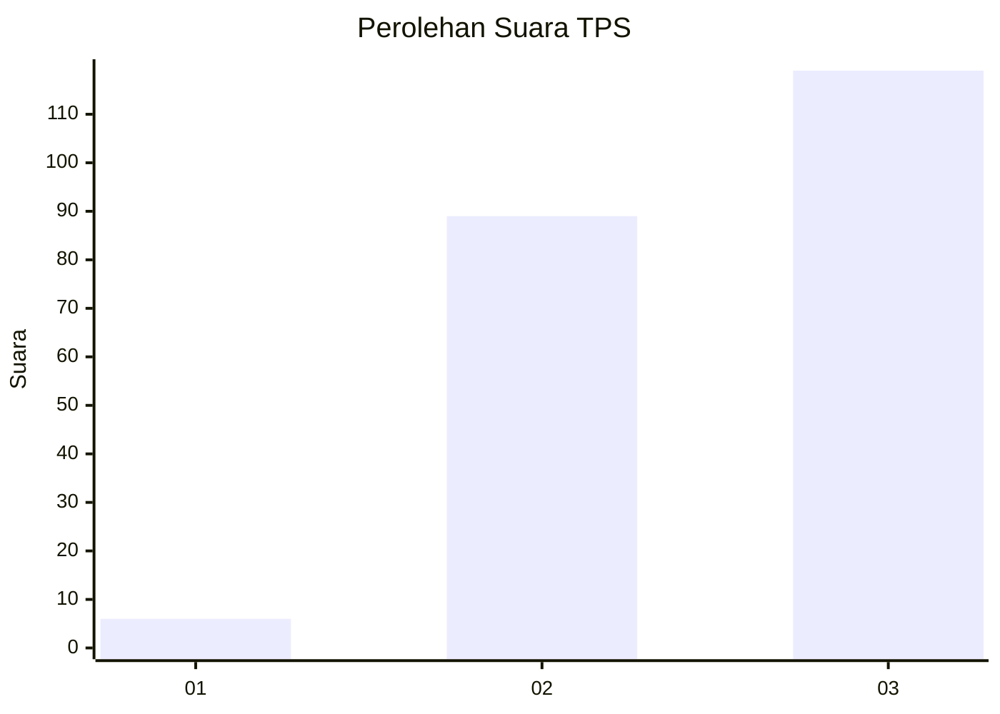
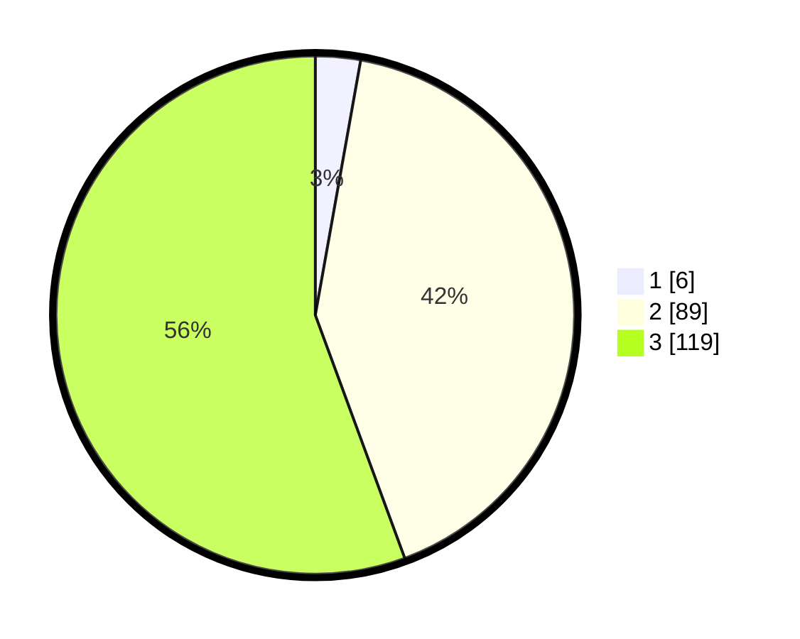

# Hasil

## Grafik

## Tabel

| No. | Nama Paslon    | Suara | Suara (raw) | Persentase |
|:--- |:-------------- | -----:| -----------:| ----------:|
| 1   | ANIES MUHAIMIN | 6     | [6][p-1]    | 2,80       |
| 2   | PRABOWO GIBRAN | 89    | [89][p-2]   | 41,59      |
| 3   | GANJAR MAHFUD  | 119   | [119][p-3]  | 55,61      |

[p-1]: https://github.com/gigit-pemilu/pemilu-2024-51-bali/blob/main/pilpres/hitung-suara/sub/51-bali/sub/01-jembrana/sub/04-melaya/sub/2009-tukadaya/sub/004-tps/sub/paslon-1.txt
[p-2]: https://github.com/gigit-pemilu/pemilu-2024-51-bali/blob/main/pilpres/hitung-suara/sub/51-bali/sub/01-jembrana/sub/04-melaya/sub/2009-tukadaya/sub/004-tps/sub/paslon-2.txt
[p-3]: https://github.com/gigit-pemilu/pemilu-2024-51-bali/blob/main/pilpres/hitung-suara/sub/51-bali/sub/01-jembrana/sub/04-melaya/sub/2009-tukadaya/sub/004-tps/sub/paslon-3.txt

## Foto C Plano

https://sirekap-obj-formc.kpu.go.id/6e4c/pemilu/ppwp/51/01/04/20/09/5101042009004-20240214-193408--31de7ee4-2b38-4333-b040-97390b669934.jpg

https://sirekap-obj-formc.kpu.go.id/6e4c/pemilu/ppwp/51/01/04/20/09/5101042009004-20240214-193412--fe2d01ce-c24a-497d-a9d9-c2c2fc82c0e9.jpg

https://sirekap-obj-formc.kpu.go.id/6e4c/pemilu/ppwp/51/01/04/20/09/5101042009004-20240214-193416--c17b79a3-2faa-4839-9eff-35bad57abd0b.jpg

## Metadata

| Key        | Value               |
| ---------- | ------------------- |
| Time Stamp | 2024-02-15 12:00:28 |

## DATA PEMILIH TETAP

Jumlah pemilih dalam DPT: **272**.
 * L: **135**.
 * P: **137**.

## DATA PENGGUNA HAK PILIH

Jumlah pengguna hak pilih dalam DPT: **218**.
 * L: **110**.
 * P: **108**.

Jumlah pengguna hak pilih dalam DPTb: **0**.
 * L: **0**.
 * P: **0**.

Jumlah pengguna hak pilih dalam DPK: **2**.
 * L: **1**.
 * P: **1**.

Jumlah pengguna hak pilih: **220**.
 * L: **111**.
 * P: **109**.

## JUMLAH SUARA SAH DAN TIDAK SAH

JUMLAH SELURUH SUARA SAH: **214**.

JUMLAH SUARA TIDAK SAH: **6**.

JUMLAH SELURUH SUARA SAH DAN SUARA TIDAK SAH: **220**.

