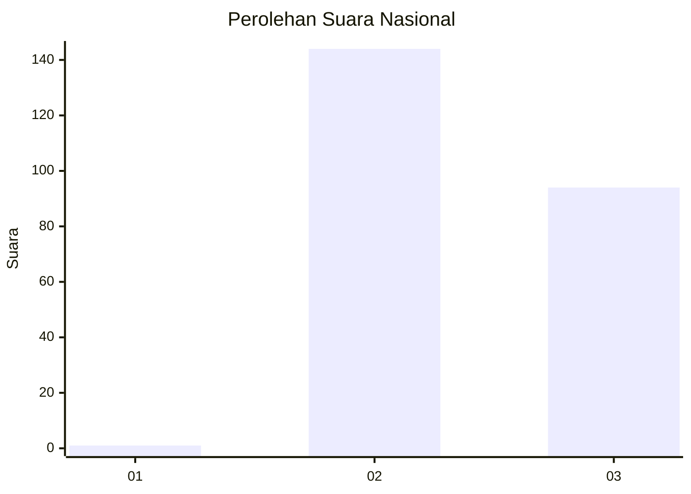
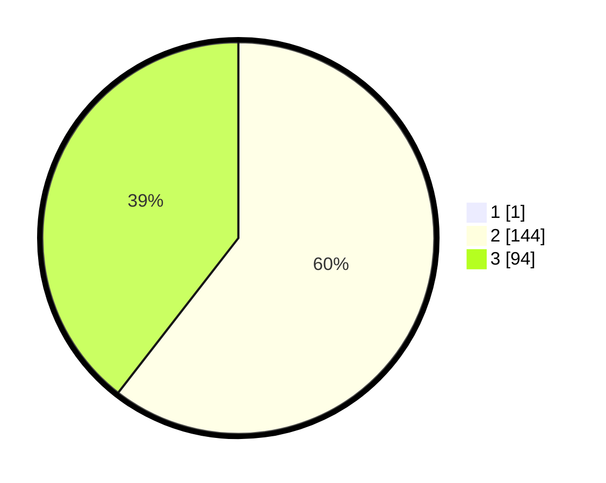

# Hasil

## Grafik

## Tabel

| No. | Nama Paslon    | Suara | Suara (raw) | Persentase |
|:--- |:-------------- | -----:| -----------:| ----------:|
| 1   | ANIES MUHAIMIN | 1     | [1][p-1]    | 0,42       |
| 2   | PRABOWO GIBRAN | 144   | [144][p-2]  | 60,25      |
| 3   | GANJAR MAHFUD  | 94    | [94][p-3]   | 39,33      |

[p-1]: https://github.com/gigit-pemilu/pemilu-2024/blob/main/pilpres/hitung-suara/sub/51-bali/sub/01-jembrana/sub/04-melaya/sub/2009-tukadaya/sub/010-tps/sub/paslon-1.txt
[p-2]: https://github.com/gigit-pemilu/pemilu-2024/blob/main/pilpres/hitung-suara/sub/51-bali/sub/01-jembrana/sub/04-melaya/sub/2009-tukadaya/sub/010-tps/sub/paslon-2.txt
[p-3]: https://github.com/gigit-pemilu/pemilu-2024/blob/main/pilpres/hitung-suara/sub/51-bali/sub/01-jembrana/sub/04-melaya/sub/2009-tukadaya/sub/010-tps/sub/paslon-3.txt

## Foto C Plano

https://sirekap-obj-formc.kpu.go.id/2dcf/pemilu/ppwp/51/01/04/20/09/5101042009010-20240214-220237--1ef13bfe-6dc1-42cf-b814-ccdcc73108a4.jpg

https://sirekap-obj-formc.kpu.go.id/2dcf/pemilu/ppwp/51/01/04/20/09/5101042009010-20240214-220244--e6e50d10-06fd-426c-98a0-940ca49819cc.jpg

https://sirekap-obj-formc.kpu.go.id/2dcf/pemilu/ppwp/51/01/04/20/09/5101042009010-20240214-220252--1322a471-5296-4fc5-9baf-ffe5ac7ab73a.jpg

## Metadata

| Key        | Value               |
| ---------- | ------------------- |
| Time Stamp | 2024-02-15 16:00:26 |

## DATA PEMILIH TETAP

Jumlah pemilih dalam DPT: **290**.
 * L: **149**.
 * P: **141**.

## DATA PENGGUNA HAK PILIH

Jumlah pengguna hak pilih dalam DPT: **247**.
 * L: **139**.
 * P: **108**.

Jumlah pengguna hak pilih dalam DPTb: **0**.
 * L: **0**.
 * P: **0**.

Jumlah pengguna hak pilih dalam DPK: **0**.
 * L: **0**.
 * P: **0**.

Jumlah pengguna hak pilih: **247**.
 * L: **139**.
 * P: **108**.

## JUMLAH SUARA SAH DAN TIDAK SAH

JUMLAH SELURUH SUARA SAH: **239**.

JUMLAH SUARA TIDAK SAH: **8**.

JUMLAH SELURUH SUARA SAH DAN SUARA TIDAK SAH: **247**.

