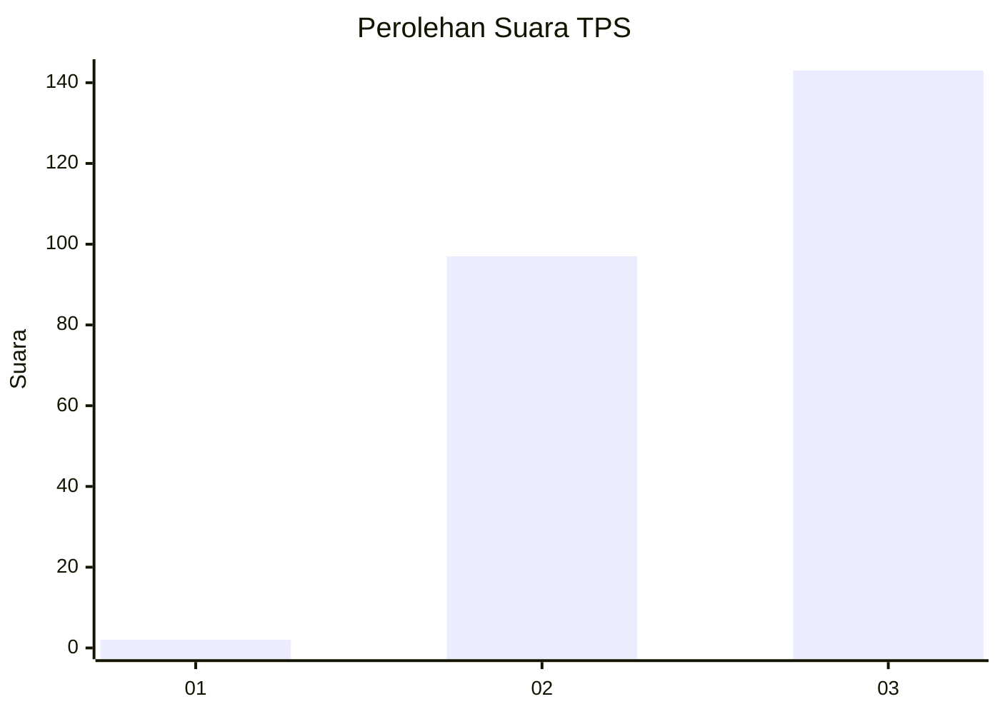
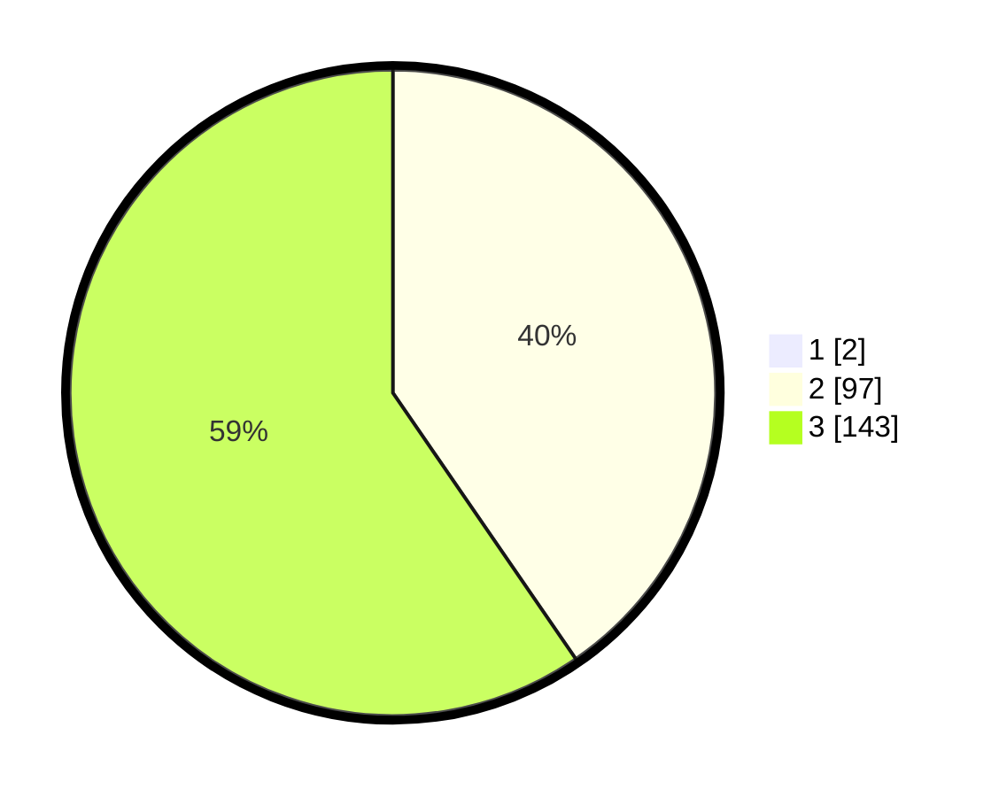

# Hasil

## Grafik

## Tabel

| No. | Nama Paslon    | Suara | Suara (raw) | Persentase |
|:--- |:-------------- | -----:| -----------:| ----------:|
| 1   | ANIES MUHAIMIN | 2     | [2][p-1]    | 0,83       |
| 2   | PRABOWO GIBRAN | 97    | [97][p-2]   | 40,08      |
| 3   | GANJAR MAHFUD  | 143   | [143][p-3]  | 59,09      |

[p-1]: https://github.com/gigit-pemilu/pemilu-2024-51-bali/blob/main/pilpres/hitung-suara/sub/51-bali/sub/01-jembrana/sub/04-melaya/sub/2009-tukadaya/sub/015-tps/sub/paslon-1.txt
[p-2]: https://github.com/gigit-pemilu/pemilu-2024-51-bali/blob/main/pilpres/hitung-suara/sub/51-bali/sub/01-jembrana/sub/04-melaya/sub/2009-tukadaya/sub/015-tps/sub/paslon-2.txt
[p-3]: https://github.com/gigit-pemilu/pemilu-2024-51-bali/blob/main/pilpres/hitung-suara/sub/51-bali/sub/01-jembrana/sub/04-melaya/sub/2009-tukadaya/sub/015-tps/sub/paslon-3.txt

## Foto C Plano

https://sirekap-obj-formc.kpu.go.id/086a/pemilu/ppwp/51/01/04/20/09/5101042009015-20240214-191036--07accbb6-db0d-4f64-99b9-eb7dba0eabd3.jpg

https://sirekap-obj-formc.kpu.go.id/086a/pemilu/ppwp/51/01/04/20/09/5101042009015-20240214-191030--3a392ab2-d898-4464-a6e8-0e52b8efab29.jpg

https://sirekap-obj-formc.kpu.go.id/086a/pemilu/ppwp/51/01/04/20/09/5101042009015-20240214-191011--8538597e-a786-4c54-bb69-59d436d89f91.jpg

## Metadata

| Key        | Value               |
| ---------- | ------------------- |
| Time Stamp | 2024-02-15 00:41:44 |

