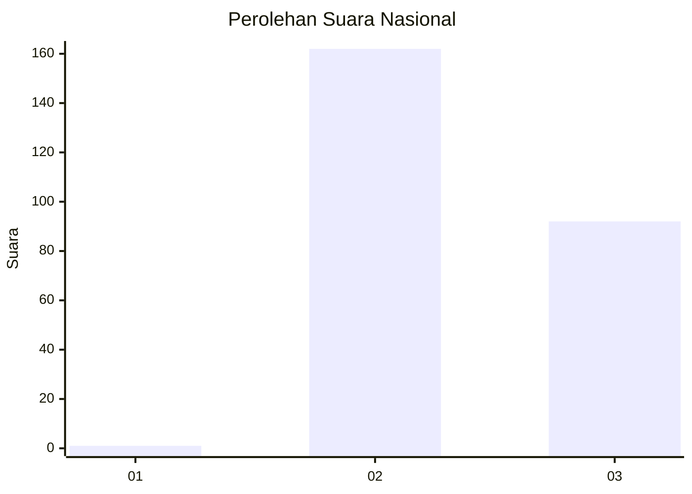
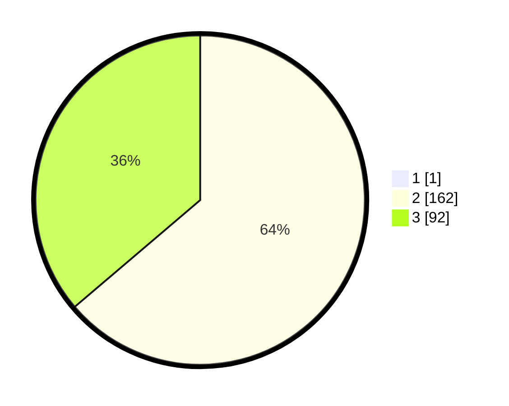

# Hasil

## Grafik

## Tabel

| No. | Nama Paslon    | Suara | Suara (raw) | Persentase |
|:--- |:-------------- | -----:| -----------:| ----------:|
| 1   | ANIES MUHAIMIN | 1     | [1][p-1]    | 0,39       |
| 2   | PRABOWO GIBRAN | 162   | [162][p-2]  | 63,53      |
| 3   | GANJAR MAHFUD  | 92    | [92][p-3]   | 36,08      |

[p-1]: https://github.com/gigit-pemilu/pemilu-2024/blob/main/pilpres/hitung-suara/sub/51-bali/sub/01-jembrana/sub/04-melaya/sub/2009-tukadaya/sub/016-tps/sub/paslon-1.txt
[p-2]: https://github.com/gigit-pemilu/pemilu-2024/blob/main/pilpres/hitung-suara/sub/51-bali/sub/01-jembrana/sub/04-melaya/sub/2009-tukadaya/sub/016-tps/sub/paslon-2.txt
[p-3]: https://github.com/gigit-pemilu/pemilu-2024/blob/main/pilpres/hitung-suara/sub/51-bali/sub/01-jembrana/sub/04-melaya/sub/2009-tukadaya/sub/016-tps/sub/paslon-3.txt

## Foto C Plano

https://sirekap-obj-formc.kpu.go.id/e100/pemilu/ppwp/51/01/04/20/09/5101042009016-20240214-222612--c058f838-9aff-4ff7-ba19-65810448cddc.jpg

https://sirekap-obj-formc.kpu.go.id/e100/pemilu/ppwp/51/01/04/20/09/5101042009016-20240214-222752--04910313-9812-4d4a-ad91-f246837d0380.jpg

https://sirekap-obj-formc.kpu.go.id/e100/pemilu/ppwp/51/01/04/20/09/5101042009016-20240214-222941--e2c9fc55-75de-415f-90b6-99f125929877.jpg

## Metadata

| Key        | Value               |
| ---------- | ------------------- |
| Time Stamp | 2024-02-15 16:00:26 |

## DATA PEMILIH TETAP

Jumlah pemilih dalam DPT: **292**.
 * L: **148**.
 * P: **144**.

## DATA PENGGUNA HAK PILIH

Jumlah pengguna hak pilih dalam DPT: **259**.
 * L: **135**.
 * P: **124**.

Jumlah pengguna hak pilih dalam DPTb: **1**.
 * L: **0**.
 * P: **1**.

Jumlah pengguna hak pilih dalam DPK: **0**.
 * L: **0**.
 * P: **0**.

Jumlah pengguna hak pilih: **260**.
 * L: **135**.
 * P: **125**.

## JUMLAH SUARA SAH DAN TIDAK SAH

JUMLAH SELURUH SUARA SAH: **255**.

JUMLAH SUARA TIDAK SAH: **5**.

JUMLAH SELURUH SUARA SAH DAN SUARA TIDAK SAH: **260**.

