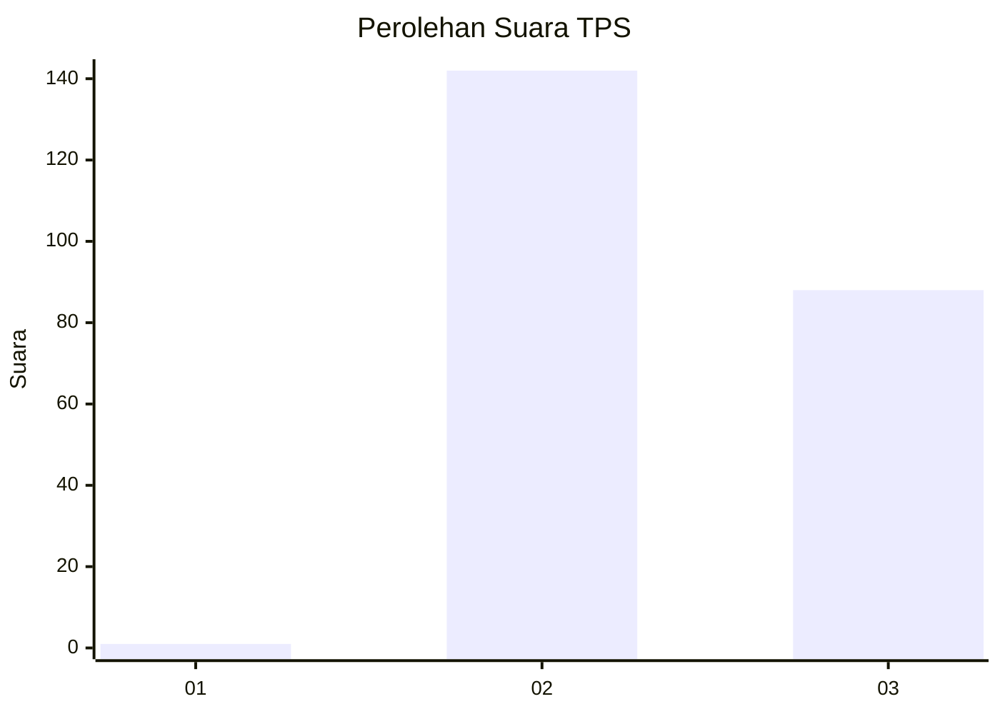
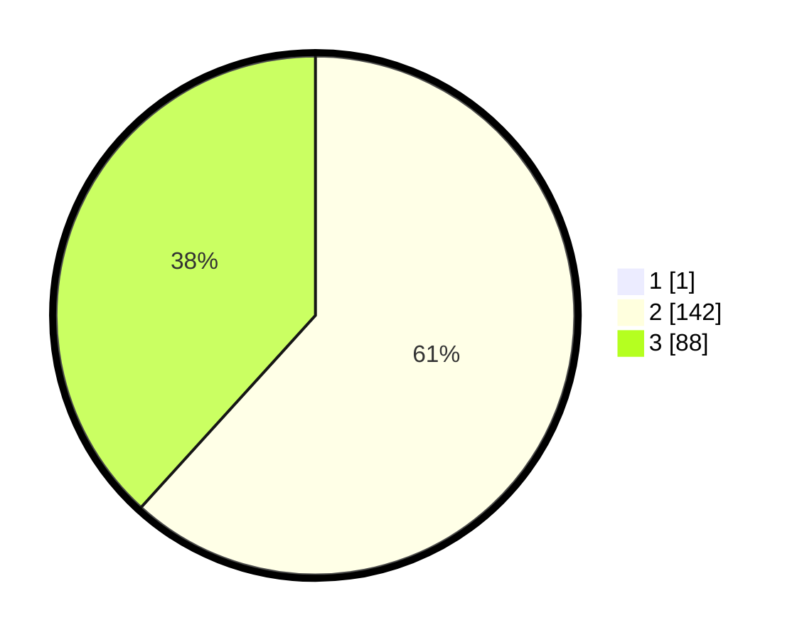

# Hasil

## Grafik

## Tabel

| No. | Nama Paslon    | Suara | Suara (raw) | Persentase |
|:--- |:-------------- | -----:| -----------:| ----------:|
| 1   | ANIES MUHAIMIN | 1     | [1][p-1]    | 0,43       |
| 2   | PRABOWO GIBRAN | 142   | [142][p-2]  | 61,47      |
| 3   | GANJAR MAHFUD  | 88    | [88][p-3]   | 38,10      |

[p-1]: https://github.com/gigit-pemilu/pemilu-2024-51-bali/blob/main/pilpres/hitung-suara/sub/51-bali/sub/01-jembrana/sub/04-melaya/sub/2009-tukadaya/sub/017-tps/sub/paslon-1.txt
[p-2]: https://github.com/gigit-pemilu/pemilu-2024-51-bali/blob/main/pilpres/hitung-suara/sub/51-bali/sub/01-jembrana/sub/04-melaya/sub/2009-tukadaya/sub/017-tps/sub/paslon-2.txt
[p-3]: https://github.com/gigit-pemilu/pemilu-2024-51-bali/blob/main/pilpres/hitung-suara/sub/51-bali/sub/01-jembrana/sub/04-melaya/sub/2009-tukadaya/sub/017-tps/sub/paslon-3.txt

## Foto C Plano

https://sirekap-obj-formc.kpu.go.id/696c/pemilu/ppwp/51/01/04/20/09/5101042009017-20240214-130917--46c0ca78-43da-4b47-8bc7-7e85c1a54ee4.jpg

https://sirekap-obj-formc.kpu.go.id/696c/pemilu/ppwp/51/01/04/20/09/5101042009017-20240214-131036--c5d73c18-dfcb-478f-920f-cbad1d0c072d.jpg

## Metadata

| Key        | Value               |
| ---------- | ------------------- |
| Time Stamp | 2024-02-16 08:00:28 |

