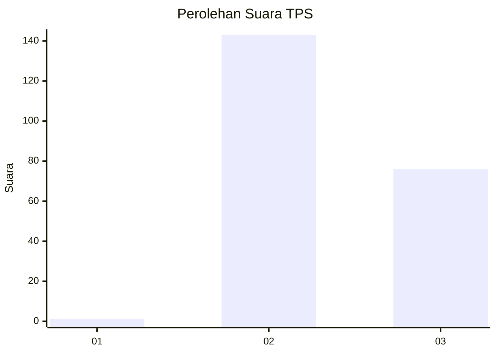
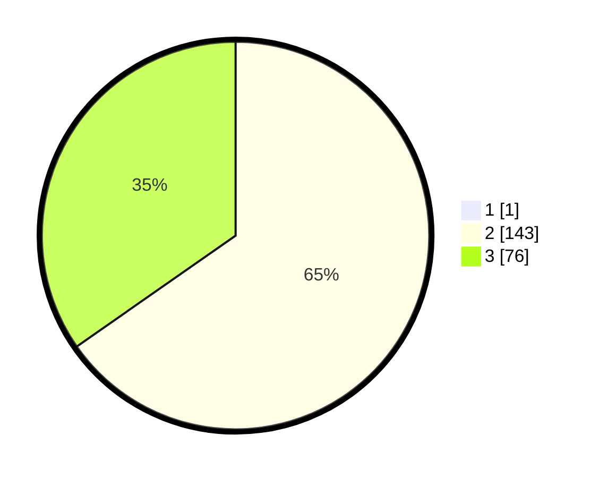

# Hasil

## Grafik

## Tabel

| No. | Nama Paslon    | Suara | Suara (raw) | Persentase |
|:--- |:-------------- | -----:| -----------:| ----------:|
| 1   | ANIES MUHAIMIN | 1     | [1][p-1]    | 0,45       |
| 2   | PRABOWO GIBRAN | 143   | [143][p-2]  | 65,00      |
| 3   | GANJAR MAHFUD  | 76    | [76][p-3]   | 34,55      |

[p-1]: https://github.com/gigit-pemilu/pemilu-2024-51-bali/blob/main/pilpres/hitung-suara/sub/51-bali/sub/01-jembrana/sub/04-melaya/sub/2010-manistutu/sub/005-tps/sub/paslon-1.txt
[p-2]: https://github.com/gigit-pemilu/pemilu-2024-51-bali/blob/main/pilpres/hitung-suara/sub/51-bali/sub/01-jembrana/sub/04-melaya/sub/2010-manistutu/sub/005-tps/sub/paslon-2.txt
[p-3]: https://github.com/gigit-pemilu/pemilu-2024-51-bali/blob/main/pilpres/hitung-suara/sub/51-bali/sub/01-jembrana/sub/04-melaya/sub/2010-manistutu/sub/005-tps/sub/paslon-3.txt

## Foto C Plano

https://sirekap-obj-formc.kpu.go.id/264e/pemilu/ppwp/51/01/04/20/10/5101042010005-20240214-212312--c3761fe9-36c1-4f4d-bf22-9e67d95d4ff2.jpg

https://sirekap-obj-formc.kpu.go.id/264e/pemilu/ppwp/51/01/04/20/10/5101042010005-20240214-212348--539caaed-b950-43e5-8d6e-876fb9b7f466.jpg

https://sirekap-obj-formc.kpu.go.id/264e/pemilu/ppwp/51/01/04/20/10/5101042010005-20240214-212415--76e76079-dcfb-4bfb-8da6-437ad4e9bc2b.jpg

## Metadata

| Key        | Value               |
| ---------- | ------------------- |
| Time Stamp | 2024-02-16 08:00:28 |

## DATA PEMILIH TETAP

Jumlah pemilih dalam DPT: **289**.
 * L: **137**.
 * P: **152**.

## DATA PENGGUNA HAK PILIH

Jumlah pengguna hak pilih dalam DPT: **226**.
 * L: **112**.
 * P: **114**.

Jumlah pengguna hak pilih dalam DPTb: **0**.
 * L: **0**.
 * P: **0**.

Jumlah pengguna hak pilih dalam DPK: **2**.
 * L: **0**.
 * P: **2**.

Jumlah pengguna hak pilih: **228**.
 * L: **112**.
 * P: **116**.

## JUMLAH SUARA SAH DAN TIDAK SAH

JUMLAH SELURUH SUARA SAH: **220**.

JUMLAH SUARA TIDAK SAH: **8**.

JUMLAH SELURUH SUARA SAH DAN SUARA TIDAK SAH: **228**.

