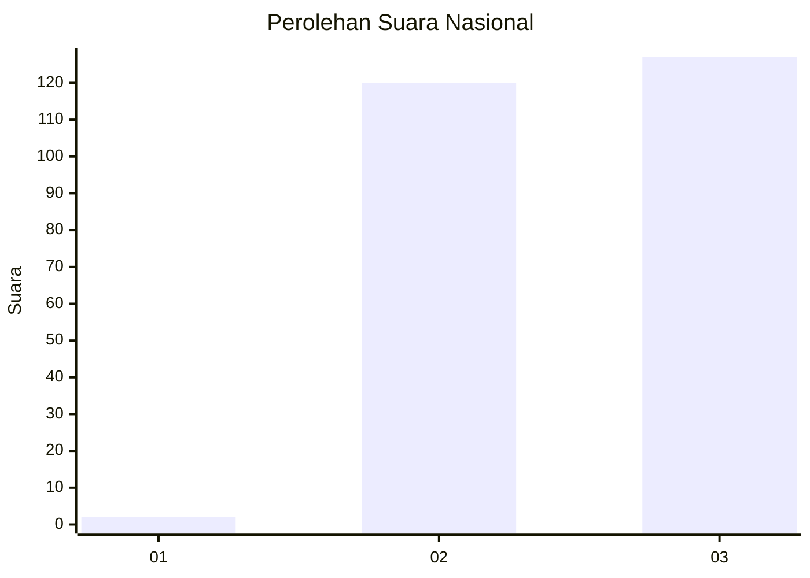
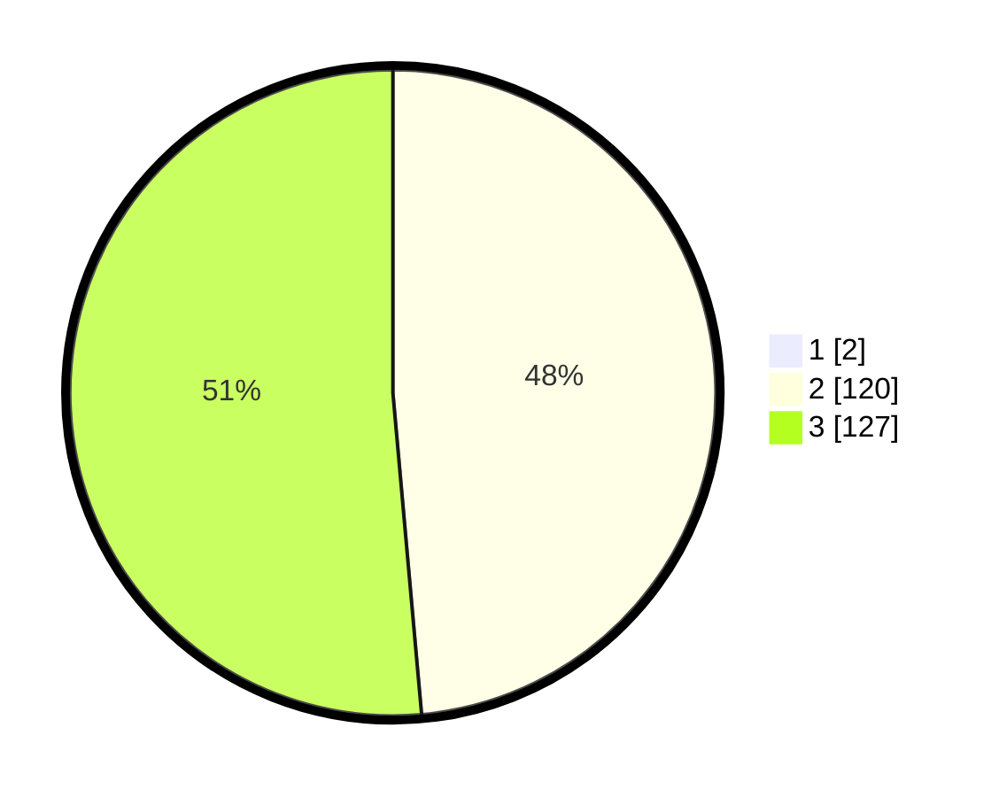

# Hasil

## Grafik

## Tabel

| No. | Nama Paslon    | Suara | Suara (raw) | Persentase |
|:--- |:-------------- | -----:| -----------:| ----------:|
| 1   | ANIES MUHAIMIN | 2     | [2][p-1]    | 0,80       |
| 2   | PRABOWO GIBRAN | 120   | [120][p-2]  | 48,19      |
| 3   | GANJAR MAHFUD  | 127   | [127][p-3]  | 51,00      |

[p-1]: https://github.com/gigit-pemilu/pemilu-2024/blob/main/pilpres/hitung-suara/sub/51-bali/sub/01-jembrana/sub/04-melaya/sub/2010-manistutu/sub/008-tps/sub/paslon-1.txt
[p-2]: https://github.com/gigit-pemilu/pemilu-2024/blob/main/pilpres/hitung-suara/sub/51-bali/sub/01-jembrana/sub/04-melaya/sub/2010-manistutu/sub/008-tps/sub/paslon-2.txt
[p-3]: https://github.com/gigit-pemilu/pemilu-2024/blob/main/pilpres/hitung-suara/sub/51-bali/sub/01-jembrana/sub/04-melaya/sub/2010-manistutu/sub/008-tps/sub/paslon-3.txt

## Foto C Plano

https://sirekap-obj-formc.kpu.go.id/2718/pemilu/ppwp/51/01/04/20/10/5101042010008-20240214-201138--16e0c776-97c3-42af-a0bd-09e4610427f1.jpg

https://sirekap-obj-formc.kpu.go.id/2718/pemilu/ppwp/51/01/04/20/10/5101042010008-20240214-201145--0319b23e-0fa7-4143-99f9-1ac01ad60bbc.jpg

https://sirekap-obj-formc.kpu.go.id/2718/pemilu/ppwp/51/01/04/20/10/5101042010008-20240214-201153--769964f5-b4f5-49ae-bc90-3f525d3761e1.jpg

## Metadata

| Key        | Value               |
| ---------- | ------------------- |
| Time Stamp | 2024-02-16 08:00:28 |

## DATA PEMILIH TETAP

Jumlah pemilih dalam DPT: **294**.
 * L: **157**.
 * P: **137**.

## DATA PENGGUNA HAK PILIH

Jumlah pengguna hak pilih dalam DPT: **258**.
 * L: **135**.
 * P: **123**.

Jumlah pengguna hak pilih dalam DPTb: **0**.
 * L: **0**.
 * P: **0**.

Jumlah pengguna hak pilih dalam DPK: **1**.
 * L: **0**.
 * P: **1**.

Jumlah pengguna hak pilih: **259**.
 * L: **135**.
 * P: **124**.

## JUMLAH SUARA SAH DAN TIDAK SAH

JUMLAH SELURUH SUARA SAH: **249**.

JUMLAH SUARA TIDAK SAH: **10**.

JUMLAH SELURUH SUARA SAH DAN SUARA TIDAK SAH: **259**.

