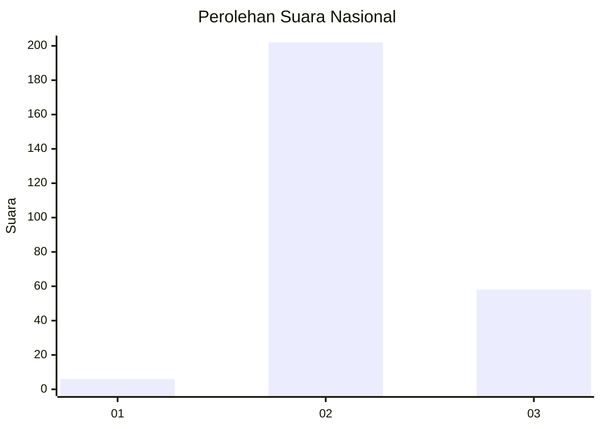

# Hasil

## Grafik

## Tabel

| No. | Nama Paslon    | Suara | Suara (raw) | Persentase |
|:--- |:-------------- | -----:| -----------:| ----------:|
| 1   | ANIES MUHAIMIN | 6     | [6][p-1]    | 2,26       |
| 2   | PRABOWO GIBRAN | 202   | [202][p-2]  | 75,94      |
| 3   | GANJAR MAHFUD  | 58    | [58][p-3]   | 21,80      |

[p-1]: https://github.com/gigit-pemilu/pemilu-2024/blob/main/pilpres/hitung-suara/sub/51-bali/sub/01-jembrana/sub/04-melaya/sub/2010-manistutu/sub/023-tps/sub/paslon-1.txt
[p-2]: https://github.com/gigit-pemilu/pemilu-2024/blob/main/pilpres/hitung-suara/sub/51-bali/sub/01-jembrana/sub/04-melaya/sub/2010-manistutu/sub/023-tps/sub/paslon-2.txt
[p-3]: https://github.com/gigit-pemilu/pemilu-2024/blob/main/pilpres/hitung-suara/sub/51-bali/sub/01-jembrana/sub/04-melaya/sub/2010-manistutu/sub/023-tps/sub/paslon-3.txt

## Foto C Plano

https://sirekap-obj-formc.kpu.go.id/f12a/pemilu/ppwp/51/01/04/20/10/5101042010023-20240214-131927--565a3c00-b89c-472d-94ac-f54d41207c9d.jpg

https://sirekap-obj-formc.kpu.go.id/f12a/pemilu/ppwp/51/01/04/20/10/5101042010023-20240214-132030--36115b0b-3f3c-44ed-ab99-eca10014b2fb.jpg

https://sirekap-obj-formc.kpu.go.id/f12a/pemilu/ppwp/51/01/04/20/10/5101042010023-20240214-141317--e3e7c39c-9a3e-4ba0-ae5a-521662a01bcf.jpg

## Metadata

| Key        | Value               |
| ---------- | ------------------- |
| Time Stamp | 2024-02-16 08:00:28 |

## DATA PEMILIH TETAP

Jumlah pemilih dalam DPT: **295**.
 * L: **143**.
 * P: **152**.

## DATA PENGGUNA HAK PILIH

Jumlah pengguna hak pilih dalam DPT: **269**.
 * L: **135**.
 * P: **134**.

Jumlah pengguna hak pilih dalam DPTb: **0**.
 * L: **0**.
 * P: **0**.

Jumlah pengguna hak pilih dalam DPK: **0**.
 * L: **0**.
 * P: **0**.

Jumlah pengguna hak pilih: **269**.
 * L: **135**.
 * P: **134**.

## JUMLAH SUARA SAH DAN TIDAK SAH

JUMLAH SELURUH SUARA SAH: **266**.

JUMLAH SUARA TIDAK SAH: **3**.

JUMLAH SELURUH SUARA SAH DAN SUARA TIDAK SAH: **269**.

