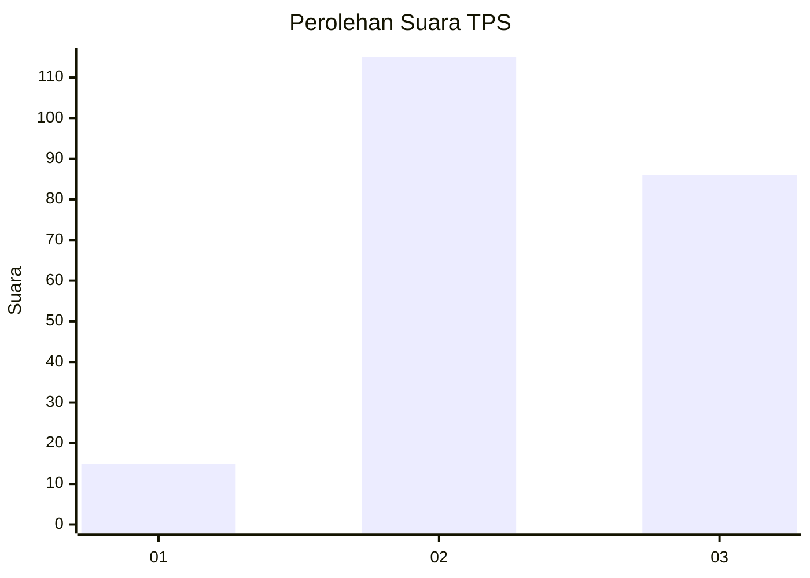
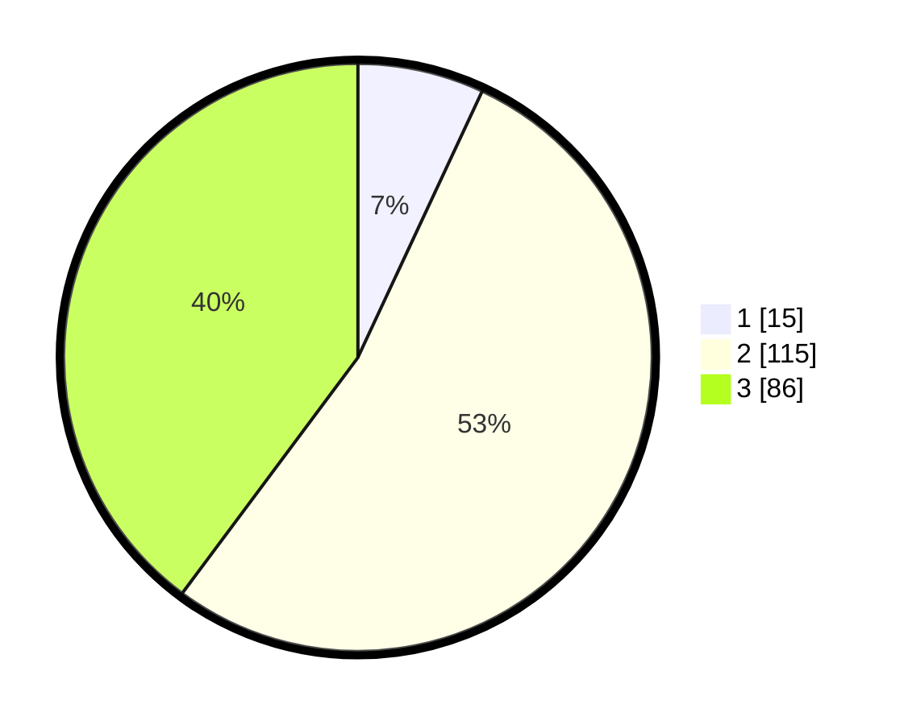

# Hasil

## Grafik

## Tabel

| No. | Nama Paslon    | Suara | Suara (raw) | Persentase |
|:--- |:-------------- | -----:| -----------:| ----------:|
| 1   | ANIES MUHAIMIN | 15    | [15][p-1]   | 6,94       |
| 2   | PRABOWO GIBRAN | 115   | [115][p-2]  | 53,24      |
| 3   | GANJAR MAHFUD  | 86    | [86][p-3]   | 39,81      |

[p-1]: https://github.com/gigit-pemilu/pemilu-2024-51-bali/blob/main/pilpres/hitung-suara/sub/51-bali/sub/01-jembrana/sub/05-jembrana/sub/1001-pendem/sub/001-tps/sub/paslon-1.txt
[p-2]: https://github.com/gigit-pemilu/pemilu-2024-51-bali/blob/main/pilpres/hitung-suara/sub/51-bali/sub/01-jembrana/sub/05-jembrana/sub/1001-pendem/sub/001-tps/sub/paslon-2.txt
[p-3]: https://github.com/gigit-pemilu/pemilu-2024-51-bali/blob/main/pilpres/hitung-suara/sub/51-bali/sub/01-jembrana/sub/05-jembrana/sub/1001-pendem/sub/001-tps/sub/paslon-3.txt

## Foto C Plano

https://sirekap-obj-formc.kpu.go.id/702a/pemilu/ppwp/51/01/05/10/01/5101051001001-20240214-141733--84f09bce-3620-49bd-90fc-54073e0564ee.jpg

https://sirekap-obj-formc.kpu.go.id/702a/pemilu/ppwp/51/01/05/10/01/5101051001001-20240214-141811--a06c6efc-605d-4685-87be-8dc72eef3595.jpg

https://sirekap-obj-formc.kpu.go.id/702a/pemilu/ppwp/51/01/05/10/01/5101051001001-20240214-141852--105ea481-9cf6-498b-99fe-78b03066d906.jpg

## Metadata

| Key        | Value               |
| ---------- | ------------------- |
| Time Stamp | 2024-02-14 21:46:01 |

## DATA PEMILIH TETAP

Jumlah pemilih dalam DPT: **286**.
 * L: **139**.
 * P: **147**.

## DATA PENGGUNA HAK PILIH

Jumlah pengguna hak pilih dalam DPT: **218**.
 * L: **107**.
 * P: **111**.

Jumlah pengguna hak pilih dalam DPTb: **8**.
 * L: **4**.
 * P: **0**.

Jumlah pengguna hak pilih dalam DPK: **0**.
 * L: **0**.
 * P: **0**.

Jumlah pengguna hak pilih: **226**.
 * L: **115**.
 * P: **111**.

## JUMLAH SUARA SAH DAN TIDAK SAH

JUMLAH SELURUH SUARA SAH: **216**.

JUMLAH SUARA TIDAK SAH: **10**.

