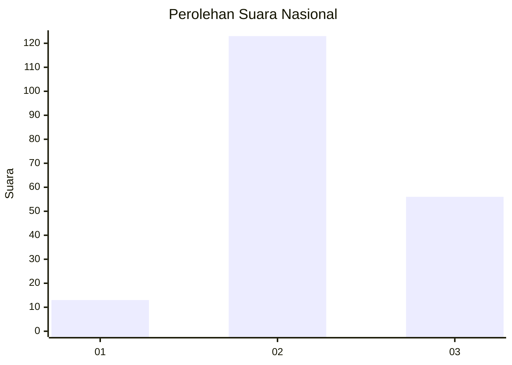
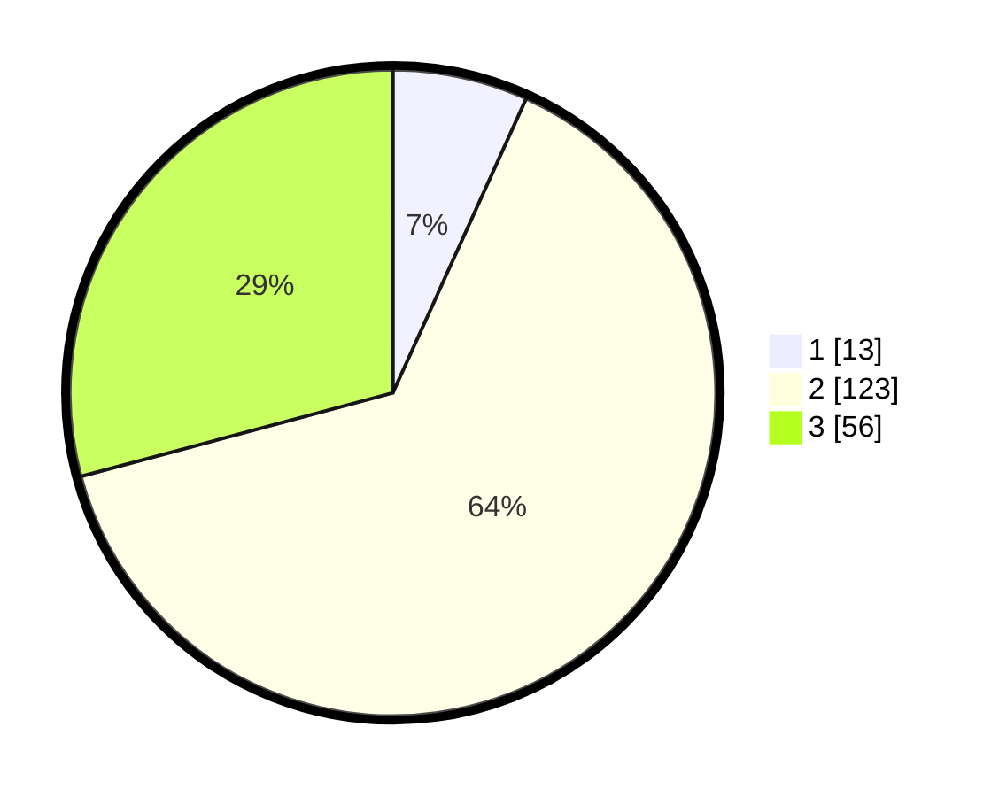

# Hasil

## Grafik

## Tabel

| No. | Nama Paslon    | Suara | Suara (raw) | Persentase |
|:--- |:-------------- | -----:| -----------:| ----------:|
| 1   | ANIES MUHAIMIN | 13    | [13][p-1]   | 6,77       |
| 2   | PRABOWO GIBRAN | 123   | [123][p-2]  | 64,06      |
| 3   | GANJAR MAHFUD  | 56    | [56][p-3]   | 29,17      |

[p-1]: https://github.com/gigit-pemilu/pemilu-2024/blob/main/pilpres/hitung-suara/sub/51-bali/sub/01-jembrana/sub/05-jembrana/sub/1001-pendem/sub/003-tps/sub/paslon-1.txt
[p-2]: https://github.com/gigit-pemilu/pemilu-2024/blob/main/pilpres/hitung-suara/sub/51-bali/sub/01-jembrana/sub/05-jembrana/sub/1001-pendem/sub/003-tps/sub/paslon-2.txt
[p-3]: https://github.com/gigit-pemilu/pemilu-2024/blob/main/pilpres/hitung-suara/sub/51-bali/sub/01-jembrana/sub/05-jembrana/sub/1001-pendem/sub/003-tps/sub/paslon-3.txt

## Foto C Plano

https://sirekap-obj-formc.kpu.go.id/2b4a/pemilu/ppwp/51/01/05/10/01/5101051001003-20240214-184733--7aaeb571-9456-4b4c-9b02-11d0fdb1db26.jpg

https://sirekap-obj-formc.kpu.go.id/2b4a/pemilu/ppwp/51/01/05/10/01/5101051001003-20240214-184737--66060066-06e0-4af2-930d-c667ca9a6340.jpg

https://sirekap-obj-formc.kpu.go.id/2b4a/pemilu/ppwp/51/01/05/10/01/5101051001003-20240214-184743--60451b01-1666-4b37-8d96-5f9ee963dc8d.jpg

## Metadata

| Key        | Value               |
| ---------- | ------------------- |
| Time Stamp | 2024-02-15 15:30:25 |

## DATA PEMILIH TETAP

Jumlah pemilih dalam DPT: **278**.
 * L: **141**.
 * P: **137**.

## DATA PENGGUNA HAK PILIH

Jumlah pengguna hak pilih dalam DPT: **194**.
 * L: **97**.
 * P: **97**.

Jumlah pengguna hak pilih dalam DPTb: **5**.
 * L: **2**.
 * P: **3**.

Jumlah pengguna hak pilih dalam DPK: **0**.
 * L: **0**.
 * P: **0**.

Jumlah pengguna hak pilih: **199**.
 * L: **99**.
 * P: **100**.

## JUMLAH SUARA SAH DAN TIDAK SAH

JUMLAH SELURUH SUARA SAH: **192**.

JUMLAH SUARA TIDAK SAH: **7**.

JUMLAH SELURUH SUARA SAH DAN SUARA TIDAK SAH: **199**.

