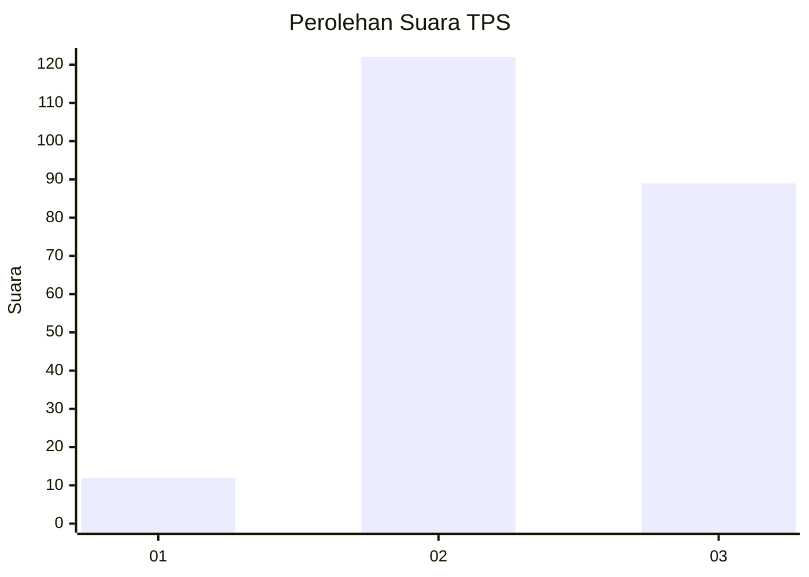
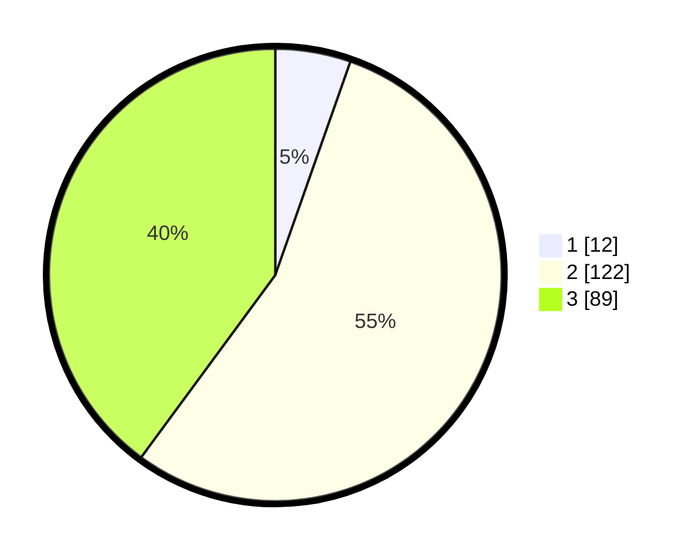

# Hasil

## Grafik

## Tabel

| No. | Nama Paslon    | Suara | Suara (raw) | Persentase |
|:--- |:-------------- | -----:| -----------:| ----------:|
| 1   | ANIES MUHAIMIN | 12    | [12][p-1]   | 5,38       |
| 2   | PRABOWO GIBRAN | 122   | [122][p-2]  | 54,71      |
| 3   | GANJAR MAHFUD  | 89    | [89][p-3]   | 39,91      |

[p-1]: https://github.com/gigit-pemilu/pemilu-2024-51-bali/blob/main/pilpres/hitung-suara/sub/51-bali/sub/01-jembrana/sub/05-jembrana/sub/1001-pendem/sub/006-tps/sub/paslon-1.txt
[p-2]: https://github.com/gigit-pemilu/pemilu-2024-51-bali/blob/main/pilpres/hitung-suara/sub/51-bali/sub/01-jembrana/sub/05-jembrana/sub/1001-pendem/sub/006-tps/sub/paslon-2.txt
[p-3]: https://github.com/gigit-pemilu/pemilu-2024-51-bali/blob/main/pilpres/hitung-suara/sub/51-bali/sub/01-jembrana/sub/05-jembrana/sub/1001-pendem/sub/006-tps/sub/paslon-3.txt

## Foto C Plano

https://sirekap-obj-formc.kpu.go.id/9fb0/pemilu/ppwp/51/01/05/10/01/5101051001006-20240216-103734--4a8cd75c-5990-4d5f-a518-f846f5937f63.jpg

https://sirekap-obj-formc.kpu.go.id/9fb0/pemilu/ppwp/51/01/05/10/01/5101051001006-20240216-103740--f43f44ce-c982-43d7-91f3-8628e624e95b.jpg

https://sirekap-obj-formc.kpu.go.id/9fb0/pemilu/ppwp/51/01/05/10/01/5101051001006-20240216-103744--4f78749a-aa5a-4075-87e5-4a215c750030.jpg

## Metadata

| Key        | Value               |
| ---------- | ------------------- |
| Time Stamp | 2024-02-16 21:01:00 |

