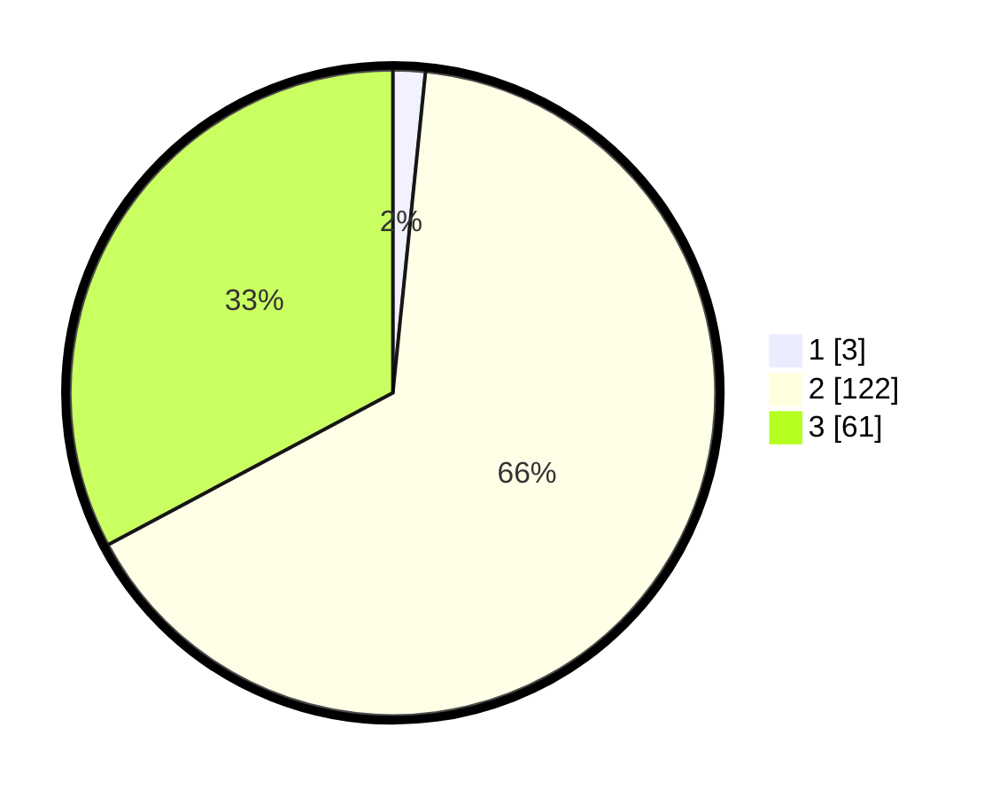

# Hasil

## Grafik

## Tabel

| No. | Nama Paslon    | Suara | Suara (raw) | Persentase |
|:--- |:-------------- | -----:| -----------:| ----------:|
| 1   | ANIES MUHAIMIN | 3     | [3][p-1]    | 1,61       |
| 2   | PRABOWO GIBRAN | 122   | [122][p-2]  | 65,59      |
| 3   | GANJAR MAHFUD  | 61    | [61][p-3]   | 32,80      |

[p-1]: https://github.com/gigit-pemilu/pemilu-2024-51-bali/blob/main/pilpres/hitung-suara/sub/51-bali/sub/01-jembrana/sub/05-jembrana/sub/1001-pendem/sub/007-tps/sub/paslon-1.txt
[p-2]: https://github.com/gigit-pemilu/pemilu-2024-51-bali/blob/main/pilpres/hitung-suara/sub/51-bali/sub/01-jembrana/sub/05-jembrana/sub/1001-pendem/sub/007-tps/sub/paslon-2.txt
[p-3]: https://github.com/gigit-pemilu/pemilu-2024-51-bali/blob/main/pilpres/hitung-suara/sub/51-bali/sub/01-jembrana/sub/05-jembrana/sub/1001-pendem/sub/007-tps/sub/paslon-3.txt

## Foto C Plano

https://sirekap-obj-formc.kpu.go.id/6503/pemilu/ppwp/51/01/05/10/01/5101051001007-20240214-132414--60162a58-7eb0-4794-9b64-f3fe06fe5eaf.jpg

https://sirekap-obj-formc.kpu.go.id/6503/pemilu/ppwp/51/01/05/10/01/5101051001007-20240214-132500--441fe2d8-4e91-4646-9136-d7182a43a31d.jpg

https://sirekap-obj-formc.kpu.go.id/6503/pemilu/ppwp/51/01/05/10/01/5101051001007-20240214-132538--7f5b31cc-378a-407e-a358-cc29e7561d92.jpg

## Metadata

| Key        | Value               |
| ---------- | ------------------- |
| Time Stamp | 2024-02-14 21:46:01 |

## DATA PEMILIH TETAP

Jumlah pemilih dalam DPT: **245**.
 * L: **111**.
 * P: **134**.

## DATA PENGGUNA HAK PILIH

Jumlah pengguna hak pilih dalam DPT: **186**.
 * L: **81**.
 * P: **105**.

Jumlah pengguna hak pilih dalam DPTb: **1**.
 * L: **0**.
 * P: **1**.

Jumlah pengguna hak pilih dalam DPK: **1**.
 * L: **1**.
 * P: **0**.

Jumlah pengguna hak pilih: **188**.
 * L: **82**.
 * P: **106**.

## JUMLAH SUARA SAH DAN TIDAK SAH

JUMLAH SELURUH SUARA SAH: **186**.

JUMLAH SUARA TIDAK SAH: **2**.

JUMLAH SELURUH SUARA SAH DAN SUARA TIDAK SAH: **128**.

