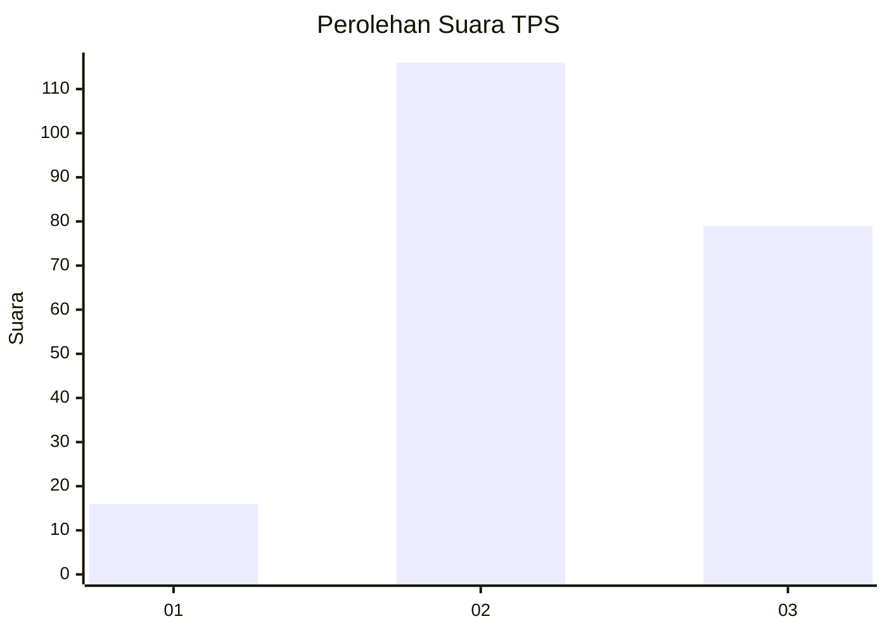
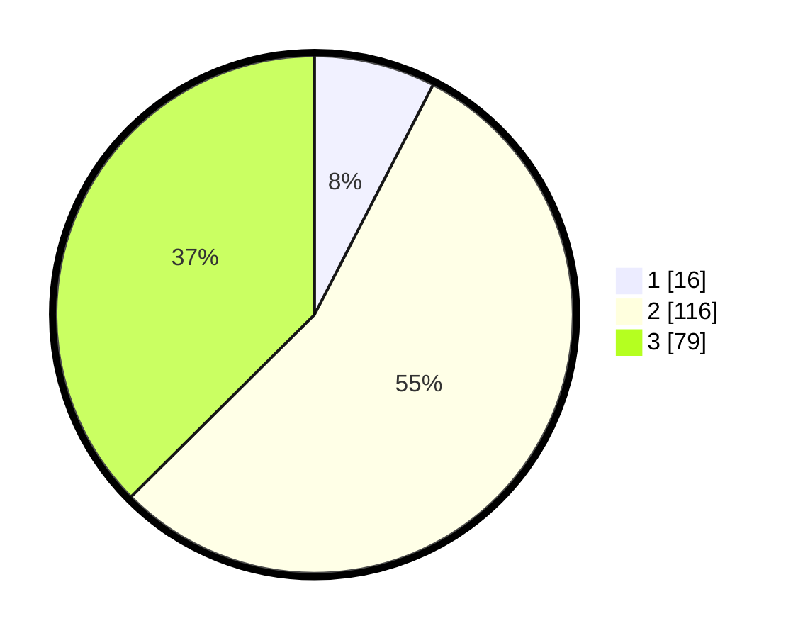

# Hasil

## Grafik

## Tabel

| No. | Nama Paslon    | Suara | Suara (raw) | Persentase |
|:--- |:-------------- | -----:| -----------:| ----------:|
| 1   | ANIES MUHAIMIN | 16    | [16][p-1]   | 7,58       |
| 2   | PRABOWO GIBRAN | 116   | [116][p-2]  | 54,98      |
| 3   | GANJAR MAHFUD  | 79    | [79][p-3]   | 37,44      |

[p-1]: https://github.com/gigit-pemilu/pemilu-2024-51-bali/blob/main/pilpres/hitung-suara/sub/51-bali/sub/01-jembrana/sub/05-jembrana/sub/1001-pendem/sub/008-tps/sub/paslon-1.txt
[p-2]: https://github.com/gigit-pemilu/pemilu-2024-51-bali/blob/main/pilpres/hitung-suara/sub/51-bali/sub/01-jembrana/sub/05-jembrana/sub/1001-pendem/sub/008-tps/sub/paslon-2.txt
[p-3]: https://github.com/gigit-pemilu/pemilu-2024-51-bali/blob/main/pilpres/hitung-suara/sub/51-bali/sub/01-jembrana/sub/05-jembrana/sub/1001-pendem/sub/008-tps/sub/paslon-3.txt

## Foto C Plano

https://sirekap-obj-formc.kpu.go.id/e262/pemilu/ppwp/51/01/05/10/01/5101051001008-20240214-141018--aab0e224-9c91-42a0-a074-da7344b99488.jpg

https://sirekap-obj-formc.kpu.go.id/e262/pemilu/ppwp/51/01/05/10/01/5101051001008-20240214-141023--50215709-c0f1-49c9-aeb6-3e34062268a8.jpg

https://sirekap-obj-formc.kpu.go.id/e262/pemilu/ppwp/51/01/05/10/01/5101051001008-20240214-141027--f0e446a3-3d4c-4659-b651-b6bd347defdb.jpg

## Metadata

| Key        | Value               |
| ---------- | ------------------- |
| Time Stamp | 2024-02-14 21:46:01 |

## DATA PEMILIH TETAP

Jumlah pemilih dalam DPT: **282**.
 * L: **133**.
 * P: **149**.

## DATA PENGGUNA HAK PILIH

Jumlah pengguna hak pilih dalam DPT: **212**.
 * L: **100**.
 * P: **112**.

Jumlah pengguna hak pilih dalam DPTb: **0**.
 * L: **0**.
 * P: **0**.

Jumlah pengguna hak pilih dalam DPK: **2**.
 * L: **1**.
 * P: **1**.

Jumlah pengguna hak pilih: **214**.
 * L: **101**.
 * P: **113**.

## JUMLAH SUARA SAH DAN TIDAK SAH

JUMLAH SELURUH SUARA SAH: **211**.

JUMLAH SUARA TIDAK SAH: **3**.

