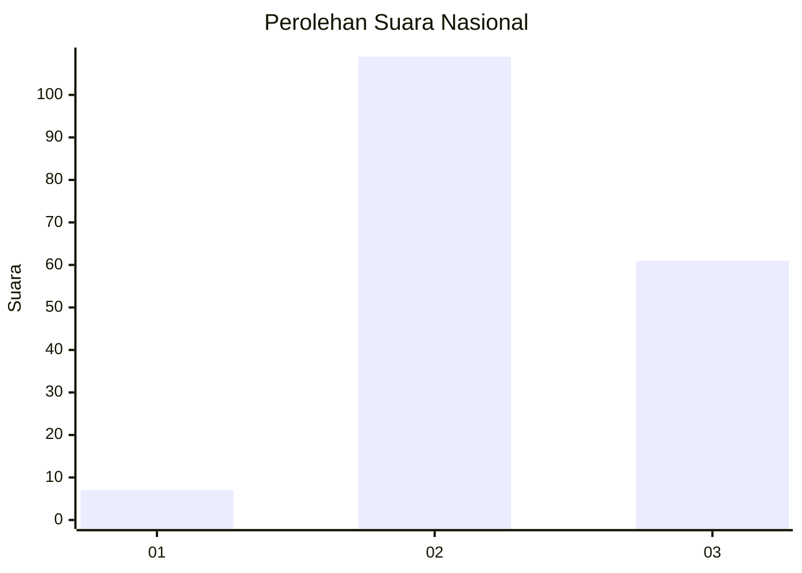
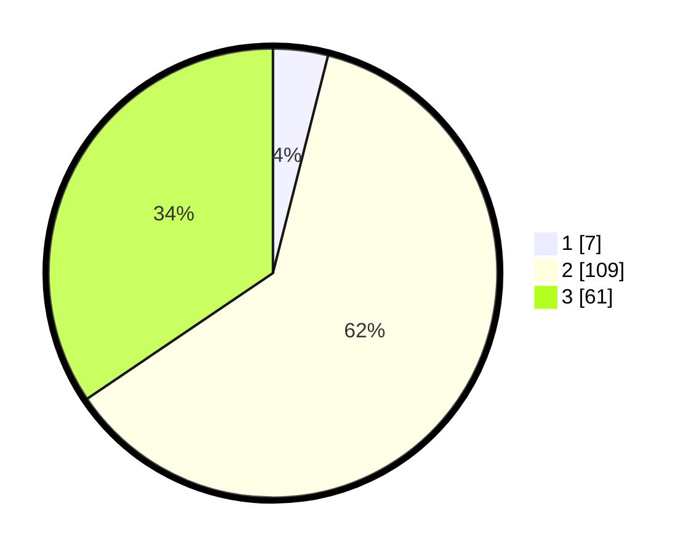

# Hasil

## Grafik

## Tabel

| No. | Nama Paslon    | Suara | Suara (raw) | Persentase |
|:--- |:-------------- | -----:| -----------:| ----------:|
| 1   | ANIES MUHAIMIN | 7     | [7][p-1]    | 3,95       |
| 2   | PRABOWO GIBRAN | 109   | [109][p-2]  | 61,58      |
| 3   | GANJAR MAHFUD  | 61    | [61][p-3]   | 34,46      |

[p-1]: https://github.com/gigit-pemilu/pemilu-2024/blob/main/pilpres/hitung-suara/sub/51-bali/sub/01-jembrana/sub/05-jembrana/sub/1001-pendem/sub/009-tps/sub/paslon-1.txt
[p-2]: https://github.com/gigit-pemilu/pemilu-2024/blob/main/pilpres/hitung-suara/sub/51-bali/sub/01-jembrana/sub/05-jembrana/sub/1001-pendem/sub/009-tps/sub/paslon-2.txt
[p-3]: https://github.com/gigit-pemilu/pemilu-2024/blob/main/pilpres/hitung-suara/sub/51-bali/sub/01-jembrana/sub/05-jembrana/sub/1001-pendem/sub/009-tps/sub/paslon-3.txt

## Foto C Plano

https://sirekap-obj-formc.kpu.go.id/5800/pemilu/ppwp/51/01/05/10/01/5101051001009-20240214-155256--58b5b375-43aa-458c-b39f-efc779e645bb.jpg

https://sirekap-obj-formc.kpu.go.id/5800/pemilu/ppwp/51/01/05/10/01/5101051001009-20240214-155538--4cd12739-aaef-46a6-a638-94dff40945fd.jpg

https://sirekap-obj-formc.kpu.go.id/5800/pemilu/ppwp/51/01/05/10/01/5101051001009-20240214-190535--c99ad996-5469-4c0f-b4ea-0482776b1d7b.jpg

## Metadata

| Key        | Value               |
| ---------- | ------------------- |
| Time Stamp | 2024-02-14 21:46:01 |

## DATA PEMILIH TETAP

Jumlah pemilih dalam DPT: **250**.
 * L: **126**.
 * P: **124**.

## DATA PENGGUNA HAK PILIH

Jumlah pengguna hak pilih dalam DPT: **185**.
 * L: **91**.
 * P: **94**.

Jumlah pengguna hak pilih dalam DPTb: **0**.
 * L: **0**.
 * P: **0**.

Jumlah pengguna hak pilih dalam DPK: **0**.
 * L: **0**.
 * P: **0**.

Jumlah pengguna hak pilih: **185**.
 * L: **91**.
 * P: **94**.

## JUMLAH SUARA SAH DAN TIDAK SAH

JUMLAH SELURUH SUARA SAH: **177**.

JUMLAH SUARA TIDAK SAH: **8**.

JUMLAH SELURUH SUARA SAH DAN SUARA TIDAK SAH: **185**.

