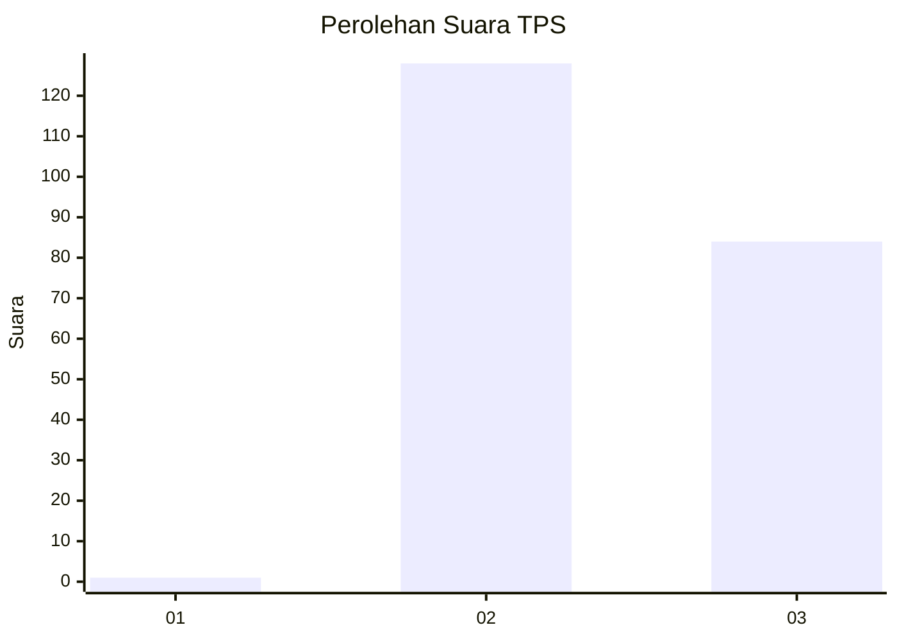
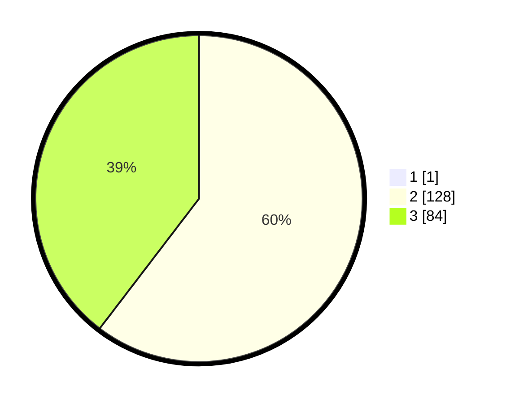

# Hasil

## Grafik

## Tabel

| No. | Nama Paslon    | Suara | Suara (raw) | Persentase |
|:--- |:-------------- | -----:| -----------:| ----------:|
| 1   | ANIES MUHAIMIN | 1     | [1][p-1]    | 0,47       |
| 2   | PRABOWO GIBRAN | 128   | [128][p-2]  | 60,09      |
| 3   | GANJAR MAHFUD  | 84    | [84][p-3]   | 39,44      |

[p-1]: https://github.com/gigit-pemilu/pemilu-2024-51-bali/blob/main/pilpres/hitung-suara/sub/51-bali/sub/01-jembrana/sub/05-jembrana/sub/1001-pendem/sub/010-tps/sub/paslon-1.txt
[p-2]: https://github.com/gigit-pemilu/pemilu-2024-51-bali/blob/main/pilpres/hitung-suara/sub/51-bali/sub/01-jembrana/sub/05-jembrana/sub/1001-pendem/sub/010-tps/sub/paslon-2.txt
[p-3]: https://github.com/gigit-pemilu/pemilu-2024-51-bali/blob/main/pilpres/hitung-suara/sub/51-bali/sub/01-jembrana/sub/05-jembrana/sub/1001-pendem/sub/010-tps/sub/paslon-3.txt

## Foto C Plano

https://sirekap-obj-formc.kpu.go.id/1072/pemilu/ppwp/51/01/05/10/01/5101051001010-20240214-184706--25cb7510-653b-42a3-8f69-7ce7d748e931.jpg

https://sirekap-obj-formc.kpu.go.id/1072/pemilu/ppwp/51/01/05/10/01/5101051001010-20240214-184722--2d571d03-5afa-403a-9f33-123ea393838f.jpg

https://sirekap-obj-formc.kpu.go.id/1072/pemilu/ppwp/51/01/05/10/01/5101051001010-20240214-184733--b131f74d-01fc-40e2-8350-380a97fa0e67.jpg

## Metadata

| Key        | Value               |
| ---------- | ------------------- |
| Time Stamp | 2024-02-14 21:46:01 |

## DATA PEMILIH TETAP

Jumlah pemilih dalam DPT: **294**.
 * L: **154**.
 * P: **140**.

## DATA PENGGUNA HAK PILIH

Jumlah pengguna hak pilih dalam DPT: **222**.
 * L: **121**.
 * P: **101**.

Jumlah pengguna hak pilih dalam DPTb: **0**.
 * L: **0**.
 * P: **0**.

Jumlah pengguna hak pilih dalam DPK: **0**.
 * L: **0**.
 * P: **0**.

Jumlah pengguna hak pilih: **222**.
 * L: **121**.
 * P: **101**.

## JUMLAH SUARA SAH DAN TIDAK SAH

JUMLAH SELURUH SUARA SAH: **213**.

JUMLAH SUARA TIDAK SAH: **9**.

JUMLAH SELURUH SUARA SAH DAN SUARA TIDAK SAH: **222**.

