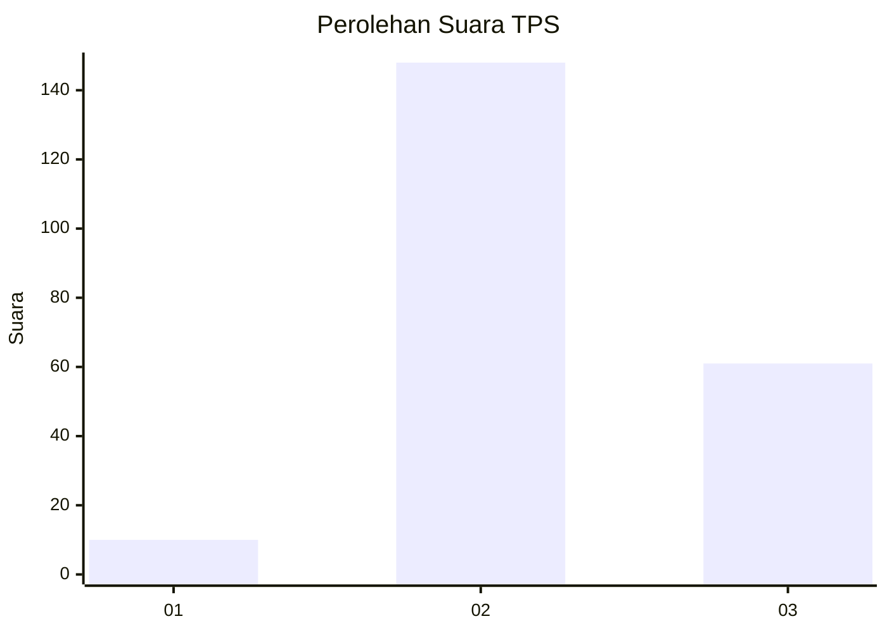
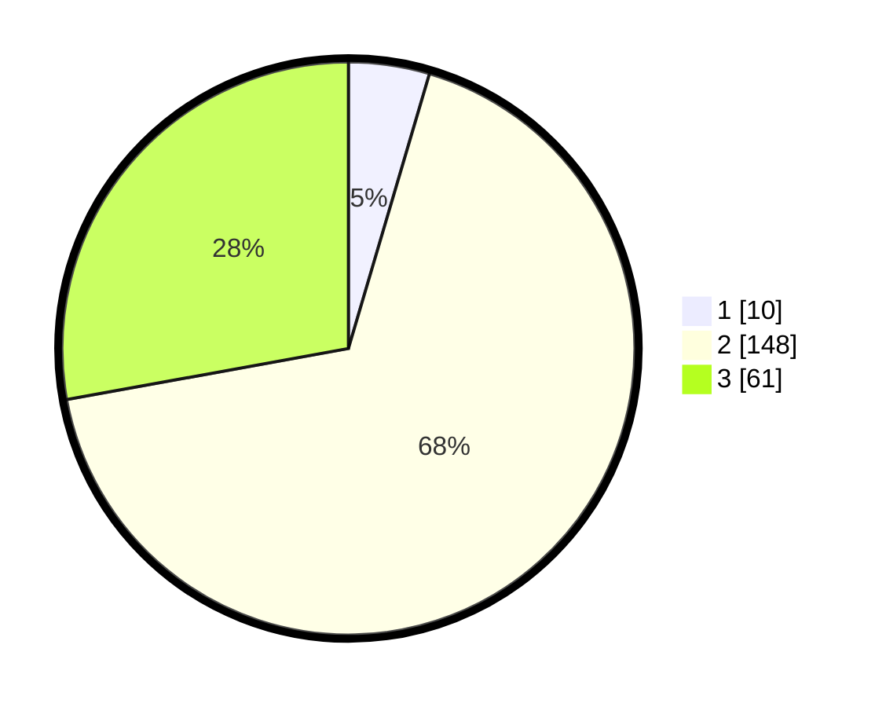

# Hasil

## Grafik

## Tabel

| No. | Nama Paslon    | Suara | Suara (raw) | Persentase |
|:--- |:-------------- | -----:| -----------:| ----------:|
| 1   | ANIES MUHAIMIN | 10    | [10][p-1]   | 4,57       |
| 2   | PRABOWO GIBRAN | 148   | [148][p-2]  | 67,58      |
| 3   | GANJAR MAHFUD  | 61    | [61][p-3]   | 27,85      |

[p-1]: https://github.com/gigit-pemilu/pemilu-2024-51-bali/blob/main/pilpres/hitung-suara/sub/51-bali/sub/01-jembrana/sub/05-jembrana/sub/1001-pendem/sub/012-tps/sub/paslon-1.txt
[p-2]: https://github.com/gigit-pemilu/pemilu-2024-51-bali/blob/main/pilpres/hitung-suara/sub/51-bali/sub/01-jembrana/sub/05-jembrana/sub/1001-pendem/sub/012-tps/sub/paslon-2.txt
[p-3]: https://github.com/gigit-pemilu/pemilu-2024-51-bali/blob/main/pilpres/hitung-suara/sub/51-bali/sub/01-jembrana/sub/05-jembrana/sub/1001-pendem/sub/012-tps/sub/paslon-3.txt

## Foto C Plano

https://sirekap-obj-formc.kpu.go.id/8aa6/pemilu/ppwp/51/01/05/10/01/5101051001012-20240214-185849--a37b12a8-6ff3-4fd3-a1ab-9c1b075a33be.jpg

https://sirekap-obj-formc.kpu.go.id/8aa6/pemilu/ppwp/51/01/05/10/01/5101051001012-20240214-191419--09f30cc7-a2f4-4aee-b2ae-b2f1507f5cbe.jpg

https://sirekap-obj-formc.kpu.go.id/8aa6/pemilu/ppwp/51/01/05/10/01/5101051001012-20240214-191944--b085a6de-cb15-47f4-a1ae-cc054dfb7944.jpg

## Metadata

| Key        | Value               |
| ---------- | ------------------- |
| Time Stamp | 2024-02-14 21:46:01 |

## DATA PEMILIH TETAP

Jumlah pemilih dalam DPT: **284**.
 * L: **127**.
 * P: **157**.

## DATA PENGGUNA HAK PILIH

Jumlah pengguna hak pilih dalam DPT: **221**.
 * L: **95**.
 * P: **126**.

Jumlah pengguna hak pilih dalam DPTb: **0**.
 * L: **0**.
 * P: **0**.

Jumlah pengguna hak pilih dalam DPK: **0**.
 * L: **0**.
 * P: **0**.

Jumlah pengguna hak pilih: **221**.
 * L: **95**.
 * P: **126**.

## JUMLAH SUARA SAH DAN TIDAK SAH

JUMLAH SELURUH SUARA SAH: **219**.

JUMLAH SUARA TIDAK SAH: **2**.

JUMLAH SELURUH SUARA SAH DAN SUARA TIDAK SAH: **221**.

