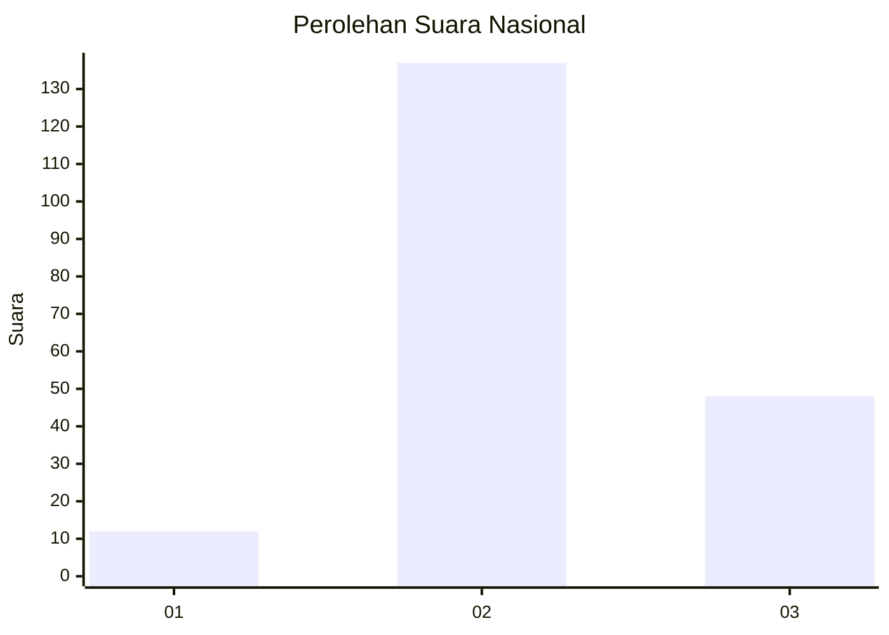
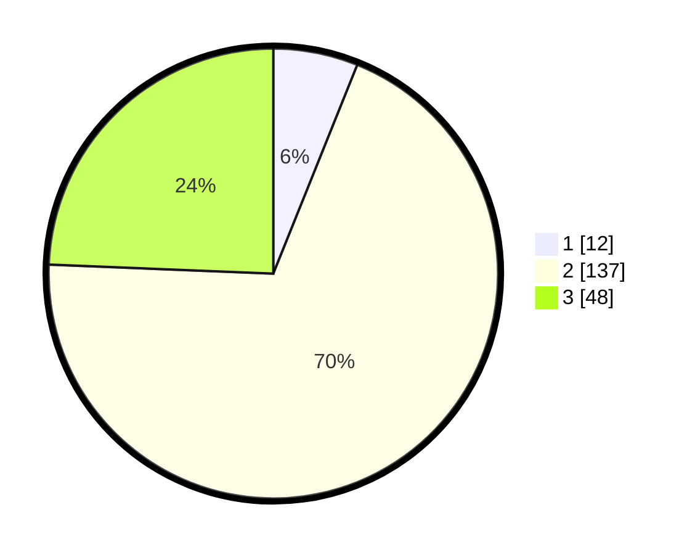

# Hasil

## Grafik

## Tabel

| No. | Nama Paslon    | Suara | Suara (raw) | Persentase |
|:--- |:-------------- | -----:| -----------:| ----------:|
| 1   | ANIES MUHAIMIN | 12    | [12][p-1]   | 6,09       |
| 2   | PRABOWO GIBRAN | 137   | [137][p-2]  | 69,54      |
| 3   | GANJAR MAHFUD  | 48    | [48][p-3]   | 24,37      |

[p-1]: https://github.com/gigit-pemilu/pemilu-2024/blob/main/pilpres/hitung-suara/sub/51-bali/sub/01-jembrana/sub/05-jembrana/sub/1001-pendem/sub/013-tps/sub/paslon-1.txt
[p-2]: https://github.com/gigit-pemilu/pemilu-2024/blob/main/pilpres/hitung-suara/sub/51-bali/sub/01-jembrana/sub/05-jembrana/sub/1001-pendem/sub/013-tps/sub/paslon-2.txt
[p-3]: https://github.com/gigit-pemilu/pemilu-2024/blob/main/pilpres/hitung-suara/sub/51-bali/sub/01-jembrana/sub/05-jembrana/sub/1001-pendem/sub/013-tps/sub/paslon-3.txt

## Foto C Plano

https://sirekap-obj-formc.kpu.go.id/2c9f/pemilu/ppwp/51/01/05/10/01/5101051001013-20240215-033710--2411a84e-7aa5-4d3d-a3d7-bbae55a52d05.jpg

https://sirekap-obj-formc.kpu.go.id/2c9f/pemilu/ppwp/51/01/05/10/01/5101051001013-20240215-034047--502ea3f5-1bbb-4bb7-b673-cd353bc6dba1.jpg

https://sirekap-obj-formc.kpu.go.id/2c9f/pemilu/ppwp/51/01/05/10/01/5101051001013-20240215-034239--6f6f10d0-ff6c-48a4-9465-690bec20ffd7.jpg

## Metadata

| Key        | Value               |
| ---------- | ------------------- |
| Time Stamp | 2024-02-15 16:00:26 |

## DATA PEMILIH TETAP

Jumlah pemilih dalam DPT: **281**.
 * L: **133**.
 * P: **148**.

## DATA PENGGUNA HAK PILIH

Jumlah pengguna hak pilih dalam DPT: **198**.
 * L: **87**.
 * P: **111**.

Jumlah pengguna hak pilih dalam DPTb: **0**.
 * L: **0**.
 * P: **0**.

Jumlah pengguna hak pilih dalam DPK: **3**.
 * L: **1**.
 * P: **2**.

Jumlah pengguna hak pilih: **201**.
 * L: **88**.
 * P: **113**.

## JUMLAH SUARA SAH DAN TIDAK SAH

JUMLAH SELURUH SUARA SAH: **197**.

JUMLAH SUARA TIDAK SAH: **4**.

JUMLAH SELURUH SUARA SAH DAN SUARA TIDAK SAH: **201**.

