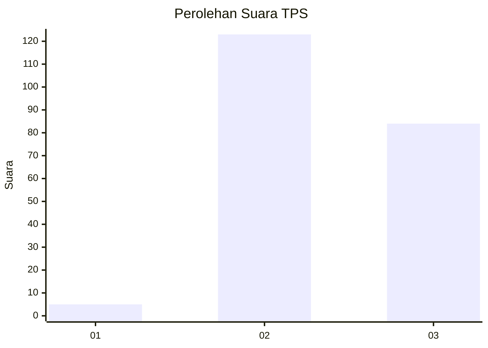
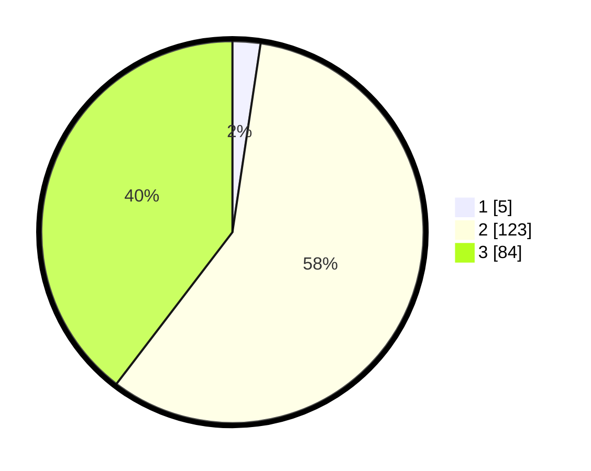

# Hasil

## Grafik

## Tabel

| No. | Nama Paslon    | Suara | Suara (raw) | Persentase |
|:--- |:-------------- | -----:| -----------:| ----------:|
| 1   | ANIES MUHAIMIN | 5     | [5][p-1]    | 2,36       |
| 2   | PRABOWO GIBRAN | 123   | [123][p-2]  | 58,02      |
| 3   | GANJAR MAHFUD  | 84    | [84][p-3]   | 39,62      |

[p-1]: https://github.com/gigit-pemilu/pemilu-2024-51-bali/blob/main/pilpres/hitung-suara/sub/51-bali/sub/01-jembrana/sub/05-jembrana/sub/1001-pendem/sub/018-tps/sub/paslon-1.txt
[p-2]: https://github.com/gigit-pemilu/pemilu-2024-51-bali/blob/main/pilpres/hitung-suara/sub/51-bali/sub/01-jembrana/sub/05-jembrana/sub/1001-pendem/sub/018-tps/sub/paslon-2.txt
[p-3]: https://github.com/gigit-pemilu/pemilu-2024-51-bali/blob/main/pilpres/hitung-suara/sub/51-bali/sub/01-jembrana/sub/05-jembrana/sub/1001-pendem/sub/018-tps/sub/paslon-3.txt

## Foto C Plano

https://sirekap-obj-formc.kpu.go.id/b8cb/pemilu/ppwp/51/01/05/10/01/5101051001018-20240214-184543--3fc2dca1-ede0-4d8f-91e4-e763b8643bbe.jpg

https://sirekap-obj-formc.kpu.go.id/b8cb/pemilu/ppwp/51/01/05/10/01/5101051001018-20240214-223111--38aa167f-a20b-4e34-9608-62e87e7a509f.jpg

https://sirekap-obj-formc.kpu.go.id/b8cb/pemilu/ppwp/51/01/05/10/01/5101051001018-20240214-223245--2adbaefc-50c6-4e9f-8c46-071a92d74307.jpg

## Metadata

| Key        | Value               |
| ---------- | ------------------- |
| Time Stamp | 2024-02-15 15:00:29 |

## DATA PEMILIH TETAP

Jumlah pemilih dalam DPT: **238**.
 * L: **121**.
 * P: **117**.

## DATA PENGGUNA HAK PILIH

Jumlah pengguna hak pilih dalam DPT: **208**.
 * L: **105**.
 * P: **103**.

Jumlah pengguna hak pilih dalam DPTb: **2**.
 * L: **1**.
 * P: **1**.

Jumlah pengguna hak pilih dalam DPK: **5**.
 * L: **4**.
 * P: **1**.

Jumlah pengguna hak pilih: **215**.
 * L: **110**.
 * P: **105**.

## JUMLAH SUARA SAH DAN TIDAK SAH

JUMLAH SELURUH SUARA SAH: **212**.

JUMLAH SUARA TIDAK SAH: **3**.

JUMLAH SELURUH SUARA SAH DAN SUARA TIDAK SAH: **215**.

