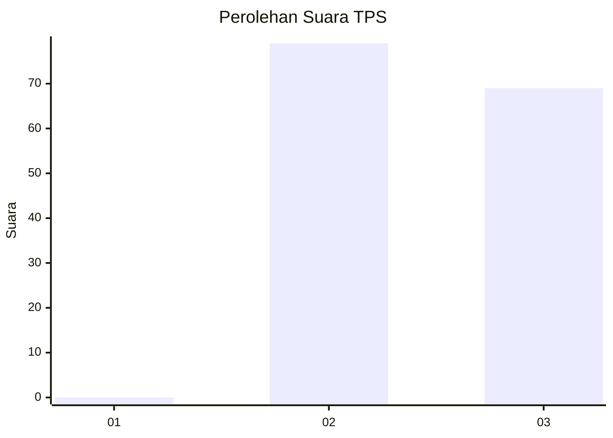
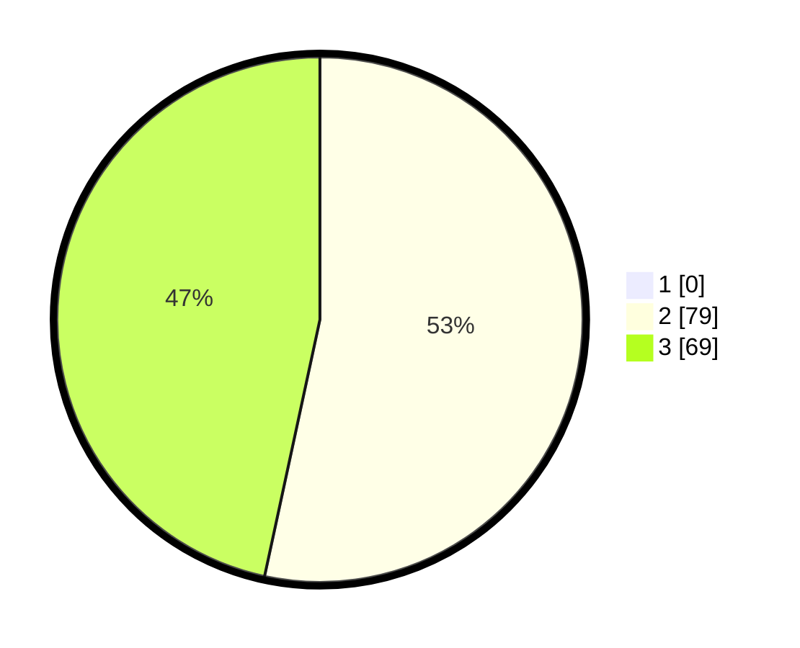

# Hasil

## Grafik

## Tabel

| No. | Nama Paslon    | Suara | Suara (raw) | Persentase |
|:--- |:-------------- | -----:| -----------:| ----------:|
| 1   | ANIES MUHAIMIN | 0     | [0][p-1]    | 0,00       |
| 2   | PRABOWO GIBRAN | 79    | [79][p-2]   | 53,38      |
| 3   | GANJAR MAHFUD  | 69    | [69][p-3]   | 46,62      |

[p-1]: https://github.com/gigit-pemilu/pemilu-2024-51-bali/blob/main/pilpres/hitung-suara/sub/51-bali/sub/01-jembrana/sub/05-jembrana/sub/1001-pendem/sub/026-tps/sub/paslon-1.txt
[p-2]: https://github.com/gigit-pemilu/pemilu-2024-51-bali/blob/main/pilpres/hitung-suara/sub/51-bali/sub/01-jembrana/sub/05-jembrana/sub/1001-pendem/sub/026-tps/sub/paslon-2.txt
[p-3]: https://github.com/gigit-pemilu/pemilu-2024-51-bali/blob/main/pilpres/hitung-suara/sub/51-bali/sub/01-jembrana/sub/05-jembrana/sub/1001-pendem/sub/026-tps/sub/paslon-3.txt

## Foto C Plano

https://sirekap-obj-formc.kpu.go.id/faa4/pemilu/ppwp/51/01/05/10/01/5101051001026-20240214-235425--66b59218-3437-486f-b236-9760524e06ac.jpg

https://sirekap-obj-formc.kpu.go.id/faa4/pemilu/ppwp/51/01/05/10/01/5101051001026-20240214-235147--d6256b60-b1b4-46cb-ac5a-0352703bb18d.jpg

https://sirekap-obj-formc.kpu.go.id/faa4/pemilu/ppwp/51/01/05/10/01/5101051001026-20240214-235317--ecda78e6-3aca-421b-9ff1-69533198f89c.jpg

## Metadata

| Key        | Value               |
| ---------- | ------------------- |
| Time Stamp | 2024-02-15 12:00:28 |

## DATA PEMILIH TETAP

Jumlah pemilih dalam DPT: **165**.
 * L: **84**.
 * P: **81**.

## DATA PENGGUNA HAK PILIH

Jumlah pengguna hak pilih dalam DPT: **149**.
 * L: **76**.
 * P: **73**.

Jumlah pengguna hak pilih dalam DPTb: **0**.
 * L: **0**.
 * P: **0**.

Jumlah pengguna hak pilih dalam DPK: **0**.
 * L: **0**.
 * P: **0**.

Jumlah pengguna hak pilih: **149**.
 * L: **76**.
 * P: **73**.

## JUMLAH SUARA SAH DAN TIDAK SAH

JUMLAH SELURUH SUARA SAH: **148**.

JUMLAH SUARA TIDAK SAH: **1**.

JUMLAH SELURUH SUARA SAH DAN SUARA TIDAK SAH: **149**.

