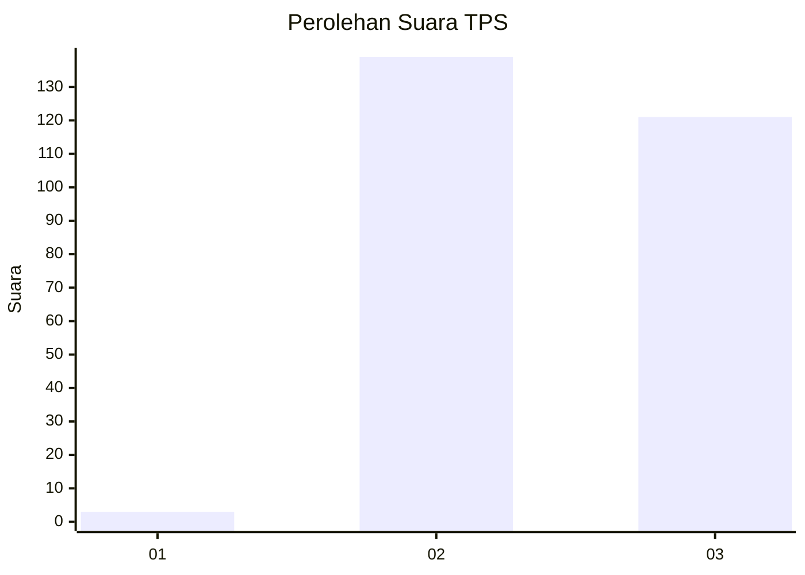
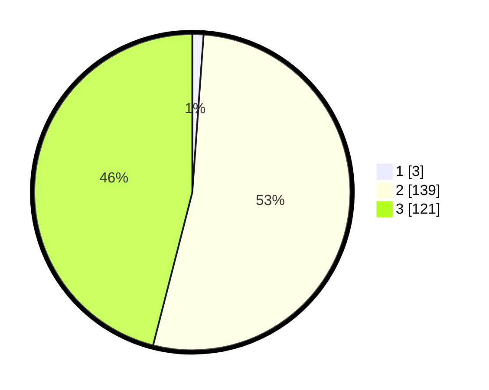

# Hasil

## Grafik

## Tabel

| No. | Nama Paslon    | Suara | Suara (raw) | Persentase |
|:--- |:-------------- | -----:| -----------:| ----------:|
| 1   | ANIES MUHAIMIN | 3     | [3][p-1]    | 1,14       |
| 2   | PRABOWO GIBRAN | 139   | [139][p-2]  | 52,85      |
| 3   | GANJAR MAHFUD  | 121   | [121][p-3]  | 46,01      |

[p-1]: https://github.com/gigit-pemilu/pemilu-2024-51-bali/blob/main/pilpres/hitung-suara/sub/51-bali/sub/01-jembrana/sub/05-jembrana/sub/1001-pendem/sub/029-tps/sub/paslon-1.txt
[p-2]: https://github.com/gigit-pemilu/pemilu-2024-51-bali/blob/main/pilpres/hitung-suara/sub/51-bali/sub/01-jembrana/sub/05-jembrana/sub/1001-pendem/sub/029-tps/sub/paslon-2.txt
[p-3]: https://github.com/gigit-pemilu/pemilu-2024-51-bali/blob/main/pilpres/hitung-suara/sub/51-bali/sub/01-jembrana/sub/05-jembrana/sub/1001-pendem/sub/029-tps/sub/paslon-3.txt

## Foto C Plano

https://sirekap-obj-formc.kpu.go.id/193e/pemilu/ppwp/51/01/05/10/01/5101051001029-20240214-141506--8e0b8b8c-ea5e-4690-b998-30cc1daa82fe.jpg

https://sirekap-obj-formc.kpu.go.id/193e/pemilu/ppwp/51/01/05/10/01/5101051001029-20240214-224143--54993a64-9226-44d0-9388-a0e9f3dfc668.jpg

https://sirekap-obj-formc.kpu.go.id/193e/pemilu/ppwp/51/01/05/10/01/5101051001029-20240214-224252--f727f78b-486e-46cf-9cfc-d4d3133b11bf.jpg

## Metadata

| Key        | Value               |
| ---------- | ------------------- |
| Time Stamp | 2024-02-15 16:00:26 |

