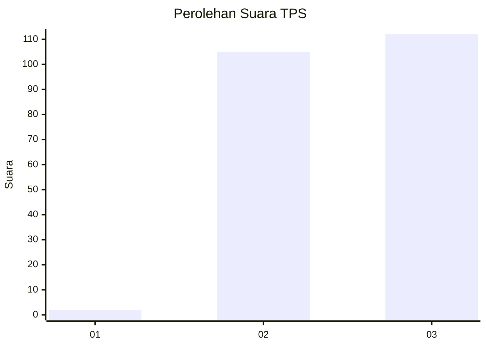
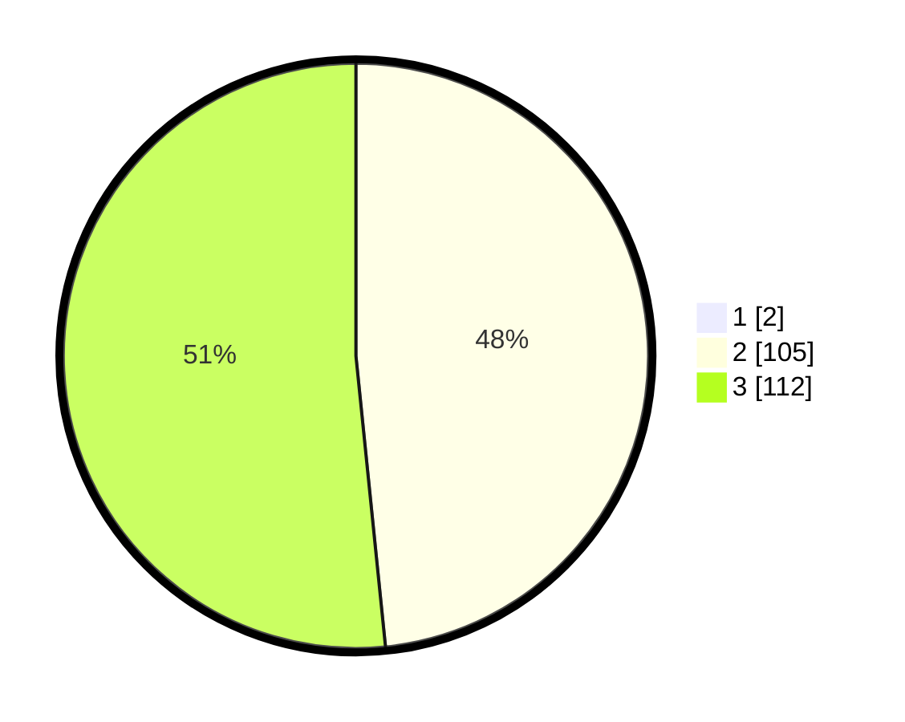

# Hasil

## Grafik

## Tabel

| No. | Nama Paslon    | Suara | Suara (raw) | Persentase |
|:--- |:-------------- | -----:| -----------:| ----------:|
| 1   | ANIES MUHAIMIN | 2     | [2][p-1]    | 0,91       |
| 2   | PRABOWO GIBRAN | 105   | [105][p-2]  | 47,95      |
| 3   | GANJAR MAHFUD  | 112   | [112][p-3]  | 51,14      |

[p-1]: https://github.com/gigit-pemilu/pemilu-2024-51-bali/blob/main/pilpres/hitung-suara/sub/51-bali/sub/01-jembrana/sub/05-jembrana/sub/1001-pendem/sub/030-tps/sub/paslon-1.txt
[p-2]: https://github.com/gigit-pemilu/pemilu-2024-51-bali/blob/main/pilpres/hitung-suara/sub/51-bali/sub/01-jembrana/sub/05-jembrana/sub/1001-pendem/sub/030-tps/sub/paslon-2.txt
[p-3]: https://github.com/gigit-pemilu/pemilu-2024-51-bali/blob/main/pilpres/hitung-suara/sub/51-bali/sub/01-jembrana/sub/05-jembrana/sub/1001-pendem/sub/030-tps/sub/paslon-3.txt

## Foto C Plano

https://sirekap-obj-formc.kpu.go.id/cfb0/pemilu/ppwp/51/01/05/10/01/5101051001030-20240214-141423--ca95e07a-f2e7-4db1-815d-dcd7c71cf954.jpg

https://sirekap-obj-formc.kpu.go.id/cfb0/pemilu/ppwp/51/01/05/10/01/5101051001030-20240214-141048--4e778721-e1f2-4ace-8ed5-e70c38d85f19.jpg

https://sirekap-obj-formc.kpu.go.id/cfb0/pemilu/ppwp/51/01/05/10/01/5101051001030-20240214-141151--e4d104a9-3f23-4ae3-a5af-9dadadf28c51.jpg

## Metadata

| Key        | Value               |
| ---------- | ------------------- |
| Time Stamp | 2024-02-14 21:46:01 |

## DATA PEMILIH TETAP

Jumlah pemilih dalam DPT: **243**.
 * L: **122**.
 * P: **121**.

## DATA PENGGUNA HAK PILIH

Jumlah pengguna hak pilih dalam DPT: **224**.
 * L: **114**.
 * P: **110**.

Jumlah pengguna hak pilih dalam DPTb: **0**.
 * L: **0**.
 * P: **0**.

Jumlah pengguna hak pilih dalam DPK: **0**.
 * L: **0**.
 * P: **0**.

Jumlah pengguna hak pilih: **224**.
 * L: **114**.
 * P: **110**.

## JUMLAH SUARA SAH DAN TIDAK SAH

JUMLAH SELURUH SUARA SAH: **219**.

JUMLAH SUARA TIDAK SAH: **5**.

