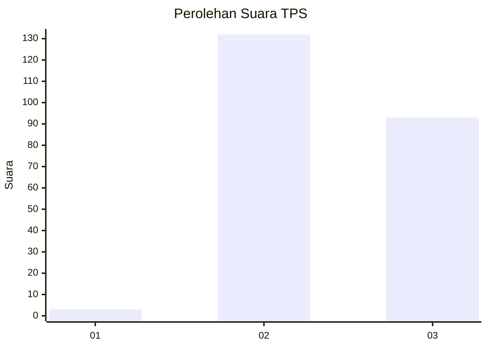
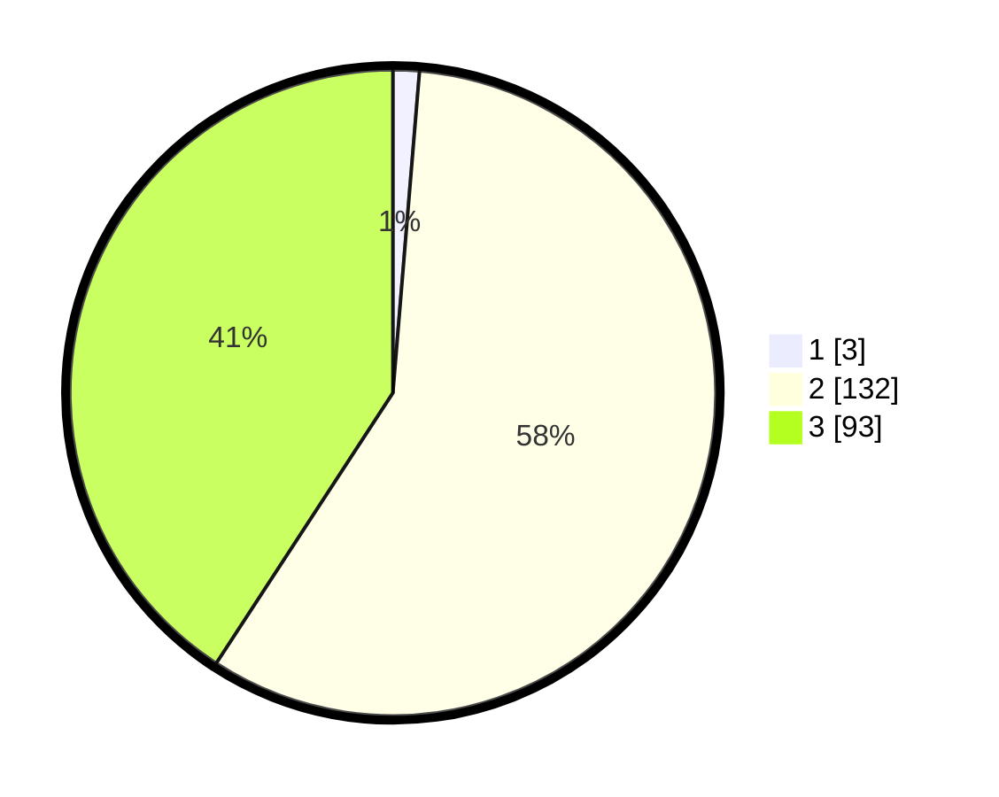

# Hasil

## Grafik

## Tabel

| No. | Nama Paslon    | Suara | Suara (raw) | Persentase |
|:--- |:-------------- | -----:| -----------:| ----------:|
| 1   | ANIES MUHAIMIN | 3     | [3][p-1]    | 1,32       |
| 2   | PRABOWO GIBRAN | 132   | [132][p-2]  | 57,89      |
| 3   | GANJAR MAHFUD  | 93    | [93][p-3]   | 40,79      |

[p-1]: https://github.com/gigit-pemilu/pemilu-2024-51-bali/blob/main/pilpres/hitung-suara/sub/51-bali/sub/01-jembrana/sub/05-jembrana/sub/1001-pendem/sub/032-tps/sub/paslon-1.txt
[p-2]: https://github.com/gigit-pemilu/pemilu-2024-51-bali/blob/main/pilpres/hitung-suara/sub/51-bali/sub/01-jembrana/sub/05-jembrana/sub/1001-pendem/sub/032-tps/sub/paslon-2.txt
[p-3]: https://github.com/gigit-pemilu/pemilu-2024-51-bali/blob/main/pilpres/hitung-suara/sub/51-bali/sub/01-jembrana/sub/05-jembrana/sub/1001-pendem/sub/032-tps/sub/paslon-3.txt

## Foto C Plano

https://sirekap-obj-formc.kpu.go.id/3e3f/pemilu/ppwp/51/01/05/10/01/5101051001032-20240214-221236--a2da04a6-5c5b-48d1-a61c-6edf025c635e.jpg

https://sirekap-obj-formc.kpu.go.id/3e3f/pemilu/ppwp/51/01/05/10/01/5101051001032-20240214-221441--7552a210-3a72-48b4-b9e8-b0f24fedf89e.jpg

https://sirekap-obj-formc.kpu.go.id/3e3f/pemilu/ppwp/51/01/05/10/01/5101051001032-20240214-221923--77f975f6-7e89-4329-9281-8ab0c3af3f74.jpg

## Metadata

| Key        | Value               |
| ---------- | ------------------- |
| Time Stamp | 2024-02-15 09:00:24 |

## DATA PEMILIH TETAP

Jumlah pemilih dalam DPT: **255**.
 * L: **124**.
 * P: **131**.

## DATA PENGGUNA HAK PILIH

Jumlah pengguna hak pilih dalam DPT: **231**.
 * L: **117**.
 * P: **114**.

Jumlah pengguna hak pilih dalam DPTb: **0**.
 * L: **0**.
 * P: **0**.

Jumlah pengguna hak pilih dalam DPK: **0**.
 * L: **0**.
 * P: **0**.

Jumlah pengguna hak pilih: **231**.
 * L: **117**.
 * P: **114**.

## JUMLAH SUARA SAH DAN TIDAK SAH

JUMLAH SELURUH SUARA SAH: **228**.

JUMLAH SUARA TIDAK SAH: **3**.

JUMLAH SELURUH SUARA SAH DAN SUARA TIDAK SAH: **231**.

