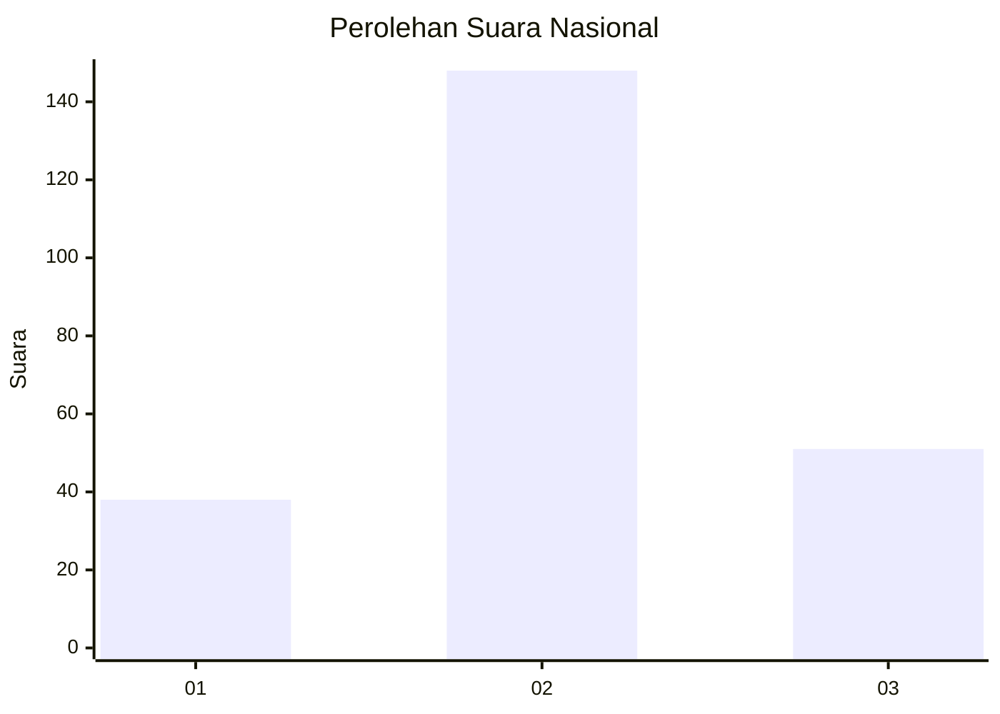
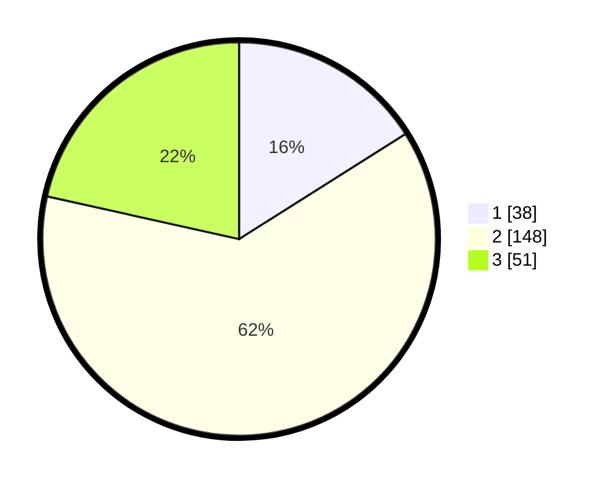

# Hasil

## Grafik

## Tabel

| No. | Nama Paslon    | Suara | Suara (raw) | Persentase |
|:--- |:-------------- | -----:| -----------:| ----------:|
| 1   | ANIES MUHAIMIN | 38    | [38][p-1]   | 16,03      |
| 2   | PRABOWO GIBRAN | 148   | [148][p-2]  | 62,45      |
| 3   | GANJAR MAHFUD  | 51    | [51][p-3]   | 21,52      |

[p-1]: https://github.com/gigit-pemilu/pemilu-2024/blob/main/pilpres/hitung-suara/sub/51-bali/sub/01-jembrana/sub/05-jembrana/sub/1003-loloan-timur/sub/002-tps/sub/paslon-1.txt
[p-2]: https://github.com/gigit-pemilu/pemilu-2024/blob/main/pilpres/hitung-suara/sub/51-bali/sub/01-jembrana/sub/05-jembrana/sub/1003-loloan-timur/sub/002-tps/sub/paslon-2.txt
[p-3]: https://github.com/gigit-pemilu/pemilu-2024/blob/main/pilpres/hitung-suara/sub/51-bali/sub/01-jembrana/sub/05-jembrana/sub/1003-loloan-timur/sub/002-tps/sub/paslon-3.txt

## Foto C Plano

https://sirekap-obj-formc.kpu.go.id/0898/pemilu/ppwp/51/01/05/10/03/5101051003002-20240214-192644--8a66bfd8-bcb0-4c3c-aca0-a093145d91b1.jpg

https://sirekap-obj-formc.kpu.go.id/0898/pemilu/ppwp/51/01/05/10/03/5101051003002-20240214-192838--51498f6c-44f5-4366-8697-281930dd8117.jpg

https://sirekap-obj-formc.kpu.go.id/0898/pemilu/ppwp/51/01/05/10/03/5101051003002-20240214-192924--25849908-116d-4d1b-b051-7bb1b2e7e444.jpg

## Metadata

| Key        | Value               |
| ---------- | ------------------- |
| Time Stamp | 2024-02-14 21:46:01 |

## DATA PEMILIH TETAP

Jumlah pemilih dalam DPT: **287**.
 * L: **134**.
 * P: **153**.

## DATA PENGGUNA HAK PILIH

Jumlah pengguna hak pilih dalam DPT: **225**.
 * L: **102**.
 * P: **123**.

Jumlah pengguna hak pilih dalam DPTb: **16**.
 * L: **10**.
 * P: **6**.

Jumlah pengguna hak pilih dalam DPK: **0**.
 * L: **0**.
 * P: **0**.

Jumlah pengguna hak pilih: **241**.
 * L: **112**.
 * P: **129**.

## JUMLAH SUARA SAH DAN TIDAK SAH

JUMLAH SELURUH SUARA SAH: **237**.

JUMLAH SUARA TIDAK SAH: **4**.

JUMLAH SELURUH SUARA SAH DAN SUARA TIDAK SAH: **241**.

