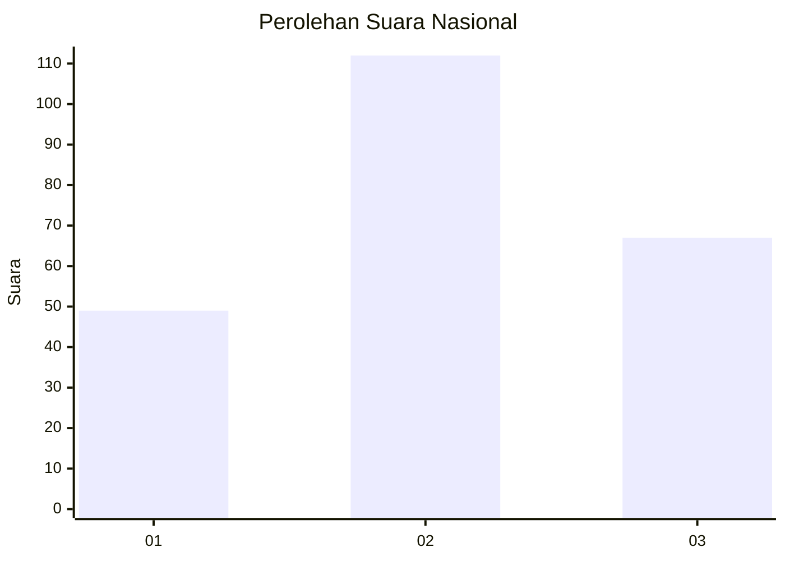
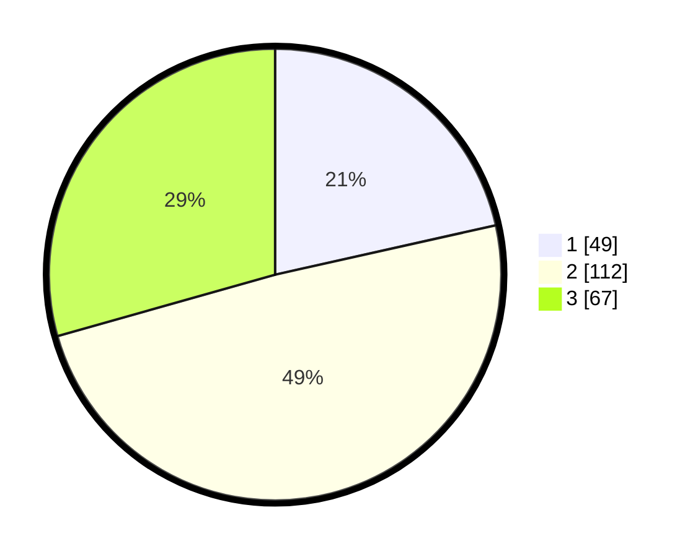

# Hasil

## Grafik

## Tabel

| No. | Nama Paslon    | Suara | Suara (raw) | Persentase |
|:--- |:-------------- | -----:| -----------:| ----------:|
| 1   | ANIES MUHAIMIN | 49    | [49][p-1]   | 21,49      |
| 2   | PRABOWO GIBRAN | 112   | [112][p-2]  | 49,12      |
| 3   | GANJAR MAHFUD  | 67    | [67][p-3]   | 29,39      |

[p-1]: https://github.com/gigit-pemilu/pemilu-2024/blob/main/pilpres/hitung-suara/sub/51-bali/sub/01-jembrana/sub/05-jembrana/sub/1003-loloan-timur/sub/003-tps/sub/paslon-1.txt
[p-2]: https://github.com/gigit-pemilu/pemilu-2024/blob/main/pilpres/hitung-suara/sub/51-bali/sub/01-jembrana/sub/05-jembrana/sub/1003-loloan-timur/sub/003-tps/sub/paslon-2.txt
[p-3]: https://github.com/gigit-pemilu/pemilu-2024/blob/main/pilpres/hitung-suara/sub/51-bali/sub/01-jembrana/sub/05-jembrana/sub/1003-loloan-timur/sub/003-tps/sub/paslon-3.txt

## Foto C Plano

https://sirekap-obj-formc.kpu.go.id/6d18/pemilu/ppwp/51/01/05/10/03/5101051003003-20240214-225217--74b789f3-e21d-4610-9b45-517764c4686e.jpg

https://sirekap-obj-formc.kpu.go.id/6d18/pemilu/ppwp/51/01/05/10/03/5101051003003-20240214-200943--1bb7c1ee-1e24-461b-ba75-5f64e992469d.jpg

https://sirekap-obj-formc.kpu.go.id/6d18/pemilu/ppwp/51/01/05/10/03/5101051003003-20240214-200950--8cdfe439-c53a-4171-9608-7777be1b37af.jpg

## Metadata

| Key        | Value               |
| ---------- | ------------------- |
| Time Stamp | 2024-02-15 09:00:24 |

## DATA PEMILIH TETAP

Jumlah pemilih dalam DPT: **279**.
 * L: **136**.
 * P: **143**.

## DATA PENGGUNA HAK PILIH

Jumlah pengguna hak pilih dalam DPT: **225**.
 * L: **117**.
 * P: **108**.

Jumlah pengguna hak pilih dalam DPTb: **10**.
 * L: **9**.
 * P: **1**.

Jumlah pengguna hak pilih dalam DPK: **0**.
 * L: **0**.
 * P: **0**.

Jumlah pengguna hak pilih: **235**.
 * L: **125**.
 * P: **110**.

## JUMLAH SUARA SAH DAN TIDAK SAH

JUMLAH SELURUH SUARA SAH: **228**.

JUMLAH SUARA TIDAK SAH: **7**.

JUMLAH SELURUH SUARA SAH DAN SUARA TIDAK SAH: **235**.

