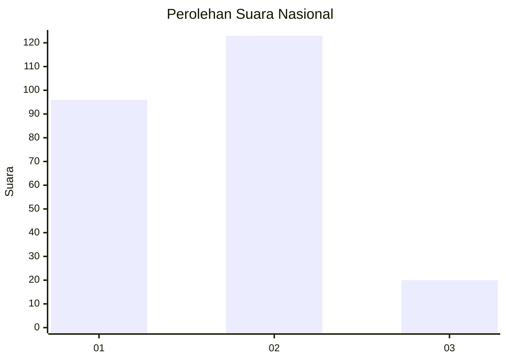
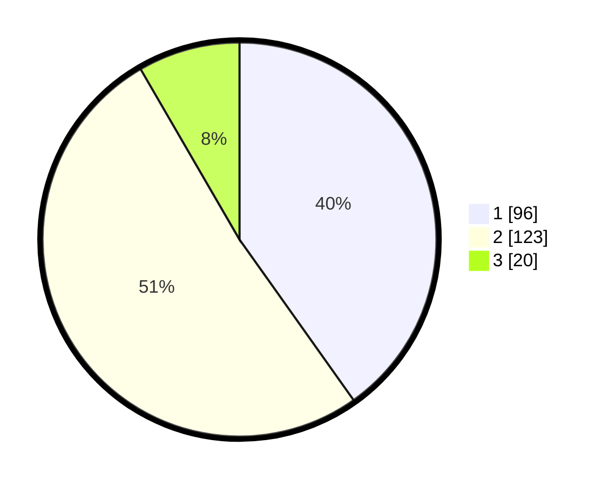

# Hasil

## Grafik

## Tabel

| No. | Nama Paslon    | Suara | Suara (raw) | Persentase |
|:--- |:-------------- | -----:| -----------:| ----------:|
| 1   | ANIES MUHAIMIN | 96    | [96][p-1]   | 40,17      |
| 2   | PRABOWO GIBRAN | 123   | [123][p-2]  | 51,46      |
| 3   | GANJAR MAHFUD  | 20    | [20][p-3]   | 8,37       |

[p-1]: https://github.com/gigit-pemilu/pemilu-2024/blob/main/pilpres/hitung-suara/sub/51-bali/sub/01-jembrana/sub/05-jembrana/sub/1003-loloan-timur/sub/011-tps/sub/paslon-1.txt
[p-2]: https://github.com/gigit-pemilu/pemilu-2024/blob/main/pilpres/hitung-suara/sub/51-bali/sub/01-jembrana/sub/05-jembrana/sub/1003-loloan-timur/sub/011-tps/sub/paslon-2.txt
[p-3]: https://github.com/gigit-pemilu/pemilu-2024/blob/main/pilpres/hitung-suara/sub/51-bali/sub/01-jembrana/sub/05-jembrana/sub/1003-loloan-timur/sub/011-tps/sub/paslon-3.txt

## Foto C Plano

https://sirekap-obj-formc.kpu.go.id/a6d6/pemilu/ppwp/51/01/05/10/03/5101051003011-20240214-140941--70285e9b-90db-4892-a7e8-2641fd4fbfad.jpg

https://sirekap-obj-formc.kpu.go.id/a6d6/pemilu/ppwp/51/01/05/10/03/5101051003011-20240214-141055--c0f68869-5b3b-472b-89d1-e3a1719a4a49.jpg

https://sirekap-obj-formc.kpu.go.id/a6d6/pemilu/ppwp/51/01/05/10/03/5101051003011-20240214-141714--1904d55a-31bf-40ac-8bd5-4b67fd868dd3.jpg

## Metadata

| Key        | Value               |
| ---------- | ------------------- |
| Time Stamp | 2024-02-14 21:46:01 |

## DATA PEMILIH TETAP

Jumlah pemilih dalam DPT: **288**.
 * L: **147**.
 * P: **141**.

## DATA PENGGUNA HAK PILIH

Jumlah pengguna hak pilih dalam DPT: **227**.
 * L: **116**.
 * P: **111**.

Jumlah pengguna hak pilih dalam DPTb: **0**.
 * L: **0**.
 * P: **0**.

Jumlah pengguna hak pilih dalam DPK: **14**.
 * L: **7**.
 * P: **7**.

Jumlah pengguna hak pilih: **241**.
 * L: **123**.
 * P: **118**.

## JUMLAH SUARA SAH DAN TIDAK SAH

