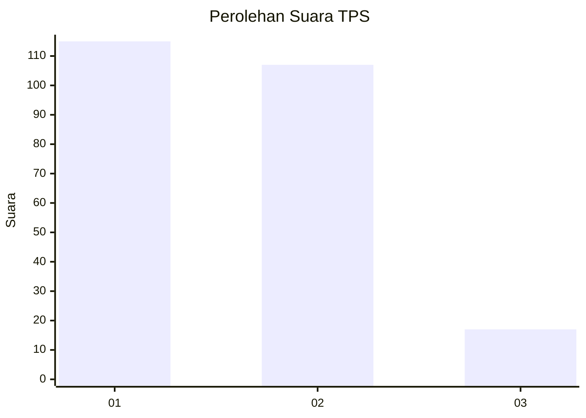
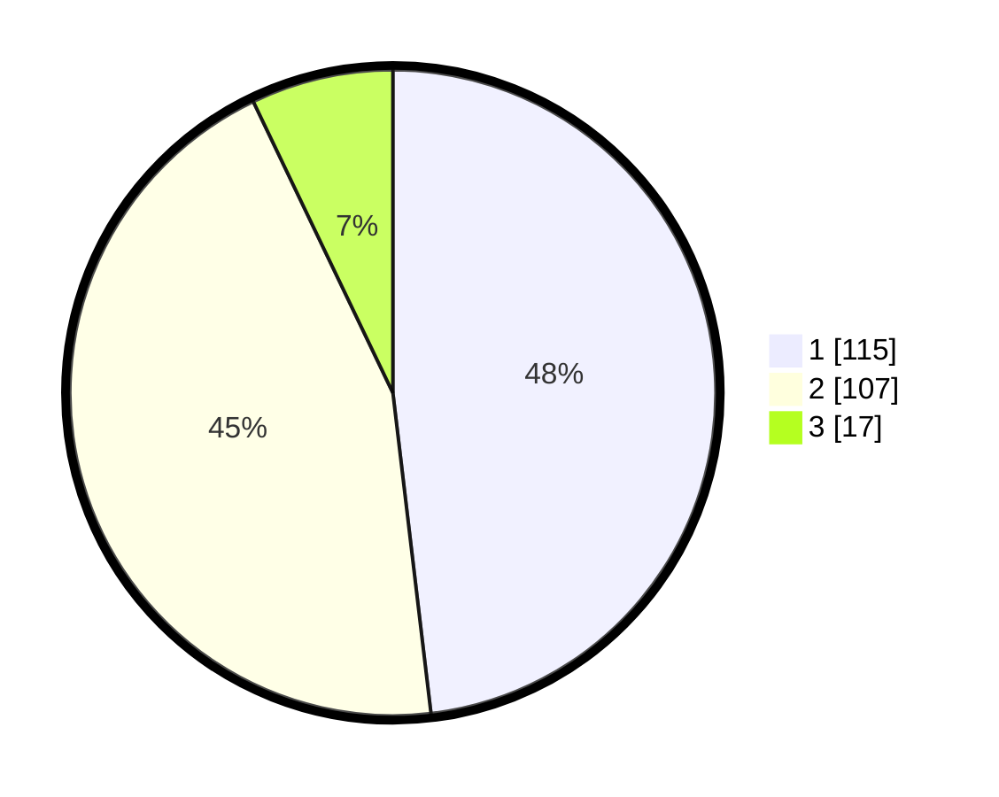

# Hasil

## Grafik

## Tabel

| No. | Nama Paslon    | Suara | Suara (raw) | Persentase |
|:--- |:-------------- | -----:| -----------:| ----------:|
| 1   | ANIES MUHAIMIN | 115   | [115][p-1]  | 48,12      |
| 2   | PRABOWO GIBRAN | 107   | [107][p-2]  | 44,77      |
| 3   | GANJAR MAHFUD  | 17    | [17][p-3]   | 7,11       |

[p-1]: https://github.com/gigit-pemilu/pemilu-2024-51-bali/blob/main/pilpres/hitung-suara/sub/51-bali/sub/01-jembrana/sub/05-jembrana/sub/1003-loloan-timur/sub/012-tps/sub/paslon-1.txt
[p-2]: https://github.com/gigit-pemilu/pemilu-2024-51-bali/blob/main/pilpres/hitung-suara/sub/51-bali/sub/01-jembrana/sub/05-jembrana/sub/1003-loloan-timur/sub/012-tps/sub/paslon-2.txt
[p-3]: https://github.com/gigit-pemilu/pemilu-2024-51-bali/blob/main/pilpres/hitung-suara/sub/51-bali/sub/01-jembrana/sub/05-jembrana/sub/1003-loloan-timur/sub/012-tps/sub/paslon-3.txt

## Foto C Plano

https://sirekap-obj-formc.kpu.go.id/84a0/pemilu/ppwp/51/01/05/10/03/5101051003012-20240214-155054--b5fc3e7e-cfe5-44b3-899d-418fb5d7bb94.jpg

https://sirekap-obj-formc.kpu.go.id/84a0/pemilu/ppwp/51/01/05/10/03/5101051003012-20240214-155908--3ae86382-5e51-40de-9385-9aa57906a7d3.jpg

https://sirekap-obj-formc.kpu.go.id/84a0/pemilu/ppwp/51/01/05/10/03/5101051003012-20240214-155141--c08c68a8-f545-449b-8965-696dc596c3ad.jpg

## Metadata

| Key        | Value               |
| ---------- | ------------------- |
| Time Stamp | 2024-02-14 21:46:01 |

## DATA PEMILIH TETAP

Jumlah pemilih dalam DPT: **275**.
 * L: **114**.
 * P: **161**.

## DATA PENGGUNA HAK PILIH

Jumlah pengguna hak pilih dalam DPT: **230**.
 * L: **110**.
 * P: **120**.

Jumlah pengguna hak pilih dalam DPTb: **0**.
 * L: **0**.
 * P: **0**.

Jumlah pengguna hak pilih dalam DPK: **10**.
 * L: **6**.
 * P: **4**.

Jumlah pengguna hak pilih: **240**.
 * L: **116**.
 * P: **124**.

## JUMLAH SUARA SAH DAN TIDAK SAH

JUMLAH SELURUH SUARA SAH: **239**.

JUMLAH SUARA TIDAK SAH: **1**.

