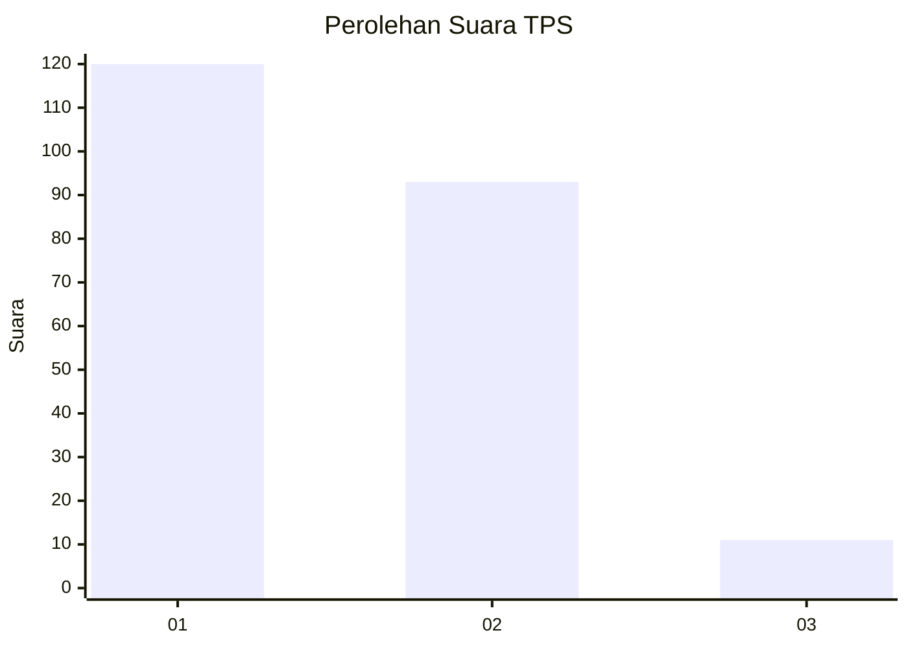
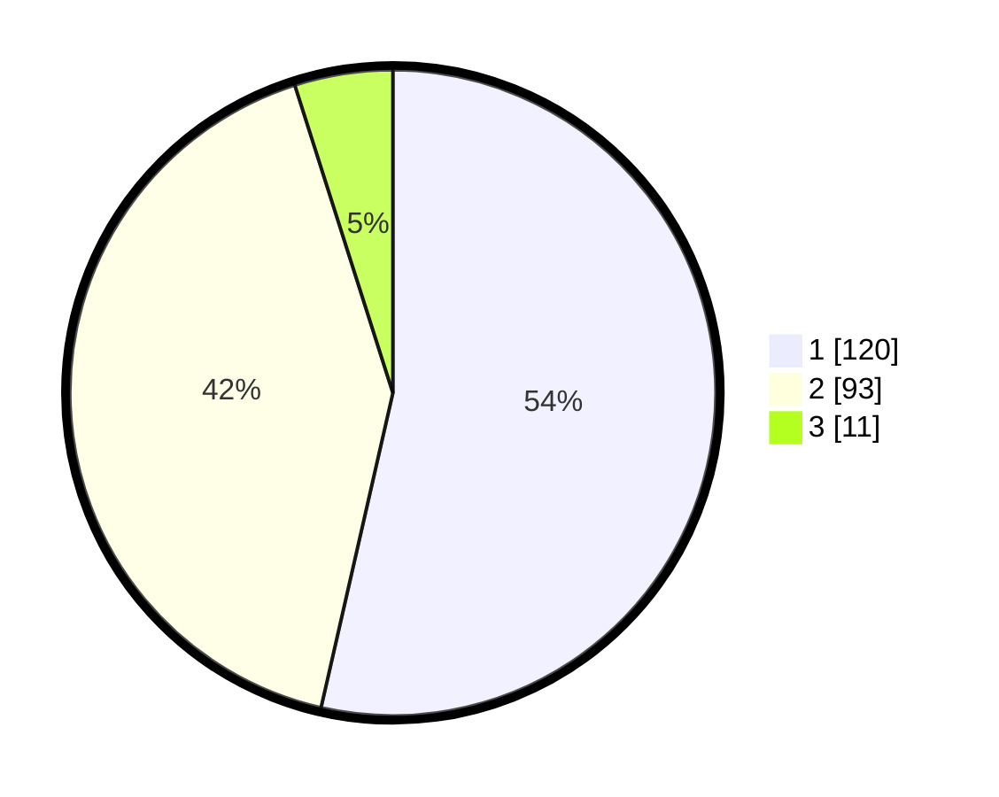

# Hasil

## Grafik

## Tabel

| No. | Nama Paslon    | Suara | Suara (raw) | Persentase |
|:--- |:-------------- | -----:| -----------:| ----------:|
| 1   | ANIES MUHAIMIN | 120   | [120][p-1]  | 53,57      |
| 2   | PRABOWO GIBRAN | 93    | [93][p-2]   | 41,52      |
| 3   | GANJAR MAHFUD  | 11    | [11][p-3]   | 4,91       |

[p-1]: https://github.com/gigit-pemilu/pemilu-2024-51-bali/blob/main/pilpres/hitung-suara/sub/51-bali/sub/01-jembrana/sub/05-jembrana/sub/1003-loloan-timur/sub/013-tps/sub/paslon-1.txt
[p-2]: https://github.com/gigit-pemilu/pemilu-2024-51-bali/blob/main/pilpres/hitung-suara/sub/51-bali/sub/01-jembrana/sub/05-jembrana/sub/1003-loloan-timur/sub/013-tps/sub/paslon-2.txt
[p-3]: https://github.com/gigit-pemilu/pemilu-2024-51-bali/blob/main/pilpres/hitung-suara/sub/51-bali/sub/01-jembrana/sub/05-jembrana/sub/1003-loloan-timur/sub/013-tps/sub/paslon-3.txt

## Foto C Plano

https://sirekap-obj-formc.kpu.go.id/d160/pemilu/ppwp/51/01/05/10/03/5101051003013-20240214-214539--ff6ee789-f136-40e2-9bdd-c15fd26683b4.jpg

https://sirekap-obj-formc.kpu.go.id/d160/pemilu/ppwp/51/01/05/10/03/5101051003013-20240214-185906--d89ab9b6-2109-4861-ac05-73c3a1c1813a.jpg

https://sirekap-obj-formc.kpu.go.id/d160/pemilu/ppwp/51/01/05/10/03/5101051003013-20240214-185942--410f5474-f6aa-4bdc-bb9e-0c6a506ccde7.jpg

## Metadata

| Key        | Value               |
| ---------- | ------------------- |
| Time Stamp | 2024-02-15 20:00:44 |

