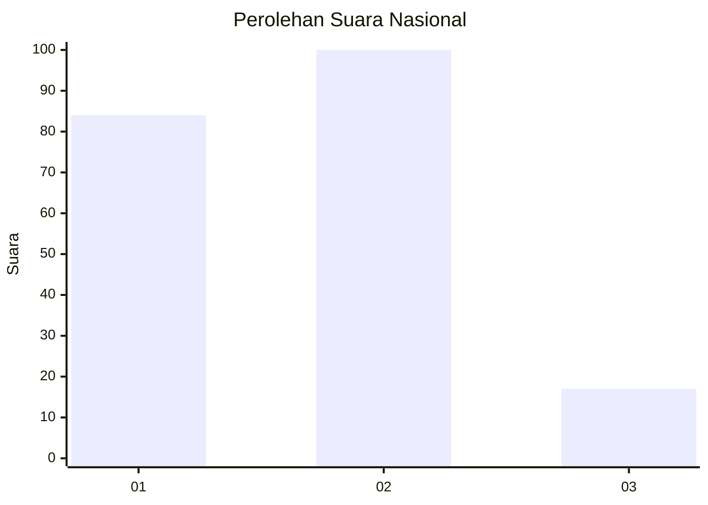
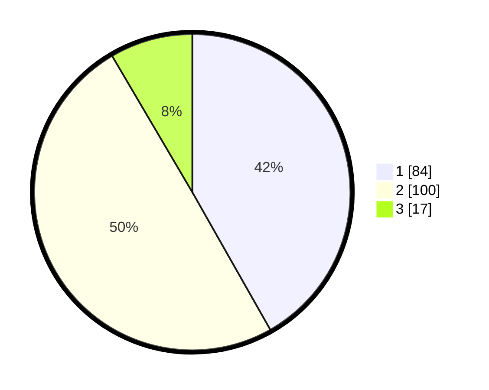

# Hasil

## Grafik

## Tabel

| No. | Nama Paslon    | Suara | Suara (raw) | Persentase |
|:--- |:-------------- | -----:| -----------:| ----------:|
| 1   | ANIES MUHAIMIN | 84    | [84][p-1]   | 41,79      |
| 2   | PRABOWO GIBRAN | 100   | [100][p-2]  | 49,75      |
| 3   | GANJAR MAHFUD  | 17    | [17][p-3]   | 8,46       |

[p-1]: https://github.com/gigit-pemilu/pemilu-2024/blob/main/pilpres/hitung-suara/sub/51-bali/sub/01-jembrana/sub/05-jembrana/sub/1003-loloan-timur/sub/017-tps/sub/paslon-1.txt
[p-2]: https://github.com/gigit-pemilu/pemilu-2024/blob/main/pilpres/hitung-suara/sub/51-bali/sub/01-jembrana/sub/05-jembrana/sub/1003-loloan-timur/sub/017-tps/sub/paslon-2.txt
[p-3]: https://github.com/gigit-pemilu/pemilu-2024/blob/main/pilpres/hitung-suara/sub/51-bali/sub/01-jembrana/sub/05-jembrana/sub/1003-loloan-timur/sub/017-tps/sub/paslon-3.txt

## Foto C Plano

https://sirekap-obj-formc.kpu.go.id/b19c/pemilu/ppwp/51/01/05/10/03/5101051003017-20240214-192621--aced1b32-7017-4ce3-aab6-f182d28dbce6.jpg

https://sirekap-obj-formc.kpu.go.id/b19c/pemilu/ppwp/51/01/05/10/03/5101051003017-20240214-192735--bc9ecf9c-9062-427e-ac53-1bde30270bf2.jpg

https://sirekap-obj-formc.kpu.go.id/b19c/pemilu/ppwp/51/01/05/10/03/5101051003017-20240214-192933--136b5216-b9fa-4e75-a9ec-7f24b1612445.jpg

## Metadata

| Key        | Value               |
| ---------- | ------------------- |
| Time Stamp | 2024-02-15 15:30:25 |

## DATA PEMILIH TETAP

Jumlah pemilih dalam DPT: **261**.
 * L: **125**.
 * P: **136**.

## DATA PENGGUNA HAK PILIH

Jumlah pengguna hak pilih dalam DPT: **207**.
 * L: **97**.
 * P: **110**.

Jumlah pengguna hak pilih dalam DPTb: **0**.
 * L: **0**.
 * P: **0**.

Jumlah pengguna hak pilih dalam DPK: **0**.
 * L: **0**.
 * P: **0**.

Jumlah pengguna hak pilih: **207**.
 * L: **97**.
 * P: **110**.

## JUMLAH SUARA SAH DAN TIDAK SAH

JUMLAH SELURUH SUARA SAH: **201**.

JUMLAH SUARA TIDAK SAH: **6**.

JUMLAH SELURUH SUARA SAH DAN SUARA TIDAK SAH: **207**.

