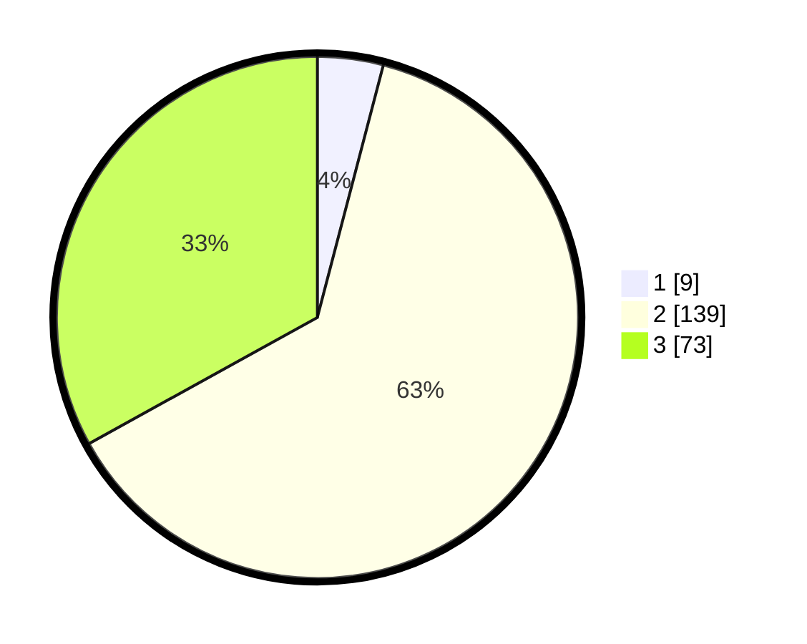

# Hasil

## Grafik

## Tabel

| No. | Nama Paslon    | Suara | Suara (raw) | Persentase |
|:--- |:-------------- | -----:| -----------:| ----------:|
| 1   | ANIES MUHAIMIN | 9     | [9][p-1]    | 4,07       |
| 2   | PRABOWO GIBRAN | 139   | [139][p-2]  | 62,90      |
| 3   | GANJAR MAHFUD  | 73    | [73][p-3]   | 33,03      |

[p-1]: https://github.com/gigit-pemilu/pemilu-2024-51-bali/blob/main/pilpres/hitung-suara/sub/51-bali/sub/01-jembrana/sub/05-jembrana/sub/1003-loloan-timur/sub/019-tps/sub/paslon-1.txt
[p-2]: https://github.com/gigit-pemilu/pemilu-2024-51-bali/blob/main/pilpres/hitung-suara/sub/51-bali/sub/01-jembrana/sub/05-jembrana/sub/1003-loloan-timur/sub/019-tps/sub/paslon-2.txt
[p-3]: https://github.com/gigit-pemilu/pemilu-2024-51-bali/blob/main/pilpres/hitung-suara/sub/51-bali/sub/01-jembrana/sub/05-jembrana/sub/1003-loloan-timur/sub/019-tps/sub/paslon-3.txt

## Foto C Plano

https://sirekap-obj-formc.kpu.go.id/1358/pemilu/ppwp/51/01/05/10/03/5101051003019-20240215-222756--8bf623c7-2d8c-40d9-a210-ade898249c78.jpg

https://sirekap-obj-formc.kpu.go.id/1358/pemilu/ppwp/51/01/05/10/03/5101051003019-20240215-222758--832e22af-6ff6-49c8-801b-df68847d5f7e.jpg

https://sirekap-obj-formc.kpu.go.id/1358/pemilu/ppwp/51/01/05/10/03/5101051003019-20240215-222757--bfd8458b-3ced-4521-b715-f19f0d2a8ae5.jpg

## Metadata

| Key        | Value               |
| ---------- | ------------------- |
| Time Stamp | 2024-02-16 08:00:28 |

## DATA PEMILIH TETAP

Jumlah pemilih dalam DPT: **283**.
 * L: **143**.
 * P: **140**.

## DATA PENGGUNA HAK PILIH

Jumlah pengguna hak pilih dalam DPT: **222**.
 * L: **113**.
 * P: **109**.

Jumlah pengguna hak pilih dalam DPTb: **0**.
 * L: **0**.
 * P: **0**.

Jumlah pengguna hak pilih dalam DPK: **5**.
 * L: **2**.
 * P: **3**.

Jumlah pengguna hak pilih: **227**.
 * L: **115**.
 * P: **112**.

## JUMLAH SUARA SAH DAN TIDAK SAH

JUMLAH SELURUH SUARA SAH: **221**.

JUMLAH SUARA TIDAK SAH: **6**.

JUMLAH SELURUH SUARA SAH DAN SUARA TIDAK SAH: **227**.

