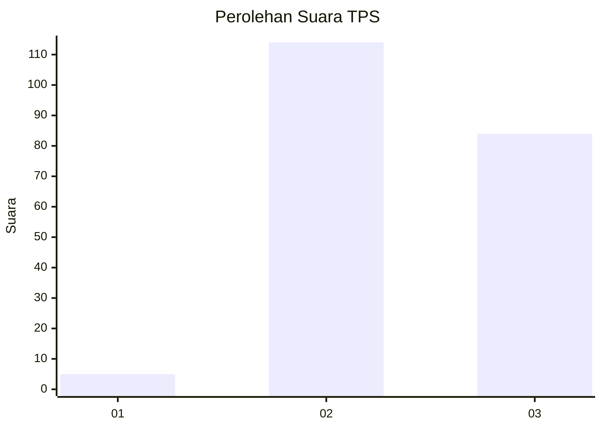
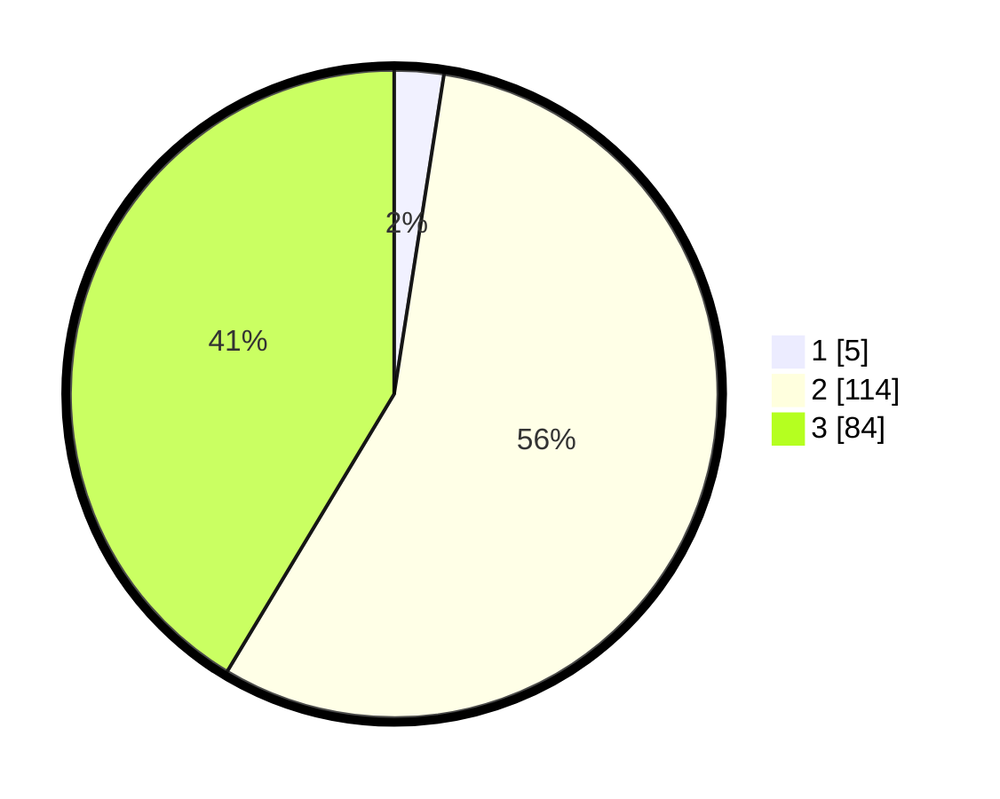

# Hasil

## Grafik

## Tabel

| No. | Nama Paslon    | Suara | Suara (raw) | Persentase |
|:--- |:-------------- | -----:| -----------:| ----------:|
| 1   | ANIES MUHAIMIN | 5     | [5][p-1]    | 2,46       |
| 2   | PRABOWO GIBRAN | 114   | [114][p-2]  | 56,16      |
| 3   | GANJAR MAHFUD  | 84    | [84][p-3]   | 41,38      |

[p-1]: https://github.com/gigit-pemilu/pemilu-2024-51-bali/blob/main/pilpres/hitung-suara/sub/51-bali/sub/01-jembrana/sub/05-jembrana/sub/1003-loloan-timur/sub/020-tps/sub/paslon-1.txt
[p-2]: https://github.com/gigit-pemilu/pemilu-2024-51-bali/blob/main/pilpres/hitung-suara/sub/51-bali/sub/01-jembrana/sub/05-jembrana/sub/1003-loloan-timur/sub/020-tps/sub/paslon-2.txt
[p-3]: https://github.com/gigit-pemilu/pemilu-2024-51-bali/blob/main/pilpres/hitung-suara/sub/51-bali/sub/01-jembrana/sub/05-jembrana/sub/1003-loloan-timur/sub/020-tps/sub/paslon-3.txt

## Foto C Plano

https://sirekap-obj-formc.kpu.go.id/13bd/pemilu/ppwp/51/01/05/10/03/5101051003020-20240214-155245--421158a0-3d53-4932-b994-387e5a010e5c.jpg

https://sirekap-obj-formc.kpu.go.id/13bd/pemilu/ppwp/51/01/05/10/03/5101051003020-20240214-155302--c5a3a4eb-4ae7-4b68-a68c-9b749c943346.jpg

https://sirekap-obj-formc.kpu.go.id/13bd/pemilu/ppwp/51/01/05/10/03/5101051003020-20240214-155307--9cbfaf58-33d9-4db1-a561-5160d9f570b8.jpg

## Metadata

| Key        | Value               |
| ---------- | ------------------- |
| Time Stamp | 2024-02-14 21:46:01 |

## DATA PEMILIH TETAP

Jumlah pemilih dalam DPT: **279**.
 * L: **134**.
 * P: **145**.

## DATA PENGGUNA HAK PILIH

Jumlah pengguna hak pilih dalam DPT: **208**.
 * L: **103**.
 * P: **105**.

Jumlah pengguna hak pilih dalam DPTb: **0**.
 * L: **0**.
 * P: **0**.

Jumlah pengguna hak pilih dalam DPK: **0**.
 * L: **0**.
 * P: **0**.

Jumlah pengguna hak pilih: **208**.
 * L: **103**.
 * P: **105**.

## JUMLAH SUARA SAH DAN TIDAK SAH

JUMLAH SELURUH SUARA SAH: **203**.

JUMLAH SUARA TIDAK SAH: **5**.

JUMLAH SELURUH SUARA SAH DAN SUARA TIDAK SAH: **208**.

