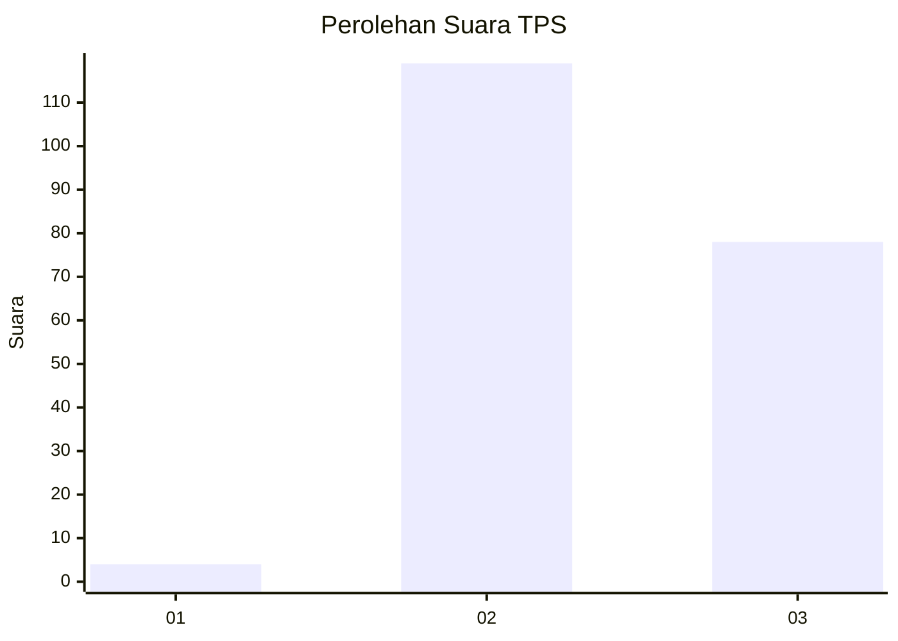
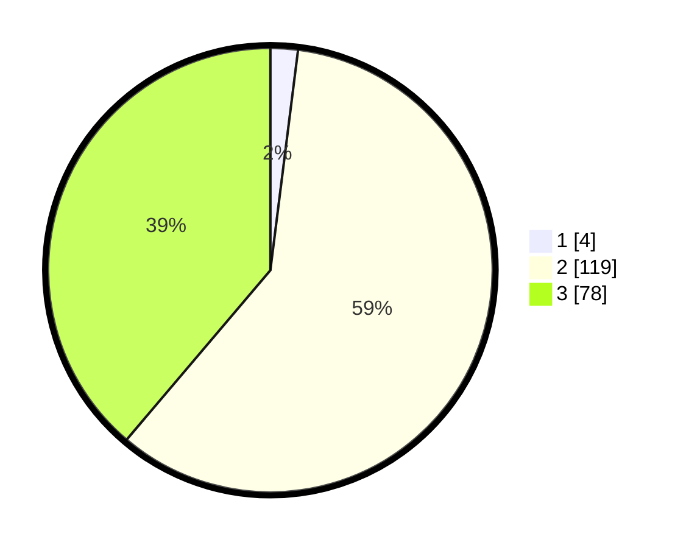

# Hasil

## Grafik

## Tabel

| No. | Nama Paslon    | Suara | Suara (raw) | Persentase |
|:--- |:-------------- | -----:| -----------:| ----------:|
| 1   | ANIES MUHAIMIN | 4     | [4][p-1]    | 1,99       |
| 2   | PRABOWO GIBRAN | 119   | [119][p-2]  | 59,20      |
| 3   | GANJAR MAHFUD  | 78    | [78][p-3]   | 38,81      |

[p-1]: https://github.com/gigit-pemilu/pemilu-2024-51-bali/blob/main/pilpres/hitung-suara/sub/51-bali/sub/01-jembrana/sub/05-jembrana/sub/1003-loloan-timur/sub/021-tps/sub/paslon-1.txt
[p-2]: https://github.com/gigit-pemilu/pemilu-2024-51-bali/blob/main/pilpres/hitung-suara/sub/51-bali/sub/01-jembrana/sub/05-jembrana/sub/1003-loloan-timur/sub/021-tps/sub/paslon-2.txt
[p-3]: https://github.com/gigit-pemilu/pemilu-2024-51-bali/blob/main/pilpres/hitung-suara/sub/51-bali/sub/01-jembrana/sub/05-jembrana/sub/1003-loloan-timur/sub/021-tps/sub/paslon-3.txt

## Foto C Plano

https://sirekap-obj-formc.kpu.go.id/7169/pemilu/ppwp/51/01/05/10/03/5101051003021-20240214-184443--e0939f8d-ce39-4b98-a904-5c7c70902e4b.jpg

https://sirekap-obj-formc.kpu.go.id/7169/pemilu/ppwp/51/01/05/10/03/5101051003021-20240214-184512--6e773509-480a-430c-9d99-94a02fa9bd66.jpg

https://sirekap-obj-formc.kpu.go.id/7169/pemilu/ppwp/51/01/05/10/03/5101051003021-20240214-184452--34fb37fe-d9f4-4335-95d0-e237460fb6d2.jpg

## Metadata

| Key        | Value               |
| ---------- | ------------------- |
| Time Stamp | 2024-02-14 21:46:01 |

## DATA PEMILIH TETAP

Jumlah pemilih dalam DPT: **257**.
 * L: **126**.
 * P: **131**.

## DATA PENGGUNA HAK PILIH

Jumlah pengguna hak pilih dalam DPT: **207**.
 * L: **108**.
 * P: **99**.

Jumlah pengguna hak pilih dalam DPTb: **0**.
 * L: **0**.
 * P: **0**.

Jumlah pengguna hak pilih dalam DPK: **0**.
 * L: **0**.
 * P: **0**.

Jumlah pengguna hak pilih: **207**.
 * L: **108**.
 * P: **99**.

## JUMLAH SUARA SAH DAN TIDAK SAH

JUMLAH SELURUH SUARA SAH: **201**.

JUMLAH SUARA TIDAK SAH: **6**.

JUMLAH SELURUH SUARA SAH DAN SUARA TIDAK SAH: **207**.

