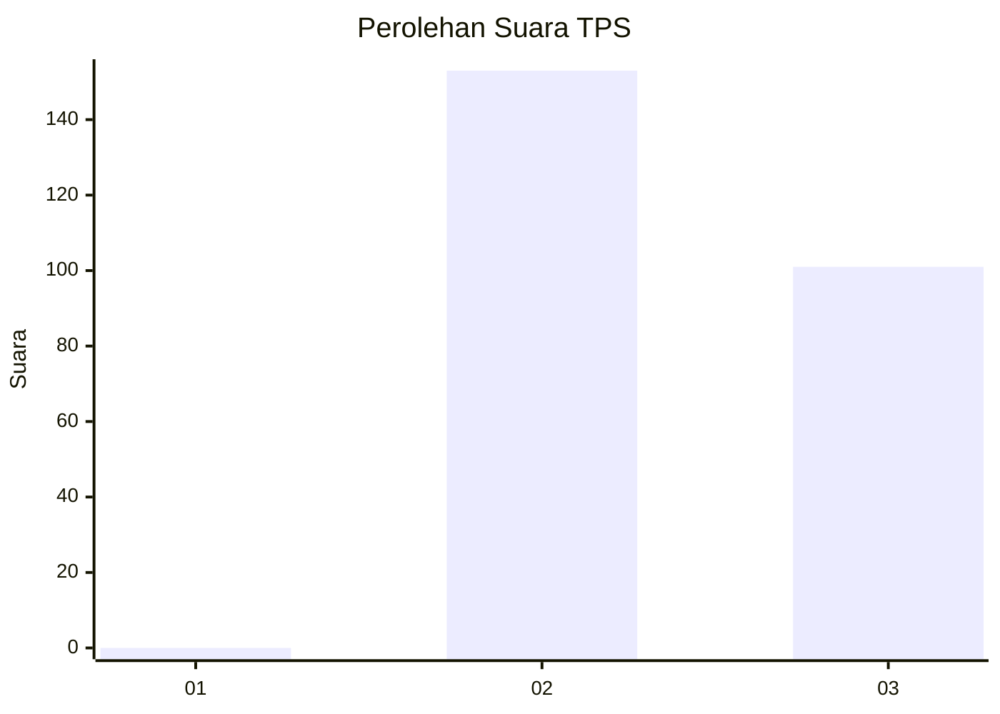
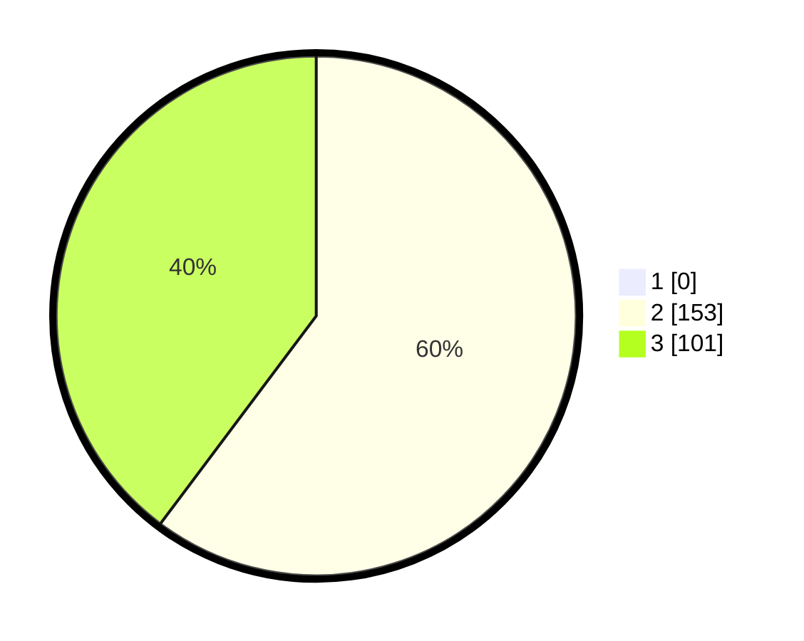

# Hasil

## Grafik

## Tabel

| No. | Nama Paslon    | Suara | Suara (raw) | Persentase |
|:--- |:-------------- | -----:| -----------:| ----------:|
| 1   | ANIES MUHAIMIN | 0     | [0][p-1]    | 0,00       |
| 2   | PRABOWO GIBRAN | 153   | [153][p-2]  | 60,24      |
| 3   | GANJAR MAHFUD  | 101   | [101][p-3]  | 39,76      |

[p-1]: https://github.com/gigit-pemilu/pemilu-2024-51-bali/blob/main/pilpres/hitung-suara/sub/51-bali/sub/01-jembrana/sub/05-jembrana/sub/1005-dauhwaru/sub/004-tps/sub/paslon-1.txt
[p-2]: https://github.com/gigit-pemilu/pemilu-2024-51-bali/blob/main/pilpres/hitung-suara/sub/51-bali/sub/01-jembrana/sub/05-jembrana/sub/1005-dauhwaru/sub/004-tps/sub/paslon-2.txt
[p-3]: https://github.com/gigit-pemilu/pemilu-2024-51-bali/blob/main/pilpres/hitung-suara/sub/51-bali/sub/01-jembrana/sub/05-jembrana/sub/1005-dauhwaru/sub/004-tps/sub/paslon-3.txt

## Foto C Plano

https://sirekap-obj-formc.kpu.go.id/5696/pemilu/ppwp/51/01/05/10/05/5101051005004-20240214-141545--48d2fe21-dbff-4203-bc70-facf256fa069.jpg

https://sirekap-obj-formc.kpu.go.id/5696/pemilu/ppwp/51/01/05/10/05/5101051005004-20240214-141825--81fa8172-2968-4c97-9468-2d82aeb8ddd9.jpg

https://sirekap-obj-formc.kpu.go.id/5696/pemilu/ppwp/51/01/05/10/05/5101051005004-20240214-223432--72d9e231-d55c-4d84-b1c8-d7b9fcc7c0ae.jpg

## Metadata

| Key        | Value               |
| ---------- | ------------------- |
| Time Stamp | 2024-02-15 07:00:44 |

