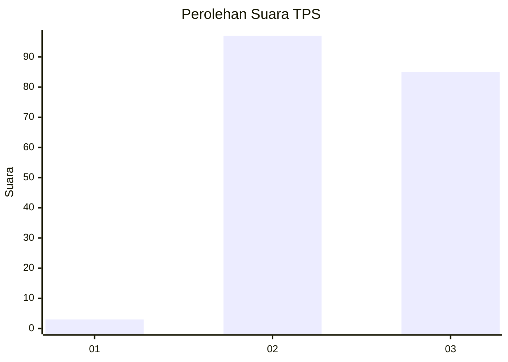
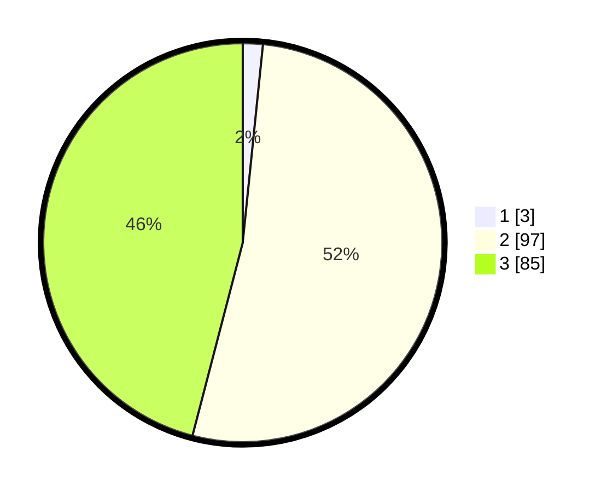

# Hasil

## Grafik

## Tabel

| No. | Nama Paslon    | Suara | Suara (raw) | Persentase |
|:--- |:-------------- | -----:| -----------:| ----------:|
| 1   | ANIES MUHAIMIN | 3     | [3][p-1]    | 1,62       |
| 2   | PRABOWO GIBRAN | 97    | [97][p-2]   | 52,43      |
| 3   | GANJAR MAHFUD  | 85    | [85][p-3]   | 45,95      |

[p-1]: https://github.com/gigit-pemilu/pemilu-2024-51-bali/blob/main/pilpres/hitung-suara/sub/51-bali/sub/01-jembrana/sub/05-jembrana/sub/1005-dauhwaru/sub/009-tps/sub/paslon-1.txt
[p-2]: https://github.com/gigit-pemilu/pemilu-2024-51-bali/blob/main/pilpres/hitung-suara/sub/51-bali/sub/01-jembrana/sub/05-jembrana/sub/1005-dauhwaru/sub/009-tps/sub/paslon-2.txt
[p-3]: https://github.com/gigit-pemilu/pemilu-2024-51-bali/blob/main/pilpres/hitung-suara/sub/51-bali/sub/01-jembrana/sub/05-jembrana/sub/1005-dauhwaru/sub/009-tps/sub/paslon-3.txt

## Foto C Plano

https://sirekap-obj-formc.kpu.go.id/fd8f/pemilu/ppwp/51/01/05/10/05/5101051005009-20240214-141440--521ea6bd-023e-4652-8e22-54e2c56b3226.jpg

https://sirekap-obj-formc.kpu.go.id/fd8f/pemilu/ppwp/51/01/05/10/05/5101051005009-20240214-141538--11d25f03-4070-4639-98ef-e4dac1e71a0a.jpg

## Metadata

| Key        | Value               |
| ---------- | ------------------- |
| Time Stamp | 2024-02-15 07:00:44 |

