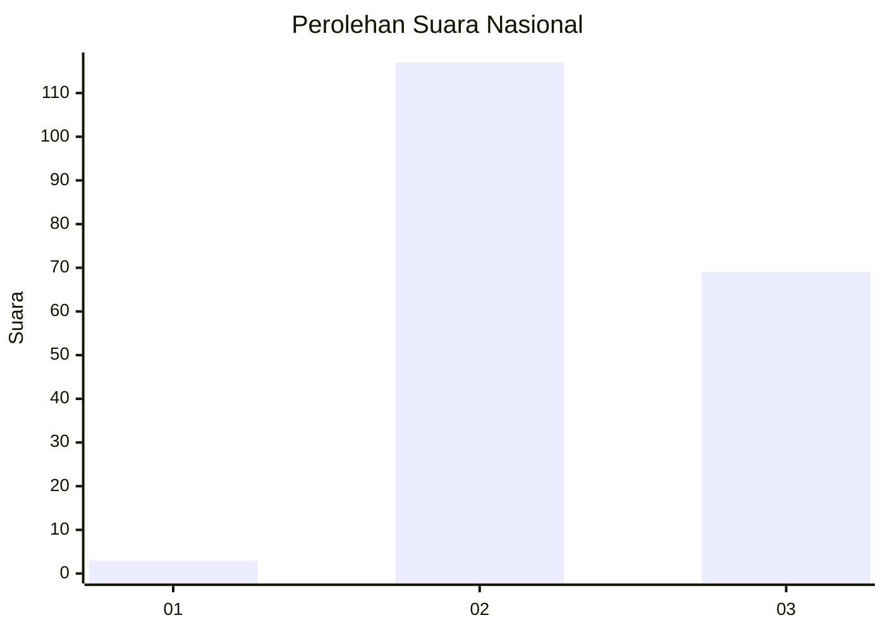
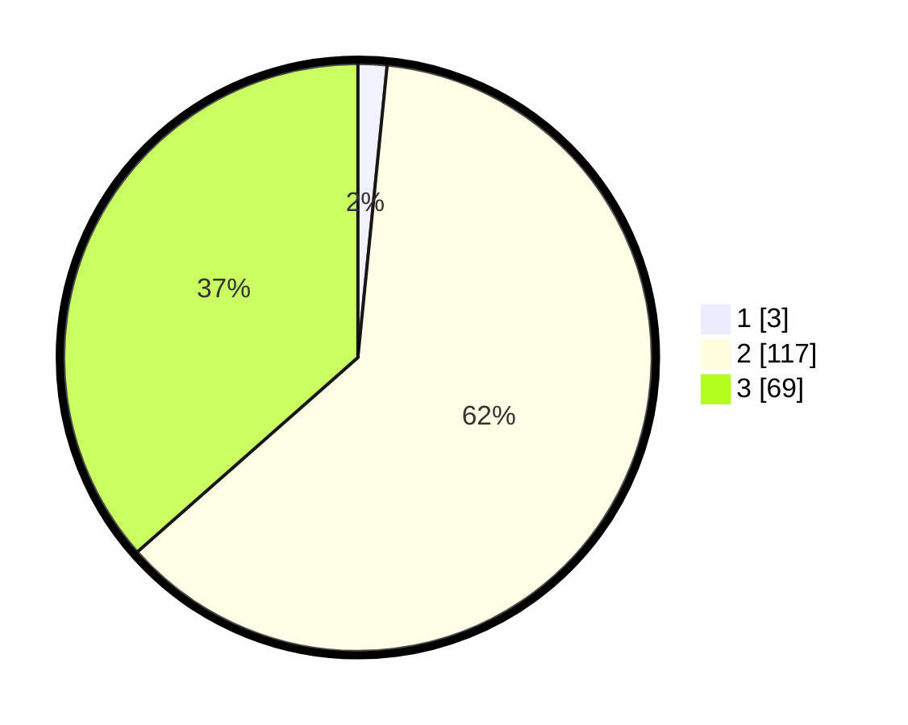

# Hasil

## Grafik

## Tabel

| No. | Nama Paslon    | Suara | Suara (raw) | Persentase |
|:--- |:-------------- | -----:| -----------:| ----------:|
| 1   | ANIES MUHAIMIN | 3     | [3][p-1]    | 1,59       |
| 2   | PRABOWO GIBRAN | 117   | [117][p-2]  | 61,90      |
| 3   | GANJAR MAHFUD  | 69    | [69][p-3]   | 36,51      |

[p-1]: https://github.com/gigit-pemilu/pemilu-2024/blob/main/pilpres/hitung-suara/sub/51-bali/sub/01-jembrana/sub/05-jembrana/sub/1005-dauhwaru/sub/015-tps/sub/paslon-1.txt
[p-2]: https://github.com/gigit-pemilu/pemilu-2024/blob/main/pilpres/hitung-suara/sub/51-bali/sub/01-jembrana/sub/05-jembrana/sub/1005-dauhwaru/sub/015-tps/sub/paslon-2.txt
[p-3]: https://github.com/gigit-pemilu/pemilu-2024/blob/main/pilpres/hitung-suara/sub/51-bali/sub/01-jembrana/sub/05-jembrana/sub/1005-dauhwaru/sub/015-tps/sub/paslon-3.txt

## Foto C Plano

https://sirekap-obj-formc.kpu.go.id/9ac6/pemilu/ppwp/51/01/05/10/05/5101051005015-20240214-212513--789fdac9-8eb6-4985-ac0f-86f6ad212ec9.jpg

https://sirekap-obj-formc.kpu.go.id/9ac6/pemilu/ppwp/51/01/05/10/05/5101051005015-20240214-212516--f1d0af5f-c04c-439a-885a-cdcdb682ae85.jpg

https://sirekap-obj-formc.kpu.go.id/9ac6/pemilu/ppwp/51/01/05/10/05/5101051005015-20240214-212518--d5aaa284-80e8-4388-8395-68fbb9e77cec.jpg

## Metadata

| Key        | Value               |
| ---------- | ------------------- |
| Time Stamp | 2024-02-15 19:30:26 |

