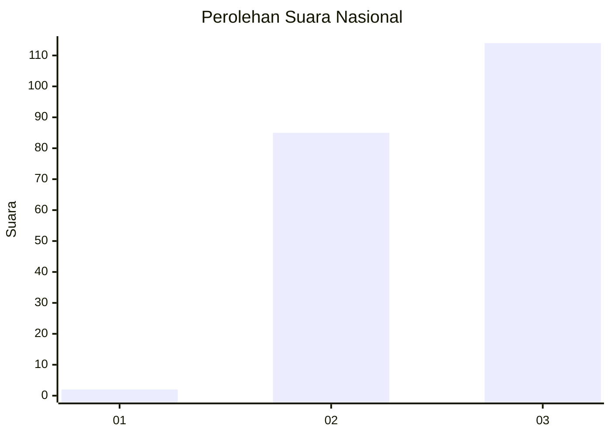
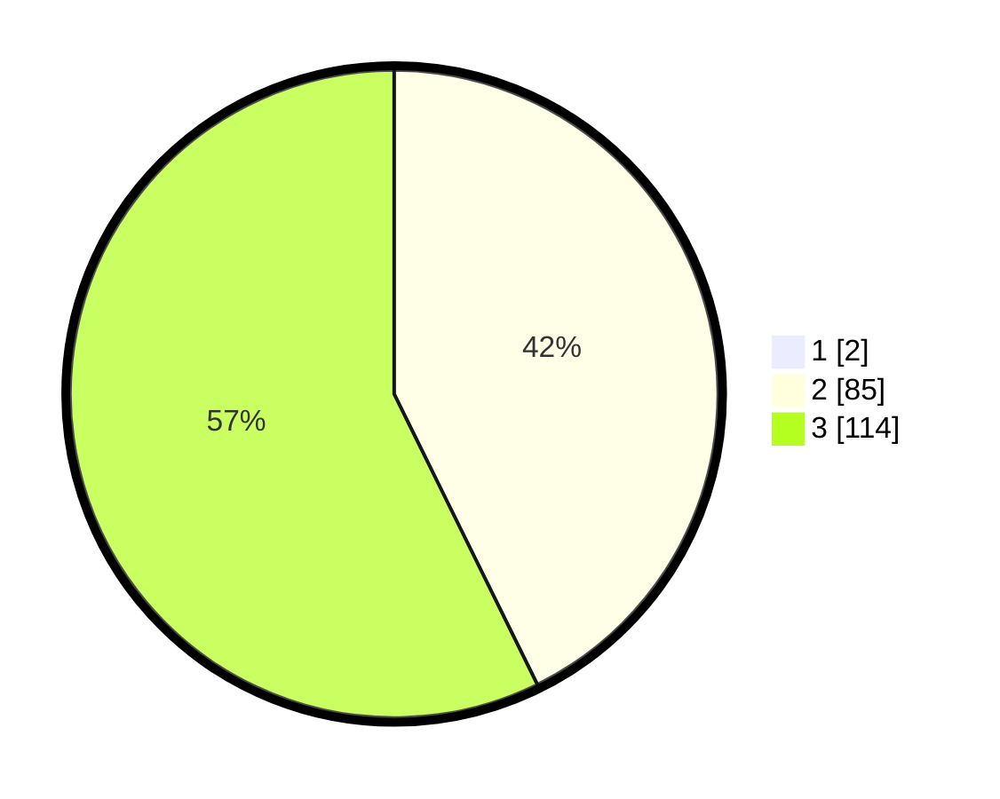

# Hasil

## Grafik

## Tabel

| No. | Nama Paslon    | Suara | Suara (raw) | Persentase |
|:--- |:-------------- | -----:| -----------:| ----------:|
| 1   | ANIES MUHAIMIN | 2     | [2][p-1]    | 1,00       |
| 2   | PRABOWO GIBRAN | 85    | [85][p-2]   | 42,29      |
| 3   | GANJAR MAHFUD  | 114   | [114][p-3]  | 56,72      |

[p-1]: https://github.com/gigit-pemilu/pemilu-2024/blob/main/pilpres/hitung-suara/sub/51-bali/sub/01-jembrana/sub/05-jembrana/sub/1005-dauhwaru/sub/020-tps/sub/paslon-1.txt
[p-2]: https://github.com/gigit-pemilu/pemilu-2024/blob/main/pilpres/hitung-suara/sub/51-bali/sub/01-jembrana/sub/05-jembrana/sub/1005-dauhwaru/sub/020-tps/sub/paslon-2.txt
[p-3]: https://github.com/gigit-pemilu/pemilu-2024/blob/main/pilpres/hitung-suara/sub/51-bali/sub/01-jembrana/sub/05-jembrana/sub/1005-dauhwaru/sub/020-tps/sub/paslon-3.txt

## Foto C Plano

https://sirekap-obj-formc.kpu.go.id/3616/pemilu/ppwp/51/01/05/10/05/5101051005020-20240216-190402--39bd9548-fd40-4741-b180-8ce942fb0cc5.jpg

https://sirekap-obj-formc.kpu.go.id/3616/pemilu/ppwp/51/01/05/10/05/5101051005020-20240216-190403--159e03e5-aafb-4400-bb68-47dc79ce1473.jpg

https://sirekap-obj-formc.kpu.go.id/3616/pemilu/ppwp/51/01/05/10/05/5101051005020-20240216-190402--8c984fbc-7c63-48c7-9088-72335e4523cb.jpg

## Metadata

| Key        | Value               |
| ---------- | ------------------- |
| Time Stamp | 2024-02-16 21:01:00 |

## DATA PEMILIH TETAP

Jumlah pemilih dalam DPT: **235**.
 * L: **112**.
 * P: **123**.

## DATA PENGGUNA HAK PILIH

Jumlah pengguna hak pilih dalam DPT: **204**.
 * L: **104**.
 * P: **100**.

Jumlah pengguna hak pilih dalam DPTb: **0**.
 * L: **0**.
 * P: **0**.

Jumlah pengguna hak pilih dalam DPK: **0**.
 * L: **0**.
 * P: **0**.

Jumlah pengguna hak pilih: **204**.
 * L: **104**.
 * P: **100**.

## JUMLAH SUARA SAH DAN TIDAK SAH

JUMLAH SELURUH SUARA SAH: **201**.

JUMLAH SUARA TIDAK SAH: **3**.

JUMLAH SELURUH SUARA SAH DAN SUARA TIDAK SAH: **204**.

