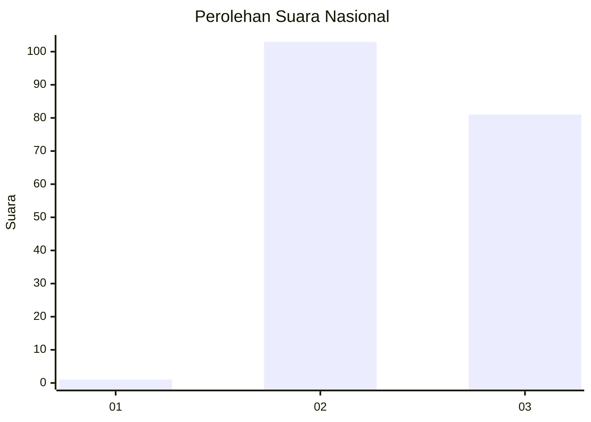
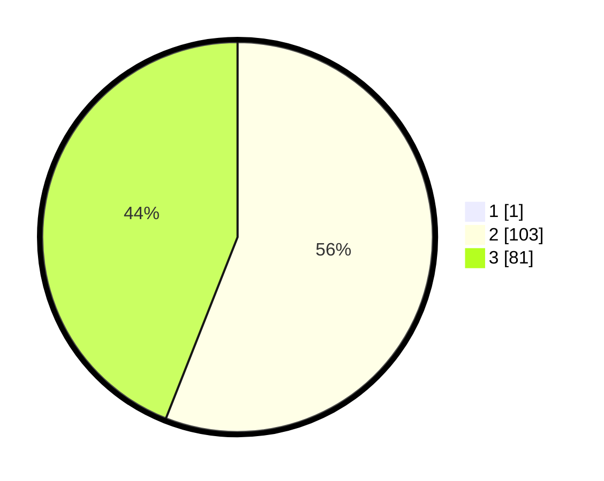

# Hasil

## Grafik

## Tabel

| No. | Nama Paslon    | Suara | Suara (raw) | Persentase |
|:--- |:-------------- | -----:| -----------:| ----------:|
| 1   | ANIES MUHAIMIN | 1     | [1][p-1]    | 0,54       |
| 2   | PRABOWO GIBRAN | 103   | [103][p-2]  | 55,68      |
| 3   | GANJAR MAHFUD  | 81    | [81][p-3]   | 43,78      |

[p-1]: https://github.com/gigit-pemilu/pemilu-2024/blob/main/pilpres/hitung-suara/sub/51-bali/sub/01-jembrana/sub/05-jembrana/sub/1005-dauhwaru/sub/021-tps/sub/paslon-1.txt
[p-2]: https://github.com/gigit-pemilu/pemilu-2024/blob/main/pilpres/hitung-suara/sub/51-bali/sub/01-jembrana/sub/05-jembrana/sub/1005-dauhwaru/sub/021-tps/sub/paslon-2.txt
[p-3]: https://github.com/gigit-pemilu/pemilu-2024/blob/main/pilpres/hitung-suara/sub/51-bali/sub/01-jembrana/sub/05-jembrana/sub/1005-dauhwaru/sub/021-tps/sub/paslon-3.txt

## Foto C Plano

https://sirekap-obj-formc.kpu.go.id/04b1/pemilu/ppwp/51/01/05/10/05/5101051005021-20240215-002543--8b41cb25-107b-4066-b9e5-ab47d135cc79.jpg

https://sirekap-obj-formc.kpu.go.id/04b1/pemilu/ppwp/51/01/05/10/05/5101051005021-20240215-002618--f30872b0-6a30-45ca-917f-a25ca2df0a1a.jpg

https://sirekap-obj-formc.kpu.go.id/04b1/pemilu/ppwp/51/01/05/10/05/5101051005021-20240215-002648--e24b593c-ecde-45e3-9943-1694139b4762.jpg

## Metadata

| Key        | Value               |
| ---------- | ------------------- |
| Time Stamp | 2024-02-15 15:00:29 |

## DATA PEMILIH TETAP

Jumlah pemilih dalam DPT: **225**.
 * L: **102**.
 * P: **123**.

## DATA PENGGUNA HAK PILIH

Jumlah pengguna hak pilih dalam DPT: **178**.
 * L: **84**.
 * P: **94**.

Jumlah pengguna hak pilih dalam DPTb: **5**.
 * L: **2**.
 * P: **3**.

Jumlah pengguna hak pilih dalam DPK: **2**.
 * L: **1**.
 * P: **1**.

Jumlah pengguna hak pilih: **185**.
 * L: **87**.
 * P: **98**.

## JUMLAH SUARA SAH DAN TIDAK SAH

JUMLAH SELURUH SUARA SAH: **185**.

JUMLAH SUARA TIDAK SAH: **0**.

JUMLAH SELURUH SUARA SAH DAN SUARA TIDAK SAH: **185**.

