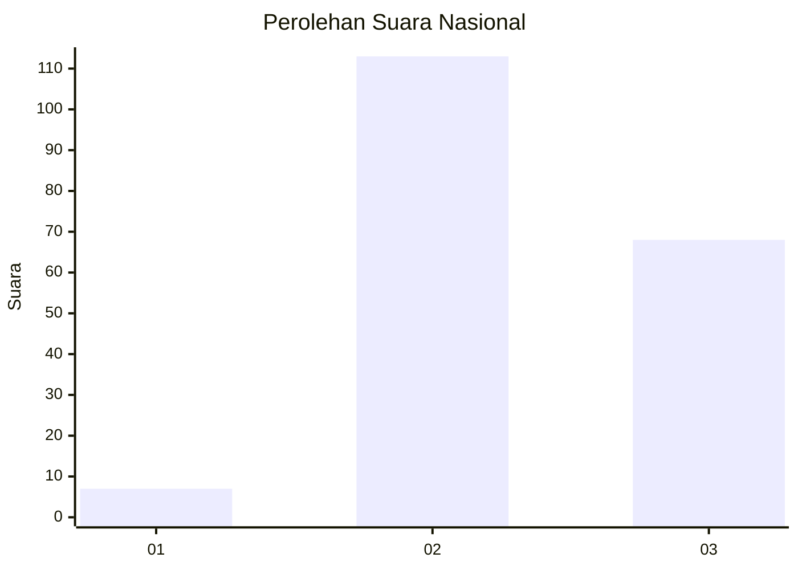
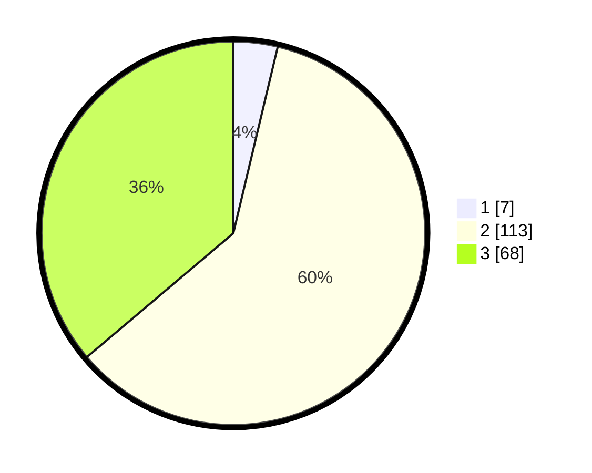

# Hasil

## Grafik

## Tabel

| No. | Nama Paslon    | Suara | Suara (raw) | Persentase |
|:--- |:-------------- | -----:| -----------:| ----------:|
| 1   | ANIES MUHAIMIN | 7     | [7][p-1]    | 3,72       |
| 2   | PRABOWO GIBRAN | 113   | [113][p-2]  | 60,11      |
| 3   | GANJAR MAHFUD  | 68    | [68][p-3]   | 36,17      |

[p-1]: https://github.com/gigit-pemilu/pemilu-2024/blob/main/pilpres/hitung-suara/sub/51-bali/sub/01-jembrana/sub/05-jembrana/sub/1005-dauhwaru/sub/022-tps/sub/paslon-1.txt
[p-2]: https://github.com/gigit-pemilu/pemilu-2024/blob/main/pilpres/hitung-suara/sub/51-bali/sub/01-jembrana/sub/05-jembrana/sub/1005-dauhwaru/sub/022-tps/sub/paslon-2.txt
[p-3]: https://github.com/gigit-pemilu/pemilu-2024/blob/main/pilpres/hitung-suara/sub/51-bali/sub/01-jembrana/sub/05-jembrana/sub/1005-dauhwaru/sub/022-tps/sub/paslon-3.txt

## Foto C Plano

https://sirekap-obj-formc.kpu.go.id/042d/pemilu/ppwp/51/01/05/10/05/5101051005022-20240214-184536--172094be-00ad-4947-be0d-c65f82432525.jpg

https://sirekap-obj-formc.kpu.go.id/042d/pemilu/ppwp/51/01/05/10/05/5101051005022-20240214-184552--1af3b555-4e33-475f-bf80-48f3b46ffe05.jpg

https://sirekap-obj-formc.kpu.go.id/042d/pemilu/ppwp/51/01/05/10/05/5101051005022-20240214-184615--9262f74d-d4c9-4b01-847f-f866260f9ed6.jpg

## Metadata

| Key        | Value               |
| ---------- | ------------------- |
| Time Stamp | 2024-02-14 21:46:01 |

## DATA PEMILIH TETAP

Jumlah pemilih dalam DPT: **222**.
 * L: **111**.
 * P: **111**.

## DATA PENGGUNA HAK PILIH

Jumlah pengguna hak pilih dalam DPT: **180**.
 * L: **87**.
 * P: **93**.

Jumlah pengguna hak pilih dalam DPTb: **6**.
 * L: **0**.
 * P: **6**.

Jumlah pengguna hak pilih dalam DPK: **5**.
 * L: **3**.
 * P: **2**.

Jumlah pengguna hak pilih: **191**.
 * L: **90**.
 * P: **101**.

## JUMLAH SUARA SAH DAN TIDAK SAH

JUMLAH SELURUH SUARA SAH: **188**.

JUMLAH SUARA TIDAK SAH: **3**.

JUMLAH SELURUH SUARA SAH DAN SUARA TIDAK SAH: **96**.

