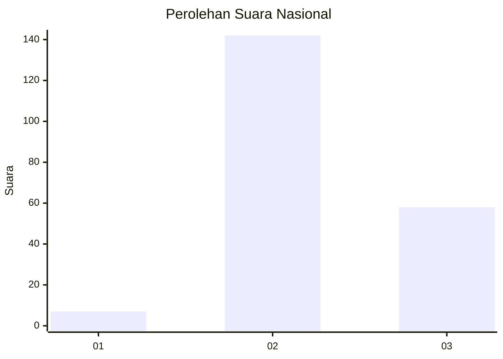
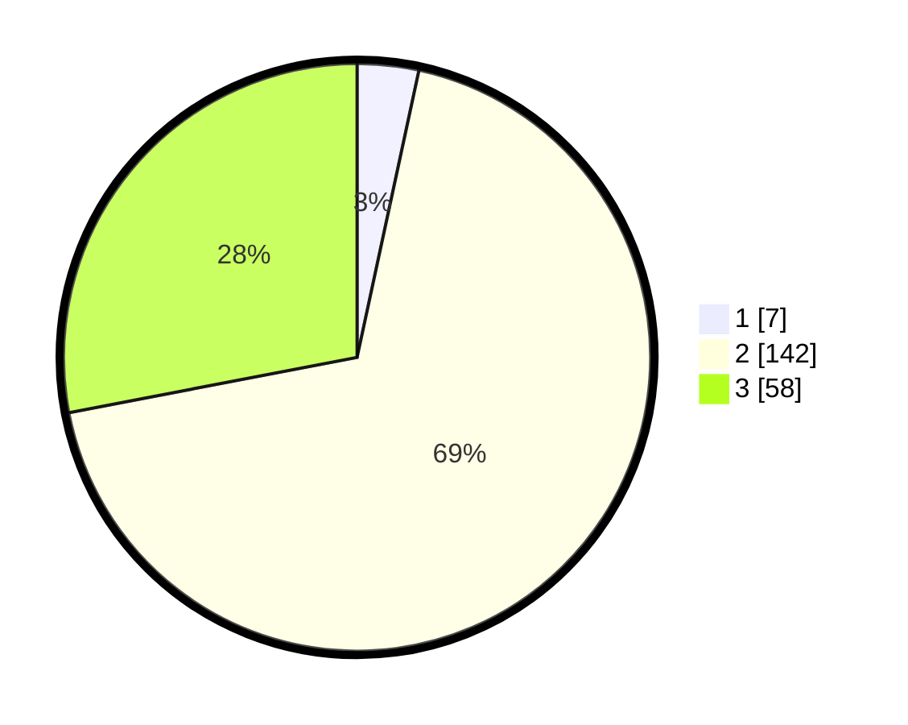

# Hasil

## Grafik

## Tabel

| No. | Nama Paslon    | Suara | Suara (raw) | Persentase |
|:--- |:-------------- | -----:| -----------:| ----------:|
| 1   | ANIES MUHAIMIN | 7     | [7][p-1]    | 3,38       |
| 2   | PRABOWO GIBRAN | 142   | [142][p-2]  | 68,60      |
| 3   | GANJAR MAHFUD  | 58    | [58][p-3]   | 28,02      |

[p-1]: https://github.com/gigit-pemilu/pemilu-2024/blob/main/pilpres/hitung-suara/sub/51-bali/sub/01-jembrana/sub/05-jembrana/sub/1005-dauhwaru/sub/023-tps/sub/paslon-1.txt
[p-2]: https://github.com/gigit-pemilu/pemilu-2024/blob/main/pilpres/hitung-suara/sub/51-bali/sub/01-jembrana/sub/05-jembrana/sub/1005-dauhwaru/sub/023-tps/sub/paslon-2.txt
[p-3]: https://github.com/gigit-pemilu/pemilu-2024/blob/main/pilpres/hitung-suara/sub/51-bali/sub/01-jembrana/sub/05-jembrana/sub/1005-dauhwaru/sub/023-tps/sub/paslon-3.txt

## Foto C Plano

https://sirekap-obj-formc.kpu.go.id/2840/pemilu/ppwp/51/01/05/10/05/5101051005023-20240214-141720--44eea6fd-55d9-422e-ba40-e201c85e7ac1.jpg

https://sirekap-obj-formc.kpu.go.id/2840/pemilu/ppwp/51/01/05/10/05/5101051005023-20240214-141818--9851b176-eb17-4eb9-8517-51888e55879a.jpg

https://sirekap-obj-formc.kpu.go.id/2840/pemilu/ppwp/51/01/05/10/05/5101051005023-20240214-215311--006338f7-6e5a-472a-b3ce-e792795316ea.jpg

## Metadata

| Key        | Value               |
| ---------- | ------------------- |
| Time Stamp | 2024-02-15 06:00:23 |

