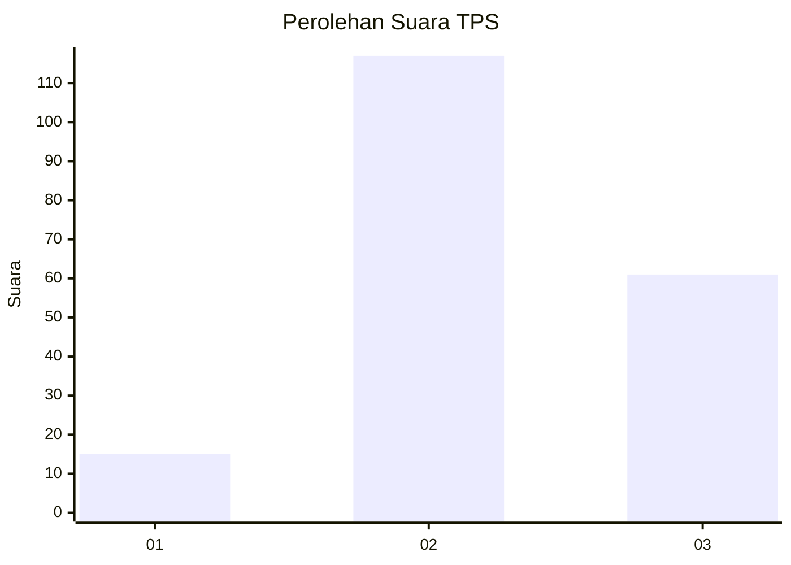
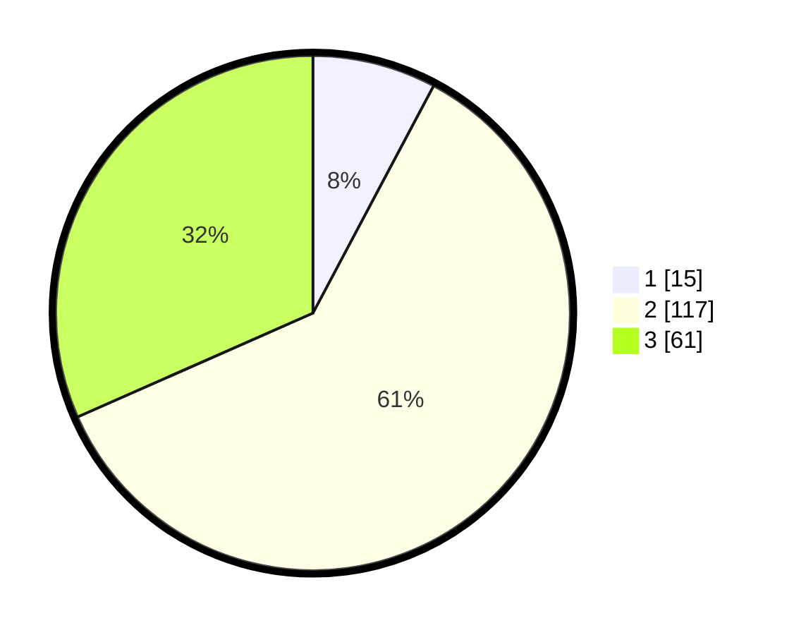

# Hasil

## Grafik

## Tabel

| No. | Nama Paslon    | Suara | Suara (raw) | Persentase |
|:--- |:-------------- | -----:| -----------:| ----------:|
| 1   | ANIES MUHAIMIN | 15    | [15][p-1]   | 7,77       |
| 2   | PRABOWO GIBRAN | 117   | [117][p-2]  | 60,62      |
| 3   | GANJAR MAHFUD  | 61    | [61][p-3]   | 31,61      |

[p-1]: https://github.com/gigit-pemilu/pemilu-2024-51-bali/blob/main/pilpres/hitung-suara/sub/51-bali/sub/01-jembrana/sub/05-jembrana/sub/1005-dauhwaru/sub/024-tps/sub/paslon-1.txt
[p-2]: https://github.com/gigit-pemilu/pemilu-2024-51-bali/blob/main/pilpres/hitung-suara/sub/51-bali/sub/01-jembrana/sub/05-jembrana/sub/1005-dauhwaru/sub/024-tps/sub/paslon-2.txt
[p-3]: https://github.com/gigit-pemilu/pemilu-2024-51-bali/blob/main/pilpres/hitung-suara/sub/51-bali/sub/01-jembrana/sub/05-jembrana/sub/1005-dauhwaru/sub/024-tps/sub/paslon-3.txt

## Foto C Plano

https://sirekap-obj-formc.kpu.go.id/2994/pemilu/ppwp/51/01/05/10/05/5101051005024-20240214-141604--9e9de7c6-ed6c-43d0-8819-bb6179f1fd8d.jpg

https://sirekap-obj-formc.kpu.go.id/2994/pemilu/ppwp/51/01/05/10/05/5101051005024-20240214-194225--996a9e8d-4383-41b6-b574-96b029b3def1.jpg

https://sirekap-obj-formc.kpu.go.id/2994/pemilu/ppwp/51/01/05/10/05/5101051005024-20240214-193622--346c9491-9598-4538-9cda-217ce08f1035.jpg

## Metadata

| Key        | Value               |
| ---------- | ------------------- |
| Time Stamp | 2024-02-15 12:00:28 |

## DATA PEMILIH TETAP

Jumlah pemilih dalam DPT: **245**.
 * L: **118**.
 * P: **127**.

## DATA PENGGUNA HAK PILIH

Jumlah pengguna hak pilih dalam DPT: **187**.
 * L: **91**.
 * P: **96**.

Jumlah pengguna hak pilih dalam DPTb: **8**.
 * L: **4**.
 * P: **4**.

Jumlah pengguna hak pilih dalam DPK: **0**.
 * L: **0**.
 * P: **0**.

Jumlah pengguna hak pilih: **195**.
 * L: **95**.
 * P: **100**.

## JUMLAH SUARA SAH DAN TIDAK SAH

JUMLAH SELURUH SUARA SAH: **193**.

JUMLAH SUARA TIDAK SAH: **2**.

JUMLAH SELURUH SUARA SAH DAN SUARA TIDAK SAH: **195**.

