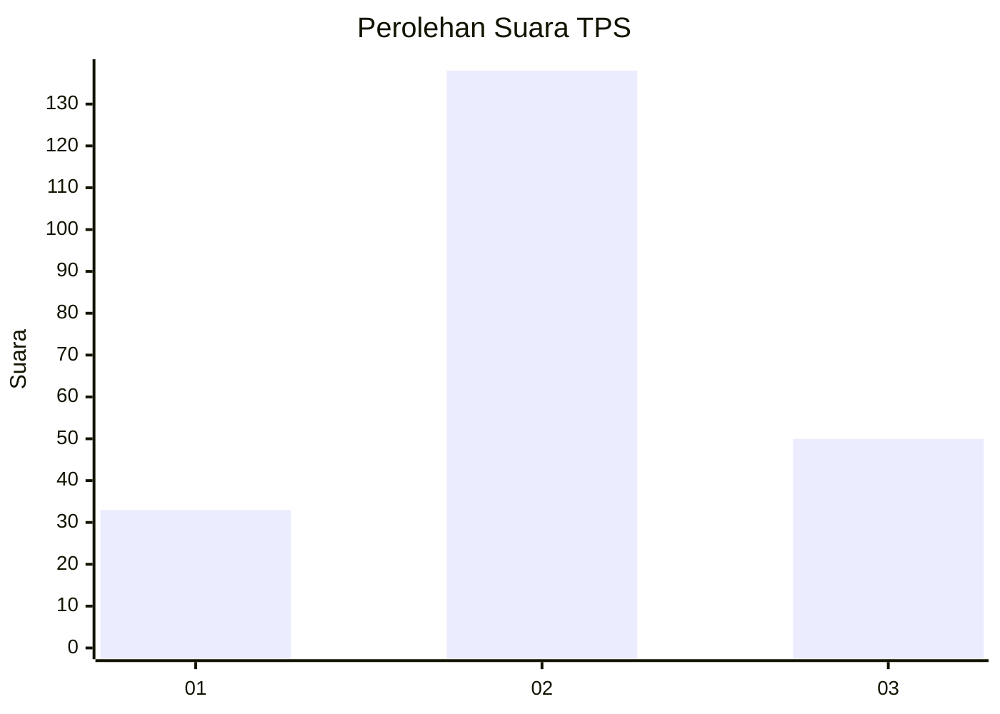
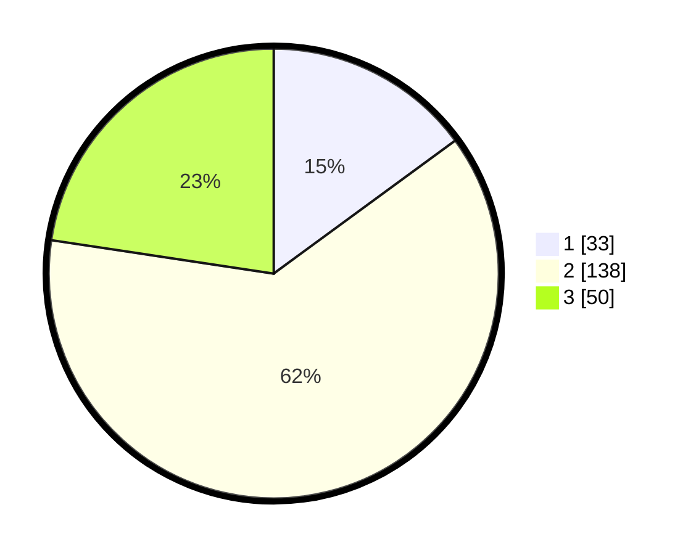

# Hasil

## Grafik

## Tabel

| No. | Nama Paslon    | Suara | Suara (raw) | Persentase |
|:--- |:-------------- | -----:| -----------:| ----------:|
| 1   | ANIES MUHAIMIN | 33    | [33][p-1]   | 14,93      |
| 2   | PRABOWO GIBRAN | 138   | [138][p-2]  | 62,44      |
| 3   | GANJAR MAHFUD  | 50    | [50][p-3]   | 22,62      |

[p-1]: https://github.com/gigit-pemilu/pemilu-2024-51-bali/blob/main/pilpres/hitung-suara/sub/51-bali/sub/01-jembrana/sub/05-jembrana/sub/1005-dauhwaru/sub/025-tps/sub/paslon-1.txt
[p-2]: https://github.com/gigit-pemilu/pemilu-2024-51-bali/blob/main/pilpres/hitung-suara/sub/51-bali/sub/01-jembrana/sub/05-jembrana/sub/1005-dauhwaru/sub/025-tps/sub/paslon-2.txt
[p-3]: https://github.com/gigit-pemilu/pemilu-2024-51-bali/blob/main/pilpres/hitung-suara/sub/51-bali/sub/01-jembrana/sub/05-jembrana/sub/1005-dauhwaru/sub/025-tps/sub/paslon-3.txt

## Foto C Plano

https://sirekap-obj-formc.kpu.go.id/a23b/pemilu/ppwp/51/01/05/10/05/5101051005025-20240214-141051--ba5fb8f7-d523-4ffa-b3f2-e4dd4b304d4b.jpg

https://sirekap-obj-formc.kpu.go.id/a23b/pemilu/ppwp/51/01/05/10/05/5101051005025-20240214-141154--d83d6660-bb6c-42b0-8620-b3cf3e411952.jpg

https://sirekap-obj-formc.kpu.go.id/a23b/pemilu/ppwp/51/01/05/10/05/5101051005025-20240214-141254--6ee61d62-c288-432e-b946-b8e0c125c496.jpg

## Metadata

| Key        | Value               |
| ---------- | ------------------- |
| Time Stamp | 2024-02-15 15:30:25 |

## DATA PEMILIH TETAP

Jumlah pemilih dalam DPT: **281**.
 * L: **132**.
 * P: **149**.

## DATA PENGGUNA HAK PILIH

Jumlah pengguna hak pilih dalam DPT: **222**.
 * L: **100**.
 * P: **122**.

Jumlah pengguna hak pilih dalam DPTb: **0**.
 * L: **0**.
 * P: **0**.

Jumlah pengguna hak pilih dalam DPK: **1**.
 * L: **0**.
 * P: **1**.

Jumlah pengguna hak pilih: **223**.
 * L: **100**.
 * P: **123**.

## JUMLAH SUARA SAH DAN TIDAK SAH

JUMLAH SELURUH SUARA SAH: **221**.

JUMLAH SUARA TIDAK SAH: **2**.

JUMLAH SELURUH SUARA SAH DAN SUARA TIDAK SAH: **223**.

