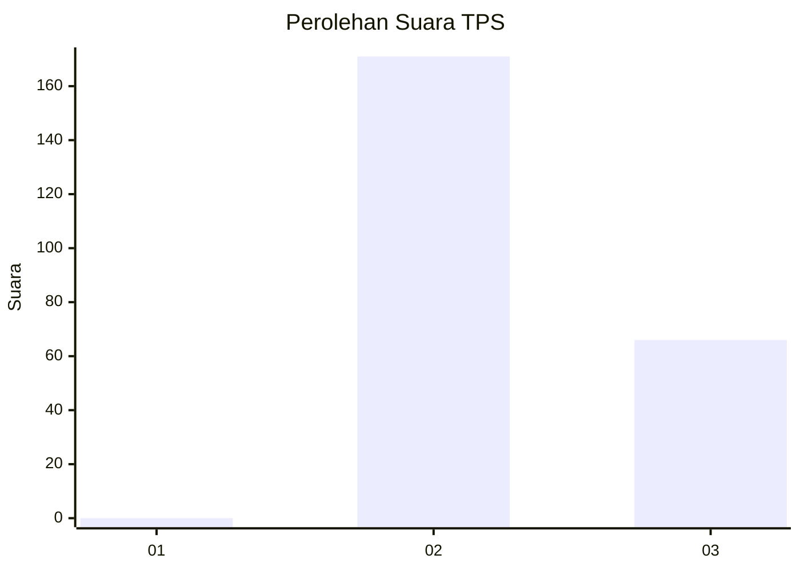
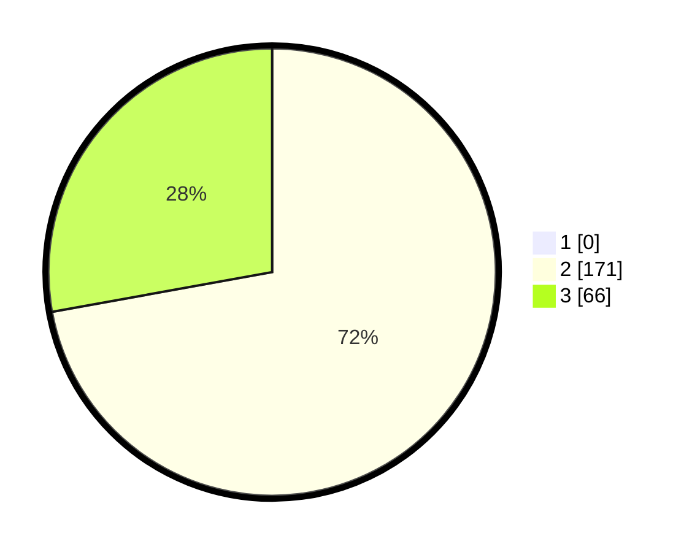

# Hasil

## Grafik

## Tabel

| No. | Nama Paslon    | Suara | Suara (raw) | Persentase |
|:--- |:-------------- | -----:| -----------:| ----------:|
| 1   | ANIES MUHAIMIN | 0     | [0][p-1]    | 0,00       |
| 2   | PRABOWO GIBRAN | 171   | [171][p-2]  | 72,15      |
| 3   | GANJAR MAHFUD  | 66    | [66][p-3]   | 27,85      |

[p-1]: https://github.com/gigit-pemilu/pemilu-2024-51-bali/blob/main/pilpres/hitung-suara/sub/51-bali/sub/01-jembrana/sub/05-jembrana/sub/1009-sangkaragung/sub/003-tps/sub/paslon-1.txt
[p-2]: https://github.com/gigit-pemilu/pemilu-2024-51-bali/blob/main/pilpres/hitung-suara/sub/51-bali/sub/01-jembrana/sub/05-jembrana/sub/1009-sangkaragung/sub/003-tps/sub/paslon-2.txt
[p-3]: https://github.com/gigit-pemilu/pemilu-2024-51-bali/blob/main/pilpres/hitung-suara/sub/51-bali/sub/01-jembrana/sub/05-jembrana/sub/1009-sangkaragung/sub/003-tps/sub/paslon-3.txt

## Foto C Plano

https://sirekap-obj-formc.kpu.go.id/fa77/pemilu/ppwp/51/01/05/10/09/5101051009003-20240214-200216--07533aea-0bf7-41d4-ad4c-8a5c661d16ac.jpg

https://sirekap-obj-formc.kpu.go.id/fa77/pemilu/ppwp/51/01/05/10/09/5101051009003-20240214-200347--ee17f572-bf40-4971-aea9-b371961cb50e.jpg

https://sirekap-obj-formc.kpu.go.id/fa77/pemilu/ppwp/51/01/05/10/09/5101051009003-20240214-200502--b4b77f2b-031f-4c31-b2f5-f2bd61e60bb2.jpg

## Metadata

| Key        | Value               |
| ---------- | ------------------- |
| Time Stamp | 2024-02-15 12:00:28 |

## DATA PEMILIH TETAP

Jumlah pemilih dalam DPT: **239**.
 * L: **122**.
 * P: **117**.

## DATA PENGGUNA HAK PILIH

Jumlah pengguna hak pilih dalam DPT: **269**.
 * L: **141**.
 * P: **128**.

Jumlah pengguna hak pilih dalam DPTb: **0**.
 * L: **0**.
 * P: **0**.

Jumlah pengguna hak pilih dalam DPK: **0**.
 * L: **0**.
 * P: **0**.

Jumlah pengguna hak pilih: **269**.
 * L: **141**.
 * P: **128**.

## JUMLAH SUARA SAH DAN TIDAK SAH

JUMLAH SELURUH SUARA SAH: **237**.

JUMLAH SUARA TIDAK SAH: **2**.

JUMLAH SELURUH SUARA SAH DAN SUARA TIDAK SAH: **239**.

