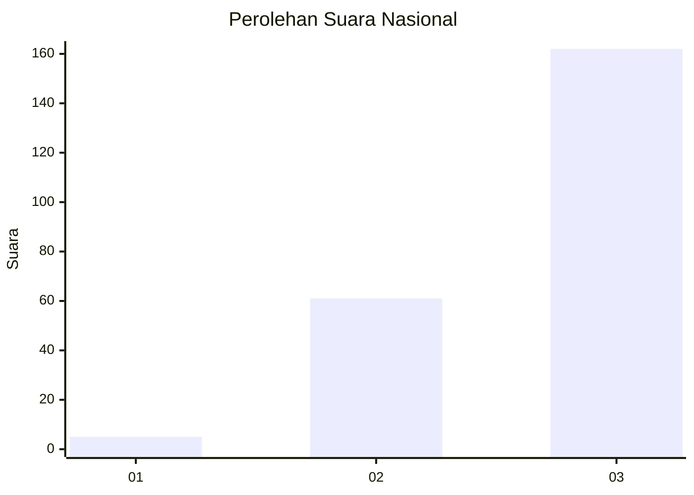
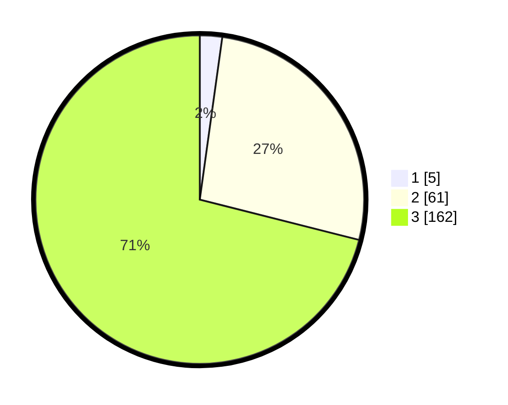

# Hasil

## Grafik

## Tabel

| No. | Nama Paslon    | Suara | Suara (raw) | Persentase |
|:--- |:-------------- | -----:| -----------:| ----------:|
| 1   | ANIES MUHAIMIN | 5     | [5][p-1]    | 2,19       |
| 2   | PRABOWO GIBRAN | 61    | [61][p-2]   | 26,75      |
| 3   | GANJAR MAHFUD  | 162   | [162][p-3]  | 71,05      |

[p-1]: https://github.com/gigit-pemilu/pemilu-2024/blob/main/pilpres/hitung-suara/sub/51-bali/sub/01-jembrana/sub/05-jembrana/sub/1009-sangkaragung/sub/005-tps/sub/paslon-1.txt
[p-2]: https://github.com/gigit-pemilu/pemilu-2024/blob/main/pilpres/hitung-suara/sub/51-bali/sub/01-jembrana/sub/05-jembrana/sub/1009-sangkaragung/sub/005-tps/sub/paslon-2.txt
[p-3]: https://github.com/gigit-pemilu/pemilu-2024/blob/main/pilpres/hitung-suara/sub/51-bali/sub/01-jembrana/sub/05-jembrana/sub/1009-sangkaragung/sub/005-tps/sub/paslon-3.txt

## Foto C Plano

https://sirekap-obj-formc.kpu.go.id/b620/pemilu/ppwp/51/01/05/10/09/5101051009005-20240214-140951--bee1e153-e5a9-49b2-adcf-798dffe3f931.jpg

https://sirekap-obj-formc.kpu.go.id/b620/pemilu/ppwp/51/01/05/10/09/5101051009005-20240214-141229--a343cea8-13f0-4ca5-9e41-ddbc6bdf6e85.jpg

https://sirekap-obj-formc.kpu.go.id/b620/pemilu/ppwp/51/01/05/10/09/5101051009005-20240214-202756--a8077ab0-58c2-469f-a109-b9a02a83876a.jpg

## Metadata

| Key        | Value               |
| ---------- | ------------------- |
| Time Stamp | 2024-02-15 00:41:44 |

## DATA PEMILIH TETAP

Jumlah pemilih dalam DPT: **280**.
 * L: **137**.
 * P: **143**.

## DATA PENGGUNA HAK PILIH

Jumlah pengguna hak pilih dalam DPT: **228**.
 * L: **105**.
 * P: **123**.

Jumlah pengguna hak pilih dalam DPTb: **0**.
 * L: **0**.
 * P: **0**.

Jumlah pengguna hak pilih dalam DPK: **4**.
 * L: **2**.
 * P: **2**.

Jumlah pengguna hak pilih: **232**.
 * L: **107**.
 * P: **125**.

## JUMLAH SUARA SAH DAN TIDAK SAH

JUMLAH SELURUH SUARA SAH: **0**.

JUMLAH SUARA TIDAK SAH: **0**.

JUMLAH SELURUH SUARA SAH DAN SUARA TIDAK SAH: **0**.

