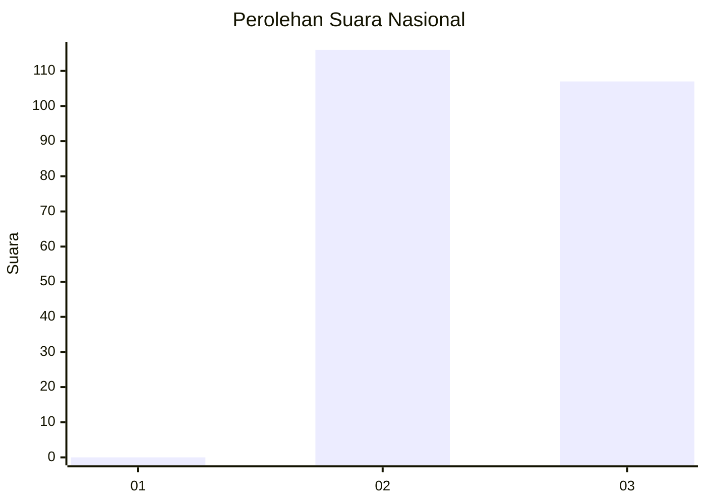
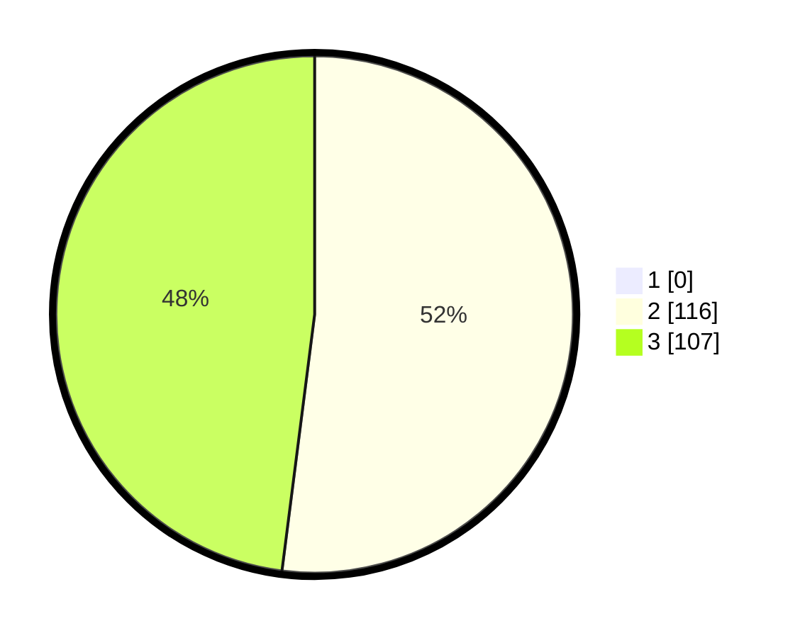

# Hasil

## Grafik

## Tabel

| No. | Nama Paslon    | Suara | Suara (raw) | Persentase |
|:--- |:-------------- | -----:| -----------:| ----------:|
| 1   | ANIES MUHAIMIN | 0     | [0][p-1]    | 0,00       |
| 2   | PRABOWO GIBRAN | 116   | [116][p-2]  | 52,02      |
| 3   | GANJAR MAHFUD  | 107   | [107][p-3]  | 47,98      |

[p-1]: https://github.com/gigit-pemilu/pemilu-2024/blob/main/pilpres/hitung-suara/sub/51-bali/sub/01-jembrana/sub/05-jembrana/sub/2002-perancak/sub/006-tps/sub/paslon-1.txt
[p-2]: https://github.com/gigit-pemilu/pemilu-2024/blob/main/pilpres/hitung-suara/sub/51-bali/sub/01-jembrana/sub/05-jembrana/sub/2002-perancak/sub/006-tps/sub/paslon-2.txt
[p-3]: https://github.com/gigit-pemilu/pemilu-2024/blob/main/pilpres/hitung-suara/sub/51-bali/sub/01-jembrana/sub/05-jembrana/sub/2002-perancak/sub/006-tps/sub/paslon-3.txt

## Foto C Plano

https://sirekap-obj-formc.kpu.go.id/c755/pemilu/ppwp/51/01/05/20/02/5101052002006-20240214-193840--8871cbeb-051f-49e8-a9d1-46e6511de11c.jpg

https://sirekap-obj-formc.kpu.go.id/c755/pemilu/ppwp/51/01/05/20/02/5101052002006-20240214-193849--7ce80bff-65f4-4f5d-956e-1f049adec41f.jpg

https://sirekap-obj-formc.kpu.go.id/c755/pemilu/ppwp/51/01/05/20/02/5101052002006-20240214-193913--8194e04f-1524-4da9-924b-909c9e6cc312.jpg

## Metadata

| Key        | Value               |
| ---------- | ------------------- |
| Time Stamp | 2024-02-15 12:00:28 |

## DATA PEMILIH TETAP

Jumlah pemilih dalam DPT: **285**.
 * L: **132**.
 * P: **153**.

## DATA PENGGUNA HAK PILIH

Jumlah pengguna hak pilih dalam DPT: **226**.
 * L: **100**.
 * P: **126**.

Jumlah pengguna hak pilih dalam DPTb: **0**.
 * L: **0**.
 * P: **0**.

Jumlah pengguna hak pilih dalam DPK: **1**.
 * L: **0**.
 * P: **1**.

Jumlah pengguna hak pilih: **227**.
 * L: **100**.
 * P: **127**.

## JUMLAH SUARA SAH DAN TIDAK SAH

JUMLAH SELURUH SUARA SAH: **223**.

JUMLAH SUARA TIDAK SAH: **4**.

JUMLAH SELURUH SUARA SAH DAN SUARA TIDAK SAH: **227**.

