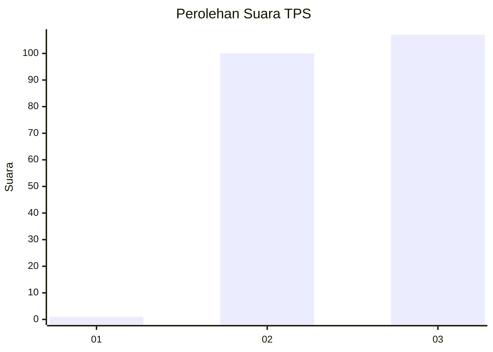
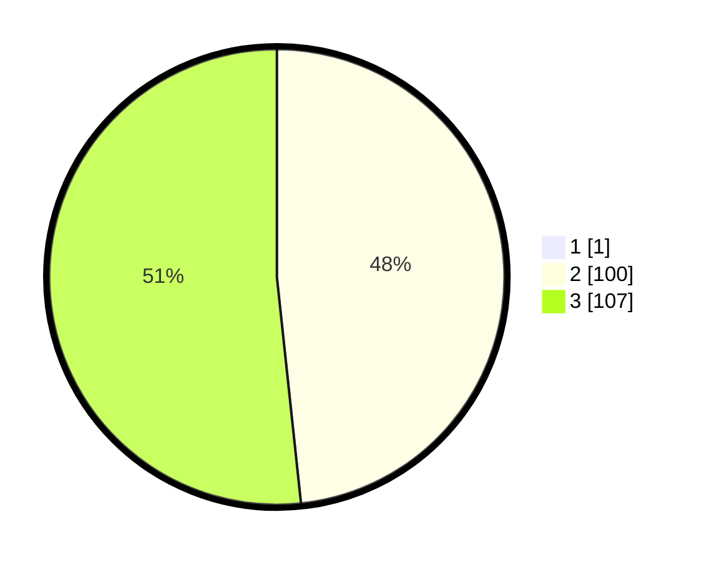

# Hasil

## Grafik

## Tabel

| No. | Nama Paslon    | Suara | Suara (raw) | Persentase |
|:--- |:-------------- | -----:| -----------:| ----------:|
| 1   | ANIES MUHAIMIN | 1     | [1][p-1]    | 0,48       |
| 2   | PRABOWO GIBRAN | 100   | [100][p-2]  | 48,08      |
| 3   | GANJAR MAHFUD  | 107   | [107][p-3]  | 51,44      |

[p-1]: https://github.com/gigit-pemilu/pemilu-2024-51-bali/blob/main/pilpres/hitung-suara/sub/51-bali/sub/01-jembrana/sub/05-jembrana/sub/2002-perancak/sub/011-tps/sub/paslon-1.txt
[p-2]: https://github.com/gigit-pemilu/pemilu-2024-51-bali/blob/main/pilpres/hitung-suara/sub/51-bali/sub/01-jembrana/sub/05-jembrana/sub/2002-perancak/sub/011-tps/sub/paslon-2.txt
[p-3]: https://github.com/gigit-pemilu/pemilu-2024-51-bali/blob/main/pilpres/hitung-suara/sub/51-bali/sub/01-jembrana/sub/05-jembrana/sub/2002-perancak/sub/011-tps/sub/paslon-3.txt

## Foto C Plano

https://sirekap-obj-formc.kpu.go.id/2ab9/pemilu/ppwp/51/01/05/20/02/5101052002011-20240214-230727--d5565e2c-1fb2-41a4-8bbb-1161c8982055.jpg

https://sirekap-obj-formc.kpu.go.id/2ab9/pemilu/ppwp/51/01/05/20/02/5101052002011-20240214-230846--f9508714-e445-486b-a07a-90f88ee80816.jpg

https://sirekap-obj-formc.kpu.go.id/2ab9/pemilu/ppwp/51/01/05/20/02/5101052002011-20240214-231004--cd51f784-f4bc-4531-83a3-c14148479184.jpg

## Metadata

| Key        | Value               |
| ---------- | ------------------- |
| Time Stamp | 2024-02-15 18:00:26 |

