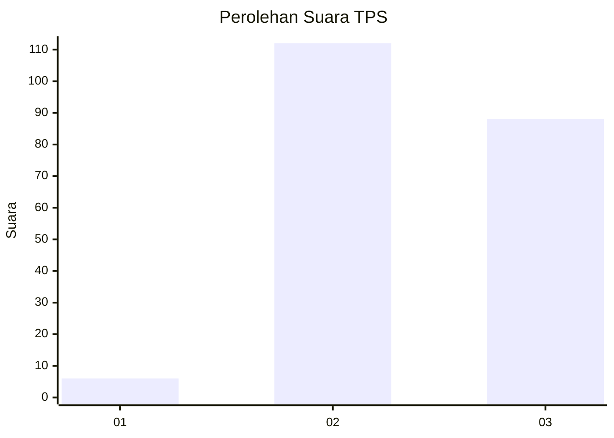
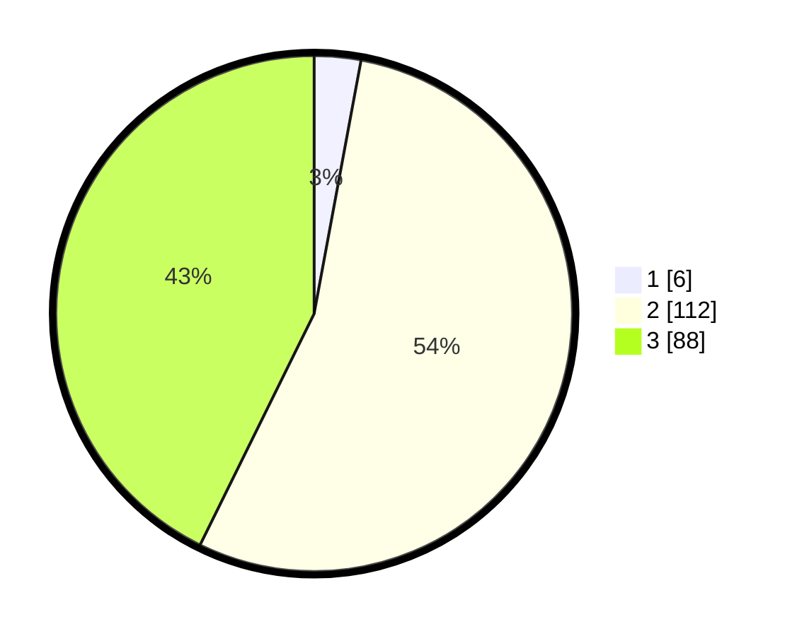

# Hasil

## Grafik

## Tabel

| No. | Nama Paslon    | Suara | Suara (raw) | Persentase |
|:--- |:-------------- | -----:| -----------:| ----------:|
| 1   | ANIES MUHAIMIN | 6     | [6][p-1]    | 2,91       |
| 2   | PRABOWO GIBRAN | 112   | [112][p-2]  | 54,37      |
| 3   | GANJAR MAHFUD  | 88    | [88][p-3]   | 42,72      |

[p-1]: https://github.com/gigit-pemilu/pemilu-2024-51-bali/blob/main/pilpres/hitung-suara/sub/51-bali/sub/01-jembrana/sub/05-jembrana/sub/2004-batu-agung/sub/002-tps/sub/paslon-1.txt
[p-2]: https://github.com/gigit-pemilu/pemilu-2024-51-bali/blob/main/pilpres/hitung-suara/sub/51-bali/sub/01-jembrana/sub/05-jembrana/sub/2004-batu-agung/sub/002-tps/sub/paslon-2.txt
[p-3]: https://github.com/gigit-pemilu/pemilu-2024-51-bali/blob/main/pilpres/hitung-suara/sub/51-bali/sub/01-jembrana/sub/05-jembrana/sub/2004-batu-agung/sub/002-tps/sub/paslon-3.txt

## Foto C Plano

https://sirekap-obj-formc.kpu.go.id/0aea/pemilu/ppwp/51/01/05/20/04/5101052004002-20240214-132412--92a12d11-c7d6-4397-9574-635174851790.jpg

https://sirekap-obj-formc.kpu.go.id/0aea/pemilu/ppwp/51/01/05/20/04/5101052004002-20240214-132538--cd5bc4fd-3e3a-4afb-9cc5-381f0141543a.jpg

https://sirekap-obj-formc.kpu.go.id/0aea/pemilu/ppwp/51/01/05/20/04/5101052004002-20240214-132647--460328e5-8cf3-41b9-9898-f8e1263785ad.jpg

## Metadata

| Key        | Value               |
| ---------- | ------------------- |
| Time Stamp | 2024-02-14 21:46:01 |

## DATA PEMILIH TETAP

Jumlah pemilih dalam DPT: **268**.
 * L: **134**.
 * P: **134**.

## DATA PENGGUNA HAK PILIH

Jumlah pengguna hak pilih dalam DPT: **207**.
 * L: **107**.
 * P: **100**.

Jumlah pengguna hak pilih dalam DPTb: **0**.
 * L: **0**.
 * P: **0**.

Jumlah pengguna hak pilih dalam DPK: **1**.
 * L: **1**.
 * P: **0**.

Jumlah pengguna hak pilih: **208**.
 * L: **108**.
 * P: **100**.

## JUMLAH SUARA SAH DAN TIDAK SAH

JUMLAH SELURUH SUARA SAH: **206**.

JUMLAH SUARA TIDAK SAH: **2**.

JUMLAH SELURUH SUARA SAH DAN SUARA TIDAK SAH: **208**.

