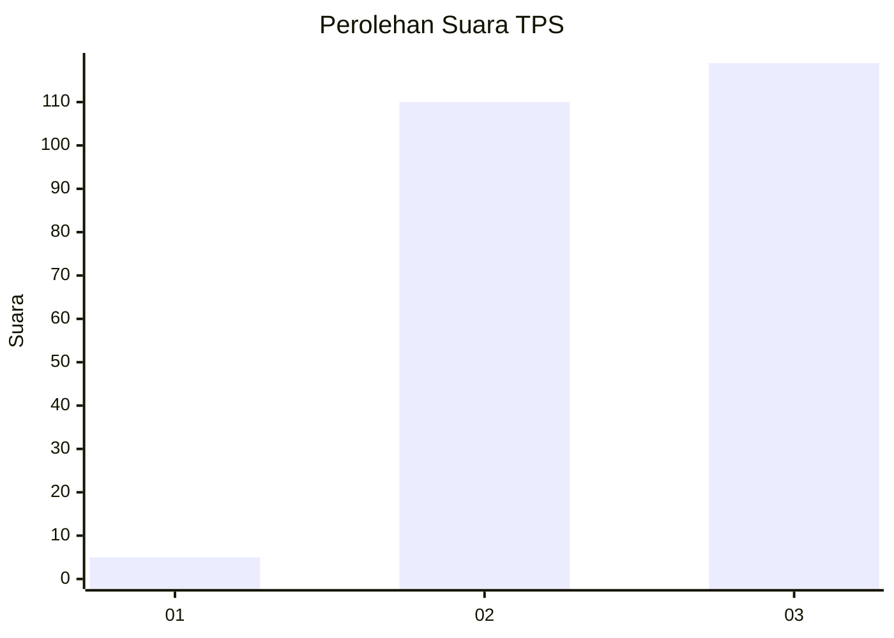
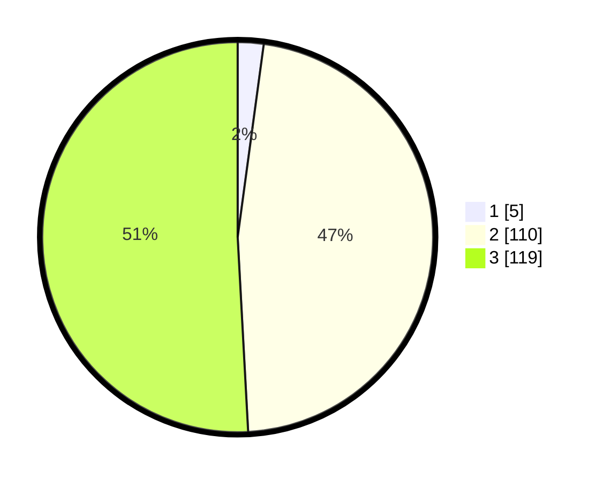

# Hasil

## Grafik

## Tabel

| No. | Nama Paslon    | Suara | Suara (raw) | Persentase |
|:--- |:-------------- | -----:| -----------:| ----------:|
| 1   | ANIES MUHAIMIN | 5     | [5][p-1]    | 2,14       |
| 2   | PRABOWO GIBRAN | 110   | [110][p-2]  | 47,01      |
| 3   | GANJAR MAHFUD  | 119   | [119][p-3]  | 50,85      |

[p-1]: https://github.com/gigit-pemilu/pemilu-2024-51-bali/blob/main/pilpres/hitung-suara/sub/51-bali/sub/01-jembrana/sub/05-jembrana/sub/2004-batu-agung/sub/006-tps/sub/paslon-1.txt
[p-2]: https://github.com/gigit-pemilu/pemilu-2024-51-bali/blob/main/pilpres/hitung-suara/sub/51-bali/sub/01-jembrana/sub/05-jembrana/sub/2004-batu-agung/sub/006-tps/sub/paslon-2.txt
[p-3]: https://github.com/gigit-pemilu/pemilu-2024-51-bali/blob/main/pilpres/hitung-suara/sub/51-bali/sub/01-jembrana/sub/05-jembrana/sub/2004-batu-agung/sub/006-tps/sub/paslon-3.txt

## Foto C Plano

https://sirekap-obj-formc.kpu.go.id/9f92/pemilu/ppwp/51/01/05/20/04/5101052004006-20240215-095518--aed7e9e6-3955-4ce2-bd57-046b8dfc9501.jpg

https://sirekap-obj-formc.kpu.go.id/9f92/pemilu/ppwp/51/01/05/20/04/5101052004006-20240215-095555--39e675bd-8132-4ee6-9d3b-c5a828f82572.jpg

https://sirekap-obj-formc.kpu.go.id/9f92/pemilu/ppwp/51/01/05/20/04/5101052004006-20240215-095600--01a5e963-0aef-49a2-b50a-3433136c4966.jpg

## Metadata

| Key        | Value               |
| ---------- | ------------------- |
| Time Stamp | 2024-02-15 15:30:25 |

## DATA PEMILIH TETAP

Jumlah pemilih dalam DPT: **278**.
 * L: **144**.
 * P: **134**.

## DATA PENGGUNA HAK PILIH

Jumlah pengguna hak pilih dalam DPT: **235**.
 * L: **118**.
 * P: **117**.

Jumlah pengguna hak pilih dalam DPTb: **2**.
 * L: **1**.
 * P: **1**.

Jumlah pengguna hak pilih dalam DPK: **0**.
 * L: **0**.
 * P: **0**.

Jumlah pengguna hak pilih: **237**.
 * L: **119**.
 * P: **118**.

## JUMLAH SUARA SAH DAN TIDAK SAH

JUMLAH SELURUH SUARA SAH: **234**.

JUMLAH SUARA TIDAK SAH: **3**.

JUMLAH SELURUH SUARA SAH DAN SUARA TIDAK SAH: **237**.

