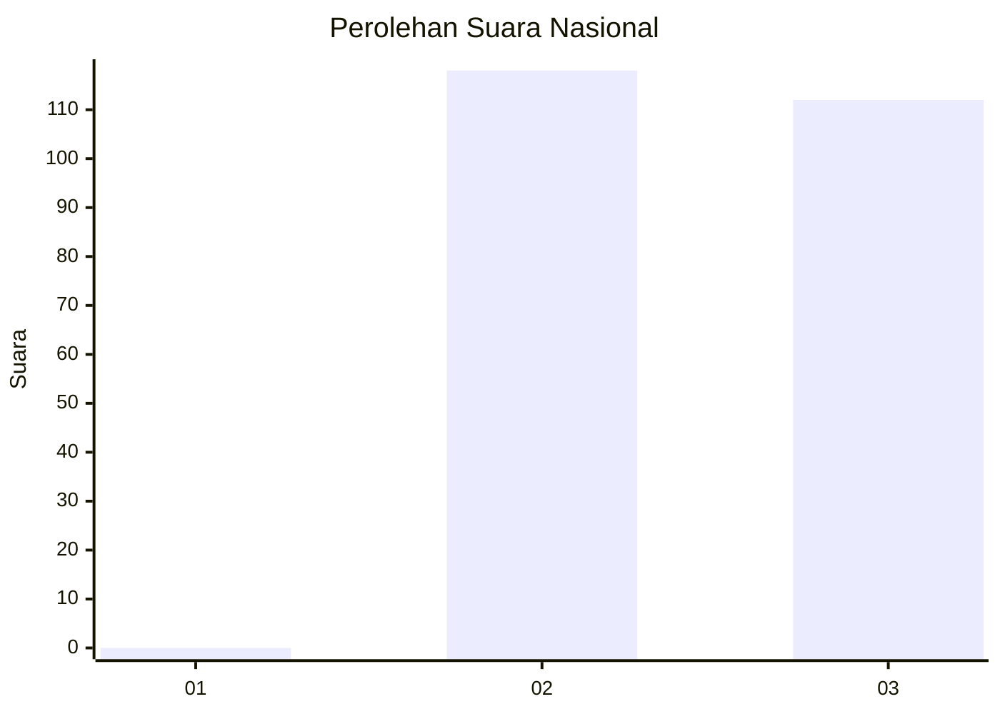
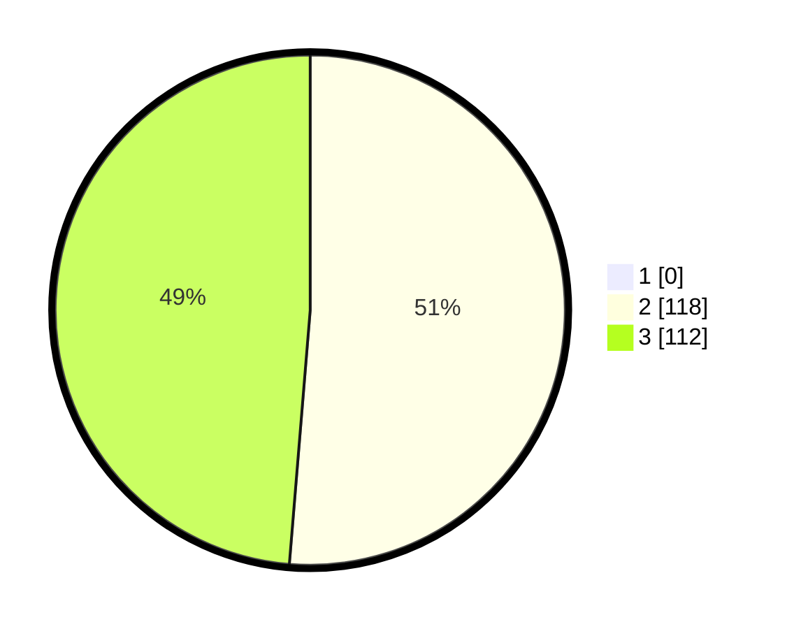

# Hasil

## Grafik

## Tabel

| No. | Nama Paslon    | Suara | Suara (raw) | Persentase |
|:--- |:-------------- | -----:| -----------:| ----------:|
| 1   | ANIES MUHAIMIN | 0     | [0][p-1]    | 0,00       |
| 2   | PRABOWO GIBRAN | 118   | [118][p-2]  | 51,30      |
| 3   | GANJAR MAHFUD  | 112   | [112][p-3]  | 48,70      |

[p-1]: https://github.com/gigit-pemilu/pemilu-2024/blob/main/pilpres/hitung-suara/sub/51-bali/sub/01-jembrana/sub/05-jembrana/sub/2004-batu-agung/sub/009-tps/sub/paslon-1.txt
[p-2]: https://github.com/gigit-pemilu/pemilu-2024/blob/main/pilpres/hitung-suara/sub/51-bali/sub/01-jembrana/sub/05-jembrana/sub/2004-batu-agung/sub/009-tps/sub/paslon-2.txt
[p-3]: https://github.com/gigit-pemilu/pemilu-2024/blob/main/pilpres/hitung-suara/sub/51-bali/sub/01-jembrana/sub/05-jembrana/sub/2004-batu-agung/sub/009-tps/sub/paslon-3.txt

## Foto C Plano

https://sirekap-obj-formc.kpu.go.id/12b8/pemilu/ppwp/51/01/05/20/04/5101052004009-20240214-230620--02866721-8876-4b62-a191-742431b6315d.jpg

https://sirekap-obj-formc.kpu.go.id/12b8/pemilu/ppwp/51/01/05/20/04/5101052004009-20240214-230656--4dd58ad2-0161-4b7c-85ce-021fe9eb61fe.jpg

https://sirekap-obj-formc.kpu.go.id/12b8/pemilu/ppwp/51/01/05/20/04/5101052004009-20240214-231124--dba28796-81bc-4dab-a70b-12edf0397bf1.jpg

## Metadata

| Key        | Value               |
| ---------- | ------------------- |
| Time Stamp | 2024-02-16 06:30:27 |

## DATA PEMILIH TETAP

Jumlah pemilih dalam DPT: **289**.
 * L: **138**.
 * P: **151**.

## DATA PENGGUNA HAK PILIH

Jumlah pengguna hak pilih dalam DPT: **231**.
 * L: **115**.
 * P: **116**.

Jumlah pengguna hak pilih dalam DPTb: **0**.
 * L: **0**.
 * P: **0**.

Jumlah pengguna hak pilih dalam DPK: **0**.
 * L: **0**.
 * P: **0**.

Jumlah pengguna hak pilih: **231**.
 * L: **115**.
 * P: **116**.

## JUMLAH SUARA SAH DAN TIDAK SAH

JUMLAH SELURUH SUARA SAH: **230**.

JUMLAH SUARA TIDAK SAH: **1**.

JUMLAH SELURUH SUARA SAH DAN SUARA TIDAK SAH: **231**.

