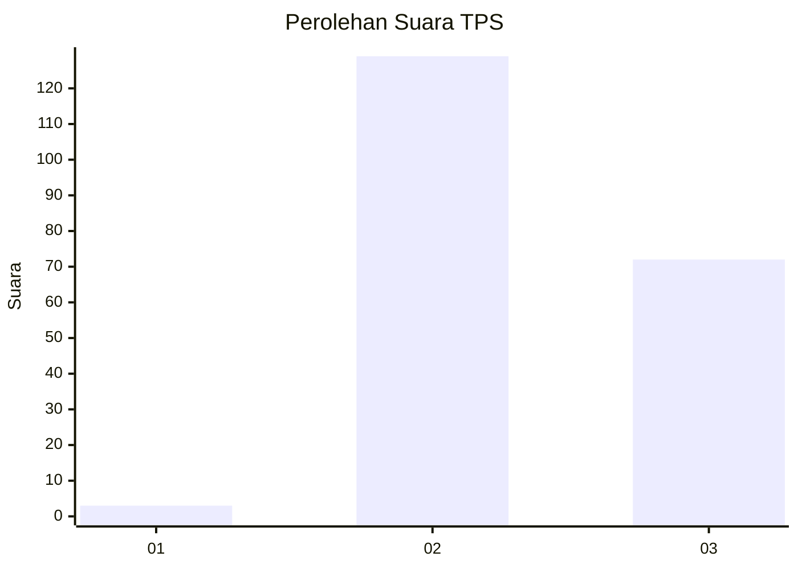
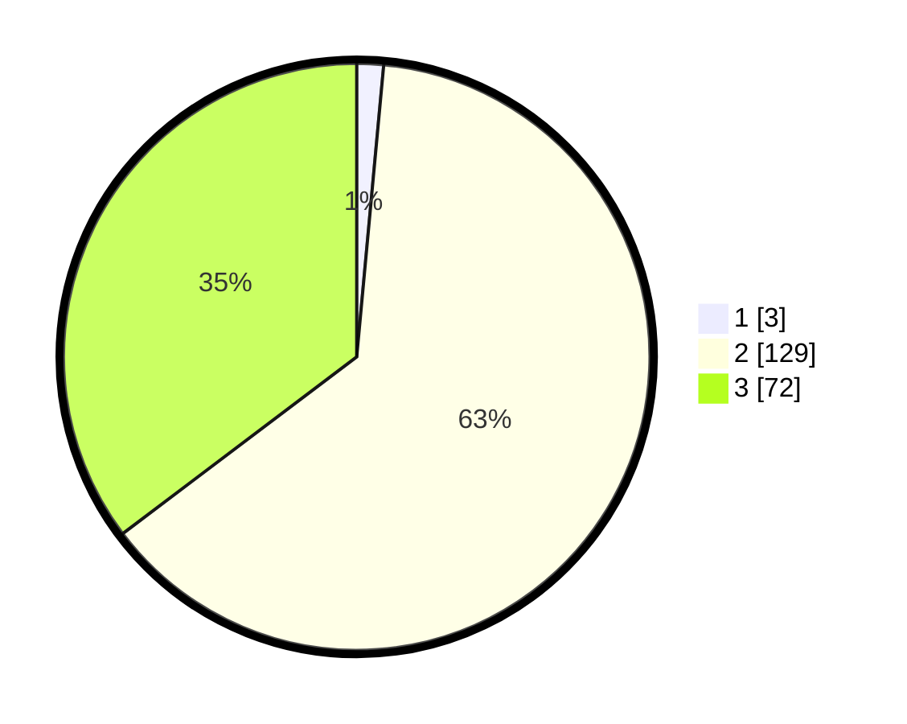

# Hasil

## Grafik

## Tabel

| No. | Nama Paslon    | Suara | Suara (raw) | Persentase |
|:--- |:-------------- | -----:| -----------:| ----------:|
| 1   | ANIES MUHAIMIN | 3     | [3][p-1]    | 1,47       |
| 2   | PRABOWO GIBRAN | 129   | [129][p-2]  | 63,24      |
| 3   | GANJAR MAHFUD  | 72    | [72][p-3]   | 35,29      |

[p-1]: https://github.com/gigit-pemilu/pemilu-2024-51-bali/blob/main/pilpres/hitung-suara/sub/51-bali/sub/01-jembrana/sub/05-jembrana/sub/2004-batu-agung/sub/010-tps/sub/paslon-1.txt
[p-2]: https://github.com/gigit-pemilu/pemilu-2024-51-bali/blob/main/pilpres/hitung-suara/sub/51-bali/sub/01-jembrana/sub/05-jembrana/sub/2004-batu-agung/sub/010-tps/sub/paslon-2.txt
[p-3]: https://github.com/gigit-pemilu/pemilu-2024-51-bali/blob/main/pilpres/hitung-suara/sub/51-bali/sub/01-jembrana/sub/05-jembrana/sub/2004-batu-agung/sub/010-tps/sub/paslon-3.txt

## Foto C Plano

https://sirekap-obj-formc.kpu.go.id/f8c8/pemilu/ppwp/51/01/05/20/04/5101052004010-20240214-221351--d4d88a7b-4623-45d3-8fdf-c95f6653c432.jpg

https://sirekap-obj-formc.kpu.go.id/f8c8/pemilu/ppwp/51/01/05/20/04/5101052004010-20240214-221408--3e796795-cd26-43fe-a3f4-918544dceeb9.jpg

## Metadata

| Key        | Value               |
| ---------- | ------------------- |
| Time Stamp | 2024-02-15 12:00:28 |

