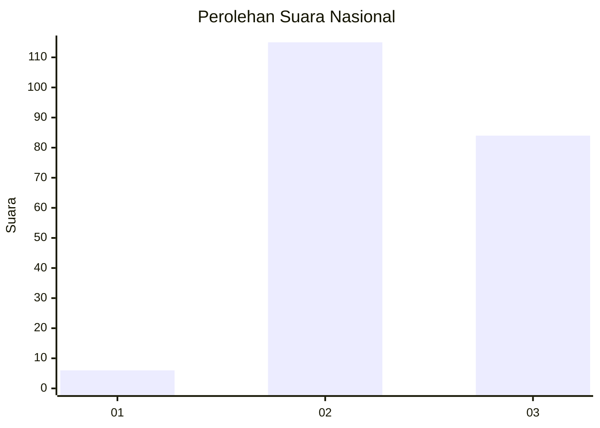
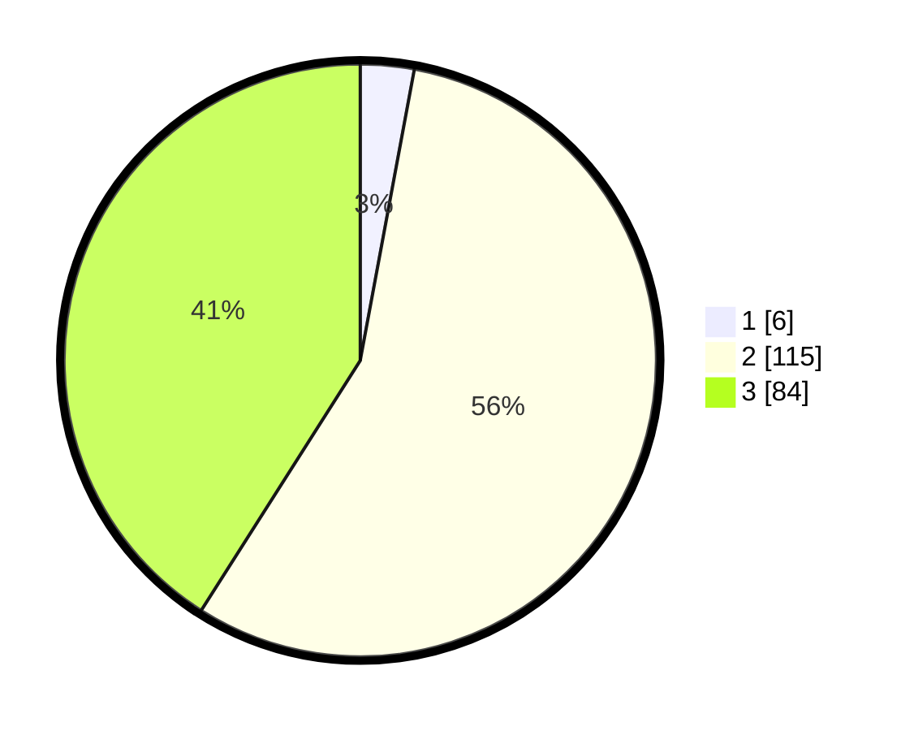

# Hasil

## Grafik

## Tabel

| No. | Nama Paslon    | Suara | Suara (raw) | Persentase |
|:--- |:-------------- | -----:| -----------:| ----------:|
| 1   | ANIES MUHAIMIN | 6     | [6][p-1]    | 2,93       |
| 2   | PRABOWO GIBRAN | 115   | [115][p-2]  | 56,10      |
| 3   | GANJAR MAHFUD  | 84    | [84][p-3]   | 40,98      |

[p-1]: https://github.com/gigit-pemilu/pemilu-2024/blob/main/pilpres/hitung-suara/sub/51-bali/sub/01-jembrana/sub/05-jembrana/sub/2004-batu-agung/sub/012-tps/sub/paslon-1.txt
[p-2]: https://github.com/gigit-pemilu/pemilu-2024/blob/main/pilpres/hitung-suara/sub/51-bali/sub/01-jembrana/sub/05-jembrana/sub/2004-batu-agung/sub/012-tps/sub/paslon-2.txt
[p-3]: https://github.com/gigit-pemilu/pemilu-2024/blob/main/pilpres/hitung-suara/sub/51-bali/sub/01-jembrana/sub/05-jembrana/sub/2004-batu-agung/sub/012-tps/sub/paslon-3.txt

## Foto C Plano

https://sirekap-obj-formc.kpu.go.id/1017/pemilu/ppwp/51/01/05/20/04/5101052004012-20240214-184512--6402b597-0f3f-48de-bf20-180c4103919d.jpg

https://sirekap-obj-formc.kpu.go.id/1017/pemilu/ppwp/51/01/05/20/04/5101052004012-20240214-184642--68198766-bd33-4e5d-b2e1-b6e607a85a48.jpg

https://sirekap-obj-formc.kpu.go.id/1017/pemilu/ppwp/51/01/05/20/04/5101052004012-20240214-184758--4c7079a4-b92f-4b17-b71e-e027e9e9050a.jpg

## Metadata

| Key        | Value               |
| ---------- | ------------------- |
| Time Stamp | 2024-02-14 21:46:01 |

## DATA PEMILIH TETAP

Jumlah pemilih dalam DPT: **270**.
 * L: **134**.
 * P: **136**.

## DATA PENGGUNA HAK PILIH

Jumlah pengguna hak pilih dalam DPT: **209**.
 * L: **103**.
 * P: **106**.

Jumlah pengguna hak pilih dalam DPTb: **0**.
 * L: **0**.
 * P: **0**.

Jumlah pengguna hak pilih dalam DPK: **0**.
 * L: **0**.
 * P: **0**.

Jumlah pengguna hak pilih: **209**.
 * L: **103**.
 * P: **106**.

## JUMLAH SUARA SAH DAN TIDAK SAH

JUMLAH SELURUH SUARA SAH: **205**.

JUMLAH SUARA TIDAK SAH: **4**.

JUMLAH SELURUH SUARA SAH DAN SUARA TIDAK SAH: **209**.

