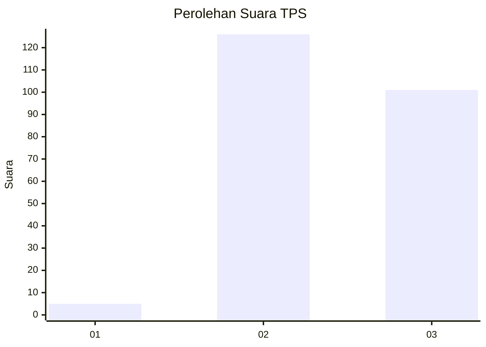
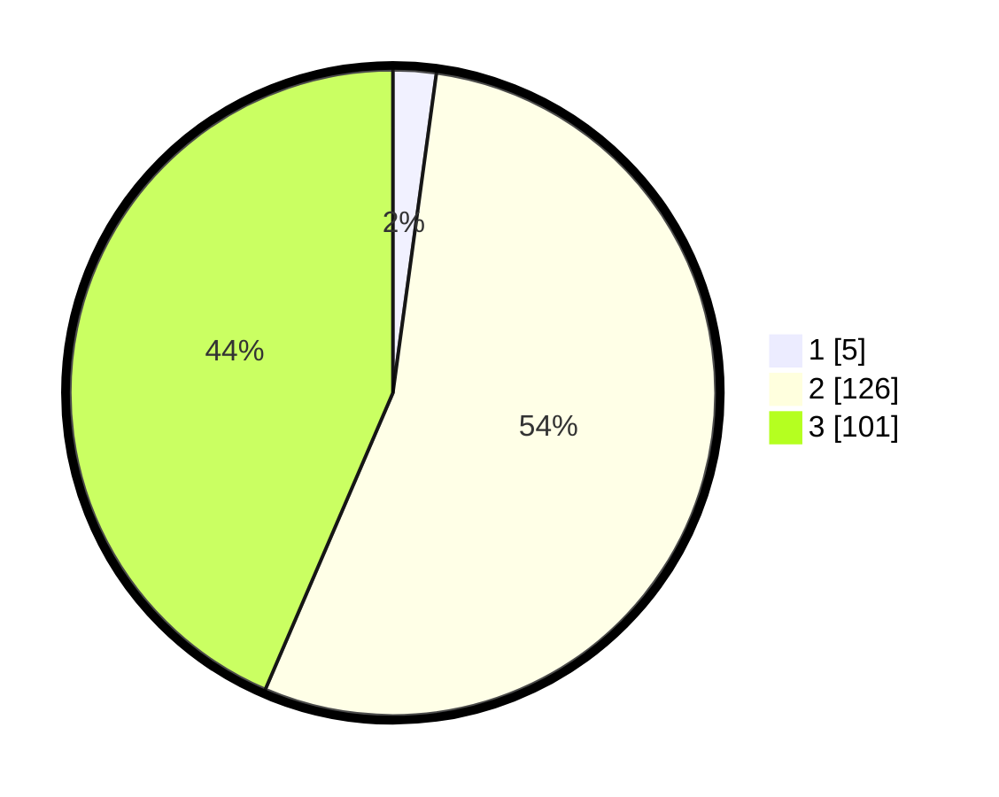

# Hasil

## Grafik

## Tabel

| No. | Nama Paslon    | Suara | Suara (raw) | Persentase |
|:--- |:-------------- | -----:| -----------:| ----------:|
| 1   | ANIES MUHAIMIN | 5     | [5][p-1]    | 2,16       |
| 2   | PRABOWO GIBRAN | 126   | [126][p-2]  | 54,31      |
| 3   | GANJAR MAHFUD  | 101   | [101][p-3]  | 43,53      |

[p-1]: https://github.com/gigit-pemilu/pemilu-2024-51-bali/blob/main/pilpres/hitung-suara/sub/51-bali/sub/01-jembrana/sub/05-jembrana/sub/2004-batu-agung/sub/020-tps/sub/paslon-1.txt
[p-2]: https://github.com/gigit-pemilu/pemilu-2024-51-bali/blob/main/pilpres/hitung-suara/sub/51-bali/sub/01-jembrana/sub/05-jembrana/sub/2004-batu-agung/sub/020-tps/sub/paslon-2.txt
[p-3]: https://github.com/gigit-pemilu/pemilu-2024-51-bali/blob/main/pilpres/hitung-suara/sub/51-bali/sub/01-jembrana/sub/05-jembrana/sub/2004-batu-agung/sub/020-tps/sub/paslon-3.txt

## Foto C Plano

https://sirekap-obj-formc.kpu.go.id/f013/pemilu/ppwp/51/01/05/20/04/5101052004020-20240214-193101--f78b2719-9e8c-49c5-8c00-85f2ec426521.jpg

https://sirekap-obj-formc.kpu.go.id/f013/pemilu/ppwp/51/01/05/20/04/5101052004020-20240214-193148--11f4fbf3-6e14-4167-a4ae-222b560ccb94.jpg

https://sirekap-obj-formc.kpu.go.id/f013/pemilu/ppwp/51/01/05/20/04/5101052004020-20240214-194255--9882e4c5-2558-4463-889a-bf8c8073ff37.jpg

## Metadata

| Key        | Value               |
| ---------- | ------------------- |
| Time Stamp | 2024-02-14 21:46:01 |

## DATA PEMILIH TETAP

Jumlah pemilih dalam DPT: **290**.
 * L: **139**.
 * P: **151**.

## DATA PENGGUNA HAK PILIH

Jumlah pengguna hak pilih dalam DPT: **237**.
 * L: **117**.
 * P: **120**.

Jumlah pengguna hak pilih dalam DPTb: **3**.
 * L: **0**.
 * P: **3**.

Jumlah pengguna hak pilih dalam DPK: **0**.
 * L: **0**.
 * P: **0**.

Jumlah pengguna hak pilih: **240**.
 * L: **117**.
 * P: **123**.

## JUMLAH SUARA SAH DAN TIDAK SAH

JUMLAH SELURUH SUARA SAH: **232**.

JUMLAH SUARA TIDAK SAH: **8**.

JUMLAH SELURUH SUARA SAH DAN SUARA TIDAK SAH: **240**.

